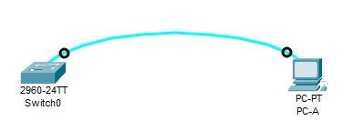
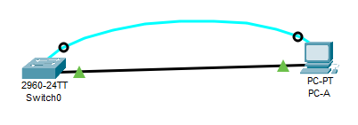
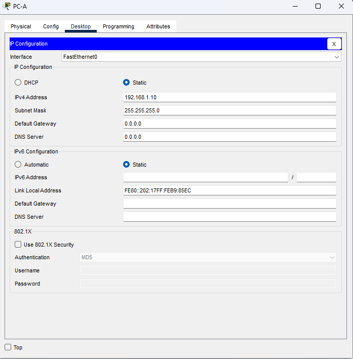
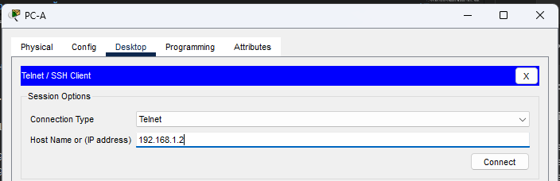

# Базовая настройка коммутатора

## Топология


## Таблица адресации
|Устройство|Интерфейс|IP-адрес / префикс|
|----------|---------|------------------|
|S1|VLAN 1|192.168.1.2/24|
|PC-A|NIC|192.168.1.10/24|

## Задачи

  1. Проверка конфигурации коммутатора по умолчанию;
  2. Создание сети и настройка основных параметров устройства:
        - Настройте базовые параметры коммутатора;
        - Настройте IP-адрес для ПК;
  3. Проверка сетевых подключений:
        - Проверка сетевых подключений;
        - Протестируйте сквозное соединение, отправив эхо-запрос;
        - Протестируйте возможности удаленного управления с помощью Telnet.

##  Решение
- [Базовая настройка коммутатора](#базовая-настройка-коммутатора)
  - [Топология](#топология)
  - [Таблица адресации](#таблица-адресации)
  - [Задачи](#задачи)
  - [Решение](#решение)
  - [1. Создание сети и проверка настроек коммутатора по умолчанию](#1-создание-сети-и-проверка-настроек-коммутатора-по-умолчанию)
    - [Шаг 1. Создайте сеть согласно топологии](#шаг-1-создайте-сеть-согласно-топологии)
    - [Шаг 2. Проверьте настройки коммутатора по умолчанию](#шаг-2-проверьте-настройки-коммутатора-по-умолчанию)
  - [2. Настройка базовых параметров сетевых устройств](#2-настройка-базовых-параметров-сетевых-устройств)
    - [Шаг 1. Настройте базовые параметры коммутатора.](#шаг-1-настройте-базовые-параметры-коммутатора)
    - [Шаг 2. Настройте IP-адрес на компьютере PC-A.](#шаг-2-настройте-ip-адрес-на-компьютере-pc-a)
  - [3. Проверка сетевых подключений](#3-проверка-сетевых-подключений)
    - [Шаг 1. Отобразите конфигурацию коммутатора.](#шаг-1-отобразите-конфигурацию-коммутатора)
    - [Шаг 2. Протестируйте сквозное соединение, отправив эхо-запрос](#шаг-2-протестируйте-сквозное-соединение-отправив-эхо-запрос)
    - [Шаг 3. Проверьте удаленное управление коммутатором S1.](#шаг-3-проверьте-удаленное-управление-коммутатором-s1)
  - [Вопросы для повторения](#вопросы-для-повторения)
  - [Приложение А. Инициализация и перезагрузка коммутатора](#приложение-а-инициализация-и-перезагрузка-коммутатора)


## 1. Создание сети и проверка настроек коммутатора по умолчанию
### Шаг 1. Создайте сеть согласно топологии
Топология с подключенным консольным кабелем представлена на рисунке
\

Вопрос: Почему нужно использовать консольное подключение для первоначальной настройки коммутатора? Почему нельзя подключиться к коммутатору через Telnet или SSH?\
Ответ: Telnet и SSH - протоколы сетевого уровня, а на данном этапе на коммутаторе не настроен IP-адрес.

### Шаг 2. Проверьте настройки коммутатора по умолчанию
a. Заходим в привилегированный режим с помощью команды enable
```
Switch>enable
Switch#
```
И получаем текущую конфигурацию коммутатора:
```
Switch#show running-config
Building configuration...

Current configuration : 1080 bytes
!
version 15.0
no service timestamps log datetime msec
no service timestamps debug datetime msec
no service password-encryption
!
hostname Switch
!
!
!
!
!
!
spanning-tree mode pvst
spanning-tree extend system-id
!
interface FastEthernet0/1
!
interface FastEthernet0/2
 --More-- 
```

b. Изучим файл конфигурации.\
В в файле конфигурации видим 24 интерфейса FastEthernet:
```
!
interface FastEthernet0/1
!
interface FastEthernet0/2
!
interface FastEthernet0/3
...
...
!
interface FastEthernet0/22
!
interface FastEthernet0/23
!
interface FastEthernet0/24
```
Также есть 2 интерфейса GigabitEthernet:
```
interface GigabitEthernet0/1
!
interface GigabitEthernet0/2
!
```
И коммутатор имеет иапазон vty-линий от 0 до 15:
```
line vty 0 4
 login
line vty 5 15
 login
```

c. При попытке получить загрузочную конфигурацию с помощью команды show startup-configuration получаем сообщение:
```
Switch#sh startup-config 
startup-config is not present
```
Сообщение возникает из-за того, что мы только включили коммутатор и он имеет только конфигурацию по умолчанию в оперативной памяти и мы ещё ни разу не сохраняли конфигурацию во flash-память.

d. Изучим характеристики SVI для интерфейса VLAN1.\
Конфигурацию интерфейса можем увидеть в выводе sh run, в разделе с интерфейсами коммутатора:
```
interface Vlan1
 no ip address
 shutdown
```
В конфигурации видно, что интерфейс Vlan1 не имеет ip-адреса и в данный момент отключен.\
Чтобы узнать MAC-адрес интерфейса Vlan1 нужно выполнить команду show interfaces Vlan 1:
```
Switch#sh interfaces Vlan 1 | include address
  Hardware is CPU Interface, address is 00e0.8fcb.0876 (bia 00e0.8fcb.0876)
```

e. Также можно посмотреть IP-свойства интерфейса Vlan1 командой show ip interface VLan 1:
```
Switch#sh ip interface VLan 1
Vlan1 is administratively down, line protocol is down
  Internet protocol processing disabled
```

f. Подключем Ethernet кабель между интерфейсом FastEthernet0/6 коммутатора и портом компьютера PC-A:\
\
При подключении и согласовании параметров портов видим сообщение в терминале:
```
Switch#
%LINK-5-CHANGED: Interface FastEthernet0/6, changed state to up

%LINEPROTO-5-UPDOWN: Line protocol on Interface FastEthernet0/6, changed state to up
```

g. Получим информацию о версии Cisco IOS с помощью команды show version (далее часть вывода команды):
```
show version
.....
Switch Ports Model              SW Version            SW Image
------ ----- -----              ----------            ----------
*    1 26    WS-C2960-24TT-L    15.0(2)SE4            C2960-LANBASEK9-M
```
В выводе комнды есть таблица с версией "Cisco IOS - 15.0(2)SE4" и имя загрузочного образа - "C2960-LANBASEK9-M".

h. Посмотрим свойства интерфейса FastEthernet0/6 с помощью команды show interface f0/6:
```
Switch#show interface f0/6 
FastEthernet0/6 is up, line protocol is up (connected)
  Hardware is Lance, address is 0090.0c2c.a506 (bia 0090.0c2c.a506)
 BW 100000 Kbit, DLY 1000 usec,
     reliability 255/255, txload 1/255, rxload 1/255
  Encapsulation ARPA, loopback not set
  Keepalive set (10 sec)
  Full-duplex, 100Mb/s
  input flow-control is off, output flow-control is off
  ARP type: ARPA, ARP Timeout 04:00:00
  Last input 00:00:08, output 00:00:05, output hang never
  Last clearing of "show interface" counters never
  Input queue: 0/75/0/0 (size/max/drops/flushes); Total output drops: 0
  Queueing strategy: fifo
  Output queue :0/40 (size/max)
  5 minute input rate 0 bits/sec, 0 packets/sec
  5 minute output rate 0 bits/sec, 0 packets/sec
     956 packets input, 193351 bytes, 0 no buffer
     Received 956 broadcasts, 0 runts, 0 giants, 0 throttles
     0 input errors, 0 CRC, 0 frame, 0 overrun, 0 ignored, 0 abort
     0 watchdog, 0 multicast, 0 pause input
     0 input packets with dribble condition detected
     2357 packets output, 263570 bytes, 0 underruns
     0 output errors, 0 collisions, 10 interface resets
     0 babbles, 0 late collision, 0 deferred
     0 lost carrier, 0 no carrier
     0 output buffer failures, 0 output buffers swapped out
```
Интерфейс уже включен, но, чтобы его включить нужно зайти в режим конфигурации этого порта и выполнить команду no shutdown:
```
conf t
interface f0/6
no shutdown
```

i. Также изучим flash-память с помощью команды show flash (или dir flash:):
```
Switch#show flash
Directory of flash:/

    1  -rw-     4670455          <no date>  2960-lanbasek9-mz.150-2.SE4.bin

64016384 bytes total (59345929 bytes free)
```
Во flash-памяти видим только один файл - файл образа IOS "2960-lanbasek9-mz.150-2.SE4.bin".

## 2. Настройка базовых параметров сетевых устройств
### Шаг 1. Настройте базовые параметры коммутатора.
a. В режиме глобальной конфигурации выполним следующие команды:
```
Switch#conf t
Enter configuration commands, one per line.  End with CNTL/Z.
Switch(config)#no ip domain-lookup
Switch(config)#hostname S1
S1(config)#service password-encryption
S1(config)#enable secret class
S1(config)#banner motd #
Enter TEXT message.  End with the character '#'.
Unauthorized access is strictly prohibited. #

S1(config)#
```

b. Назначим интерфейсу Vlan1 IP-адрес согласно таблицы адресации из задания к данной лабораторной работе и включим данный интерфейс:
```
S1#conf t
Enter configuration commands, one per line.  End with CNTL/Z.
S1(config)#interface Vlan 1
S1(config-if)#ip address 192.168.1.2 255.255.255.0
S1(config-if)#no shutdown

S1(config-if)#
%LINK-5-CHANGED: Interface Vlan1, changed state to up

%LINEPROTO-5-UPDOWN: Line protocol on Interface Vlan1, changed state to up

S1(config-if)#
```

c. Зададим для консольного порта доступ по паролю:
```
S1(config)#line con 0
S1(config-line)#password cisco
login
```

d. Зададим пароль доступа для удалённых vty-линий в диапазоне 0-4:
```
S1(config)#line vty 0 4
S1(config-line)#password cisco
S1(config-line)#login
```
Настройку завершим командой login, которая включает проверку пароля при подключении к линиям управления vty.

### Шаг 2. Настройте IP-адрес на компьютере PC-A.
Настройка IP-адреса для PC-A в Cisco Packet Tracer согласно таблицы адресации согласно заданию:


## 3. Проверка сетевых подключений
### Шаг 1. Отобразите конфигурацию коммутатора.
a. Отобразим текущюю конфигурацию коммутатора:
```
S1#sh run
Building configuration...

Current configuration : 1272 bytes
!
version 15.0
no service timestamps log datetime msec
no service timestamps debug datetime msec
service password-encryption
!
hostname S1
!
enable secret 5 $1$mERr$9cTjUIEqNGurQiFU.ZeCi1
!
...
!
interface Vlan1
 ip address 192.168.1.2 255.255.255.0
!
banner motd ^C
Unauthorized access is strictly prohibited. ^C
!
!
!
line con 0
 password 7 0822455D0A16
 logging synchronous
 login
!
line vty 0 4
 password 7 0822455D0A16
 login
line vty 5 15
 login
!
!
!
!
end
```
В выводе приведены только изменённые в ходе лабораторной работы блоки конфигурации.

b. Также, проверим параметры Vlan 1:
```
S1#show interface vlan 1
Vlan1 is up, line protocol is up
  Hardware is CPU Interface, address is 00e0.8fcb.0876 (bia 00e0.8fcb.0876)
  Internet address is 192.168.1.2/24
  MTU 1500 bytes, BW 100000 Kbit, DLY 1000000 usec,
     reliability 255/255, txload 1/255, rxload 1/255
  Encapsulation ARPA, loopback not set
  ARP type: ARPA, ARP Timeout 04:00:00
  Last input 21:40:21, output never, output hang never
  Last clearing of "show interface" counters never
  Input queue: 0/75/0/0 (size/max/drops/flushes); Total output drops: 0
  Queueing strategy: fifo
  Output queue: 0/40 (size/max)
  5 minute input rate 0 bits/sec, 0 packets/sec
  5 minute output rate 0 bits/sec, 0 packets/sec
     1682 packets input, 530955 bytes, 0 no buffer
     Received 0 broadcasts (0 IP multicast)
     0 runts, 0 giants, 0 throttles
     0 input errors, 0 CRC, 0 frame, 0 overrun, 0 ignored
     563859 packets output, 0 bytes, 0 underruns
     0 output errors, 23 interface resets
     0 output buffer failures, 0 output buffers swapped out
```
В подстроке "BW 100000 Kbit" видим пропускную способность интерфейса  100000 Kbit – 100 Мбит/с

### Шаг 2. Протестируйте сквозное соединение, отправив эхо-запрос
a. На PC-A В командной строке выполним команду ping до адреса 192.168.1.10 (для самого себя):
```
Cisco Packet Tracer PC Command Line 1.0
C:\>ping 192.168.1.10

Pinging 192.168.1.10 with 32 bytes of data:

Reply from 192.168.1.10: bytes=32 time=4ms TTL=128
Reply from 192.168.1.10: bytes=32 time=2ms TTL=128
Reply from 192.168.1.10: bytes=32 time<1ms TTL=128
Reply from 192.168.1.10: bytes=32 time=4ms TTL=128

Ping statistics for 192.168.1.10:
    Packets: Sent = 4, Received = 4, Lost = 0 (0% loss),
Approximate round trip times in milli-seconds:
    Minimum = 0ms, Maximum = 4ms, Average = 2ms
```

b. Выполним на PC-A команду пинг до адреса коммутатора 192.168.1.2:
```
C:\>ping 192.168.1.2

Pinging 192.168.1.2 with 32 bytes of data:

Reply from 192.168.1.2: bytes=32 time<1ms TTL=255
Reply from 192.168.1.2: bytes=32 time<1ms TTL=255
Reply from 192.168.1.2: bytes=32 time<1ms TTL=255
Reply from 192.168.1.2: bytes=32 time<1ms TTL=255

Ping statistics for 192.168.1.2:
    Packets: Sent = 4, Received = 4, Lost = 0 (0% loss),
Approximate round trip times in milli-seconds:
    Minimum = 0ms, Maximum = 0ms, Average = 0ms
```

### Шаг 3. Проверьте удаленное управление коммутатором S1.
a. Открываем приложение Telnet / SSH Client на PC-A

b. Выбераем тип подключения Telnet и указываем адрес коммутатора:


c. Вводим пароль входа в пользовательский режим, указанный для линий vty, потом вводим enable и пароль для привилегированного режима:
```
Trying 192.168.1.2 ...Open
Unauthorized access is strictly prohibited. 


User Access Verification

Password: 
S1>enable
Password: 
S1#
```

d. Сохраним конфигурацию во flash:
```
S1#wr
Building configuration...
[OK]
```
e. Завершаем сеанс Telnet:
```
exit
```

## Вопросы для повторения
1. Зачем необходимо настраивать пароль VTY для коммутатора?\
Ответ: Для удалённого доступа к устройству (например по протоколам telnet и SSH) по паролю

2. Что нужно сделать, чтобы пароли не отправлялись в незашифрованном виде?\
Ответ: Использовать enable secret, service password-encryption и ssh для подключения

## Приложение А. Инициализация и перезагрузка коммутатора
a. Подключитесь к коммутатору с помощью консоли и войдите в привилегированный режим EXEC:
```
S1>en
Password: 
S1#
```

b. Воспользуйтесь командой show flash, чтобы определить, были ли созданы сети VLAN на коммутаторе:
```
S1#show flash
Directory of flash:/

    1  -rw-     4670455          <no date>  2960-lanbasek9-mz.150-2.SE4.bin
    2  -rw-        1272          <no date>  config.text

64016384 bytes total (59344657 bytes free)
```

c. Если во флеш-памяти обнаружен файл vlan.dat, удалите его.
На моём коммутаторе файла vlan.dat нет.

e. Введите команду erase startup-config, чтобы удалить файл загрузочной конфигурации из NVRAM:
```
S1#erase startup-config 
Erasing the nvram filesystem will remove all configuration files! Continue? [confirm]
[OK]
Erase of nvram: complete
%SYS-7-NV_BLOCK_INIT: Initialized the geometry of nvram
```
f. Перезагрузите коммутатор, чтобы удалить устаревшую информацию о конфигурации из памяти:
```
S1# reload
Proceed with reload? [confirm]
C2960 Boot Loader (C2960-HBOOT-M) Version 12.2(25r)FX, RELEASE SOFTWARE (fc4)
Cisco WS-C2960-24TT (RC32300) processor (revision C0) with 21039K bytes of memory.
2960-24TT starting...
Base ethernet MAC Address: 00E0.8FCB.0876
Xmodem file system is available.
Initializing Flash...
....
```

g. После перезагрузки коммутатора появится запрос о входе в диалоговое окно начальной конфигурации. Чтобы ответить, введите no и нажмите клавишу Enter.
После перезагрузки в моём коммутаторе такой диалог не появлялся.