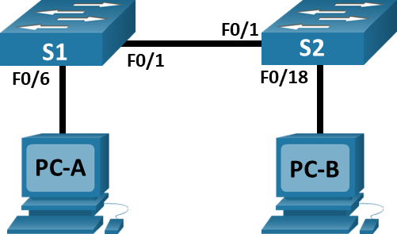
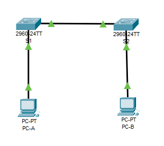

# Просмотр таблицы MAC-адресов коммутатора

## Топология


## Таблица адресации
|Устройство|Интерфейс|IP-адрес|Маска подсети|
|----------|---------|--------|-------------|
|S1|VLAN 1|192.168.1.11|255.255.255.0|
|S2|VLAN 1|192.168.1.12|255.255.255.0|
|PC-A|NIC|192.168.1.1|255.255.255.0|
|PC-B|NIC|192.168.1.2|255.255.255.0|

## Цели
1. Создание и настройка сети
2. Изучение таблицы МАС-адресов коммутатора

##  Решение
- [1. Создание и настройка сети](#1-создание-и-настройка-сети)
  - [Шаг 1. Подключите сеть в соответствии с топологией](#шаг-1-подключите-сеть-в-соответствии-с-топологией)
  - [Шаг 2. Настройте узлы ПК](#шаг-2-настройте-узлы-пк)
  - [Шаг 3. Выполните инициализацию и перезагрузку коммутаторов](#шаг-3-выполните-инициализацию-и-перезагрузку-коммутаторов)
  - [Шаг 4. Настройте базовые параметры каждого коммутатора](#шаг-4-настройте-базовые-параметры-каждого-коммутатора)
- [2. Изучение таблицы МАС-адресов коммутатора](#2-изучение-таблицы-мас-адресов-коммутатора)
  - [Шаг 1. Запишите МАС-адреса сетевых устройств](#шаг-1-запишите-мас-адреса-сетевых-устройств)
  - [Шаг 2. Просмотрите таблицу МАС-адресов коммутатора](#шаг-2-просмотрите-таблицу-мас-адресов-коммутатора)
  - [Шаг 3. Очистите таблицу МАС-адресов коммутатора S2 и снова отобразите таблицу МАС-адресов](#шаг-3-очистите-таблицу-мас-адресов-коммутатора-s2-и-снова-отобразите-таблицу-мас-адресов)
  - [Шаг 4. С компьютера PC-B отправьте эхо-запросы устройствам в сети и просмотрите таблицу МАС-адресов коммутатора](#шаг-4-с-компьютера-pc-b-отправьте-эхо-запросы-устройствам-в-сети-и-просмотрите-таблицу-мас-адресов-коммутатора)
- [Вопросы для повторения](#вопросы-для-повторения)


## 1. Создание и настройка сети
### Шаг 1. Подключите сеть в соответствии с топологией
В CPT получилась следующая топология:\

### Шаг 2. Настройте узлы ПК
Узлам PC-A и PC-B присвоены IP-адреса согласно таблице адресации:
```
C:\>ipconfig

FastEthernet0 Connection:(default port)

   Connection-specific DNS Suffix..: 
   Link-local IPv6 Address.........: FE80::230:F2FF:FE55:5558
   IPv6 Address....................: ::
   IPv4 Address....................: 192.168.1.1
   Subnet Mask.....................: 255.255.255.0
   Default Gateway.................: ::
                                     0.0.0.0
```
### Шаг 3. Выполните инициализацию и перезагрузку коммутаторов
Коммутатор уже инициализирован в эмуляторе, нужно произвести перезагрузку:
```
Switch#reload
Proceed with reload? [confirm]
```
### Шаг 4. Настройте базовые параметры каждого коммутатора
a. Настраиваем имя устройства и отключаем резолвинг доменных адресов
```
Switch#conf t
Switch(config)#hostname S1
S1(config)#no ip domain-lookup
```
b. Настраиваем IP
```
S1(config)#interface vlan 1
S1(config-if)#ip address 192.168.1.11 255.255.255.0
S1(config-if)#no shutdown
```
c. Назначаем пароль для консоли и vty
```
S1(config)#line con 0
S1(config-line)#password cisco
S1(config)#line vty 0 4
S1(config-line)#password cisco
S1(config-line)#login
```
d. Назначаем пароль для привилегированного режима и сохраняем конфигурацию
```
S1(config)#service password-encryption
S1(config)#enable secret class
S1(config)#banner motd #
S1(config)#^Z
S1#wr
Building configuration...
[OK]
```

## 2. Изучение таблицы МАС-адресов коммутатора
### Шаг 1. Запишите МАС-адреса сетевых устройств
a. На компьютерах PC-A и PC-B была выполнена команда ipconfig и получены MAC-адреса:
- MAC-адрес компьютера PC-A: 0030.F255.5558
- MAC-адрес компьютера PC-B: 0060.5CB3.6756
b. На коммутаторах S1 и S2 была выполнена команда show interface F0/1 | include bia и получены MAC-адреса порта коммутатора:
- МАС-адрес коммутатора S1 Fast Ethernet 0/1: 0001.c903.5a01
- МАС-адрес коммутатора S2 Fast Ethernet 0/1: 0001.4384.6601
### Шаг 2. Просмотрите таблицу МАС-адресов коммутатора
a. Подключение к коммутатору  и взод в привилегированный режим:
```
S2>en
```
b. Получаем вывод команды show mac address-table
```
S2#sh mac address-table 
          Mac Address Table
-------------------------------------------

Vlan    Mac Address       Type        Ports
----    -----------       --------    -----

   1    0001.c76e.6548    DYNAMIC     Fa0/1
   1    0001.c903.5a01    DYNAMIC     Fa0/1
   1    0030.f255.5558    DYNAMIC     Fa0/1
```
В выводе видим записи, которые соответствует MAC-адресам порта F0/1 коммутатора S1, PC-A которые мы записали на шаге 1. Но, также, здесь видим адрес 0001.c76e.6548, который принадлежит Vlan1 коммутатора S1. Например, если бы MAC-адрес коммутатора S2 не был записан ранее, а нам нужно определить устройство за этим адресом, то мы можем обратиться к колонке "Ports" вывода команды show mac address-table, где указывается порт, на котором нужно искать устройство, которому адрес принадлежит, и так, по цепочке, найти конечное устройство. Также, можно воспользоваться arp-протоколом и попробовать найти ip-адрес устройства, что тоже может помочь идентифицировать устройство, но это работает не всегда, так как arp таблица динамична и записи имеют время жизни, также, коммутаторы редко имеют IP-адрес во всех возможных сетях (обычно только в управляющей сети) и arp-запросы мало эффективны в таких случаях.
### Шаг 3. Очистите таблицу МАС-адресов коммутатора S2 и снова отобразите таблицу МАС-адресов
a. Выполним команду clear mac address-table dynamic
```
S2#clear mac address-table dynamic
```
Команда выполняется без вывода информации в консоль.
b. Сразу же выполним команду show mac address-table:
```
S2#show mac address-table
          Mac Address Table
-------------------------------------------

Vlan    Mac Address       Type        Ports
----    -----------       --------    -----

S2#
```
Видно, что таблица адресов стала пустая, поэтому ждём несколько секунд и выполним команду снова:
```
S2#show mac address-table
          Mac Address Table
-------------------------------------------

Vlan    Mac Address       Type        Ports
----    -----------       --------    -----

   1    0001.c903.5a01    DYNAMIC     Fa0/1
```
Запись MAC-адреса порта F0/1 коммутатора S1 снова появилась, но записей PC-A/B и новых уникальных записей в таблице нет.
### Шаг 4. С компьютера PC-B отправьте эхо-запросы устройствам в сети и просмотрите таблицу МАС-адресов коммутатора
a. Выполняем команду arp -a на PC-B:
```
C:\>arp -a
No ARP Entries Found
```
Пока arp-таблица на компьютере не имеет записей.\
b. Выполним ping до коммутаторов S1,S2 и до PC-A:
```
C:\>ping 192.168.1.1

Pinging 192.168.1.1 with 32 bytes of data:

Reply from 192.168.1.1: bytes=32 time<1ms TTL=128
Reply from 192.168.1.1: bytes=32 time<1ms TTL=128
Reply from 192.168.1.1: bytes=32 time<1ms TTL=128
Reply from 192.168.1.1: bytes=32 time<1ms TTL=128

Ping statistics for 192.168.1.1:
    Packets: Sent = 4, Received = 4, Lost = 0 (0% loss),
Approximate round trip times in milli-seconds:
    Minimum = 0ms, Maximum = 0ms, Average = 0ms

C:\>ping 192.168.1.11

Pinging 192.168.1.11 with 32 bytes of data:

Request timed out.
Reply from 192.168.1.11: bytes=32 time<1ms TTL=255
Reply from 192.168.1.11: bytes=32 time<1ms TTL=255
Reply from 192.168.1.11: bytes=32 time<1ms TTL=255

Ping statistics for 192.168.1.11:
    Packets: Sent = 4, Received = 3, Lost = 1 (25% loss),
Approximate round trip times in milli-seconds:
    Minimum = 0ms, Maximum = 0ms, Average = 0ms

C:\>ping 192.168.1.12

Pinging 192.168.1.12 with 32 bytes of data:

Request timed out.
Reply from 192.168.1.12: bytes=32 time<1ms TTL=255
Reply from 192.168.1.12: bytes=32 time<1ms TTL=255
Reply from 192.168.1.12: bytes=32 time<1ms TTL=255

Ping statistics for 192.168.1.12:
    Packets: Sent = 4, Received = 3, Lost = 1 (25% loss),
Approximate round trip times in milli-seconds:
    Minimum = 0ms, Maximum = 0ms, Average = 0ms

C:\>
```
Видим, что от всех устройств пришли ответы на эхо-запросы.\
c. Снова выполним show mac address-table на S2:
```
S2#show mac address-table
          Mac Address Table
-------------------------------------------

Vlan    Mac Address       Type        Ports
----    -----------       --------    -----

   1    0001.c76e.6548    DYNAMIC     Fa0/1
   1    0001.c903.5a01    DYNAMIC     Fa0/1
   1    0030.f255.5558    DYNAMIC     Fa0/1
   1    0060.5cb3.6756    DYNAMIC     Fa0/18
```
Видим, что снова добавились MAC-адреса PC-A (0030.f255.5558), PC-B (060.5cb3.6756) и Vlan1 коммутатора S1 (0001.c76e.6548).\
На PC-B также посмотрим arp -a:
```
C:\>arp -a
  Internet Address      Physical Address      Type
  192.168.1.1           0030.f255.5558        dynamic
  192.168.1.11          0001.c76e.6548        dynamic
  192.168.1.12          000a.f3d8.ba75        dynamic
```
В таблице находятся все записи узлов, до которых ранее выполнялся ping.
## Вопросы для повторения
#### Вопрос:
В сетях Ethernet данные передаются на устройства по соответствующим МАС-адресам. Для этого коммутаторы и компьютеры динамически создают ARP-кэш и таблицы МАС-адресов. Если компьютеров в сети немного, эта процедура выглядит достаточно простой. Какие сложности могут возникнуть в крупных сетях?
#### Ответ:
В крупных сетях многократно растёт ARP-кэш на устройствах (особенно в часы большой нагрузки) и громоздкая таблица MAC-адресов, которая должна храниться в памяти коммутатора и эта память имеет шанс переполниться, сам процесс опроса таблицы может быть гораздо медленне в крупной сети, если коммутатор имеет недостаточную производительность. Также, если на коммутатор будет поступать много кадров с MAC-адресом, которого нет в таблице устройства, то коммутатор будет вынужден делать broadcast-запросы во все порты, кроме того, из которого запрос пришёл. Если broadcast запросов будет много, это уже можно считать широковещательным штормом, который приводит к снижению производительности сети.