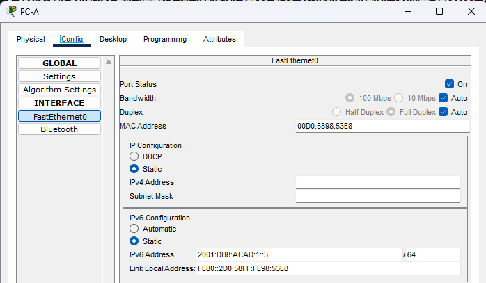
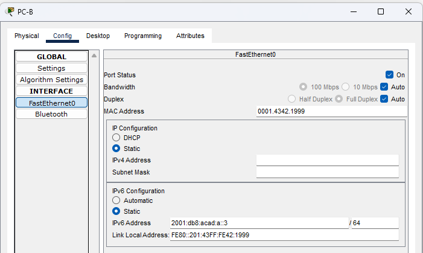
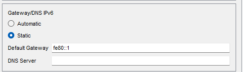

# Настройка IPv6-адресов на сетевых устройствах 

## Оглавление
- [Топология](#топология)
- [Таблица адресации](#таблица-адресации)
- [Задачи](#задачи)
- [Общие сведения/сценарий](#общие-сведениясценарий)
- [Необходимые ресурсы](#необходимые-ресурсы)
- [Решение](#решение)
  - [Часть 1. Настройка топологии и конфигурация основных параметров маршрутизатора и коммутатора](#часть-1-настройка-топологии-и-конфигурация-основных-параметров-маршрутизатора-и-коммутатора)
    - [Шаг 1. Настройте маршрутизатор](#шаг-1-настройте-маршрутизатор)
    - [Шаг 2. Настройте коммутатор.](#шаг-2-настройте-коммутатор)
  - [Часть 2. Ручная настройка IPv6-адресов](#часть-2-ручная-настройка-ipv6-адресов)
    - [Шаг 1. Назначьте IPv6-адреса интерфейсам Ethernet на R1.](#шаг-1-назначьте-ipv6-адреса-интерфейсам-ethernet-на-r1)
    - [Шаг 2. Активируйте IPv6-маршрутизацию на R1.](#шаг-2-активируйте-ipv6-маршрутизацию-на-r1)
    - [Шаг 3. Назначьте IPv6-адреса интерфейсу управления (SVI) на S1.](#шаг-3-назначьте-ipv6-адреса-интерфейсу-управления-svi-на-s1)
    - [Шаг 4. Назначьте компьютерам статические IPv6-адреса.](#шаг-4-назначьте-компьютерам-статические-ipv6-адреса)
  - [Часть 3. Проверка сквозного подключения](#часть-3-проверка-сквозного-подключения)
- [Вопросы для повторения](#вопросы-для-повторения)

## Топология


## Таблица адресации
|Устройство|Интерфейс|IPv6-адрес|Link local IPv6-адрес|Длина префикса|Шлюз по умолчанию|
|----------|---------|----------|---------------------|--------------|-----------------|
|R1|G0/0/0|2001:db8:acad:a::1|fe80::1|64|—|
|R1|G0/0/1|2001:db8:acad:1::1 |fe80::1|64|—|
|S1|VLAN 1|2001:db8:acad:1::b|fe80::b|64|—|
|PC-A|NIC|2001:db8:acad:1::3|SLACC|64|fe80::1|
|PC-B|NIC|2001:db8:acad:a::3|SLACC|64|fe80::1|

## Задачи
**Часть 1.** Настройка топологии и конфигурация основных параметров маршрутизатора и коммутатора\
**Часть 2.** Ручная настройка IPv6-адресов\
**Часть 3.** Проверка сквозного соединения

## Общие сведения/сценарий
В этой лабораторной работе  вы будете настраивать хосты и интерфейсы устройств с IPv6-адресами. Для просмотра индивидуальных и групповых IPv6-адресов вы будете использовать команду show. Вы также будете проверять сквозное соединение с помощью команд ping and traceroute.

## Необходимые ресурсы
- 1 Маршрутизатор (Cisco 4221 с универсальным образом Cisco IOS XE версии 16.9.4 или аналогичным);
- 1 коммутатор (Cisco 2960 с ПО Cisco IOS версии 15.2(2) с образом lanbasek9 или аналогичная модель);
- 2 ПК (Windows и программа эмуляции терминала, такая как Tera Term);
- Консольные кабели для настройки устройств Cisco IOS через консольные порты;
- Кабели Ethernet, расположенные в соответствии с топологией.

## Решение
### Часть 1. Настройка топологии и конфигурация основных параметров маршрутизатора и коммутатора

#### Шаг 1. Настройте маршрутизатор
Настроим имя хоста на роутере и включим оба интерфейса:
```
Router>en
Router#conf t
Router(config)#hostname R1
R1(config)#
R1(config)#int range gigabitEthernet 0/0/0-1
R1(config-if-range)#no shutdown 
```
#### Шаг 2. Настройте коммутатор.
Настроим имя хоста на коммутаторе, включим дуалстек и перезагрузим:
```
Switch>en
Switch#conf t
Switch(config)#hostname S1
S1(config)#sdm prefer dual-ipv4-and-ipv6 default
Changes to the running SDM preferences have been stored, but cannot take effect until the next reload.
Use 'show sdm prefer' to see what SDM preference is currently active.
S1(config)#end
S1#reload
```

### Часть 2. Ручная настройка IPv6-адресов

#### Шаг 1. Назначьте IPv6-адреса интерфейсам Ethernet на R1.

a. Назначьте глобальные индивидуальные IPv6-адреса, указанные в таблице адресации обоим интерфейсам Ethernet на R1.
```
R1#conf t
Enter configuration commands, one per line.  End with CNTL/Z.
R1(config)#int gi0/0/0
R1(config-if)#ipv6 address 2001:db8:acad:a::1/64
R1(config-if)#ipv6 address fe80::1 link-local 
R1(config-if)#int gi0/0/1
R1(config-if)#ipv6 address 2001:db8:acad:1::1/64
R1(config-if)#ipv6 address fe80::1 link-local 
```

b.	Введите команду ```show ipv6 interface brief```, чтобы проверить, назначен ли каждому интерфейсу корректный индивидуальный IPv6-адрес.
```
R1#show ipv6 interface brief 
GigabitEthernet0/0/0       [up/up]
    FE80::1
    2001:DB8:ACAD:A::1
GigabitEthernet0/0/1       [up/up]
    FE80::1
    2001:DB8:ACAD:1::1
Vlan1                      [administratively down/down]
    unassigned
```

Видим, что link-local и индивидуальные IPv6-адреса присвоены согласно таблицы адресации.

#### Шаг 2. Активируйте IPv6-маршрутизацию на R1.

a.	В командной строке на PC-B введите команду ipconfig, чтобы получить данные IPv6-адреса, назначенного интерфейсу ПК.

```
C:\>ipconfig

FastEthernet0 Connection:(default port)

   Connection-specific DNS Suffix..: 
   Link-local IPv6 Address.........: FE80::201:43FF:FE42:1999
   IPv6 Address....................: ::
   IPv4 Address....................: 0.0.0.0
   Subnet Mask.....................: 0.0.0.0
   Default Gateway.................: ::
                                     0.0.0.0
```
Интерфейсу PC-B назначен автоматически только link-local адрес, индивидуальный IPv6 не назначен.

b.	Активируйте IPv6-маршрутизацию на R1 с помощью команды IPv6 unicast-routing.

```
R1(config)#ipv6 unicast-routing
```

c.	Теперь, когда R1 входит в группу многоадресной рассылки всех маршрутизаторов, еще раз введите команду ipconfig на PC-B. Проверьте данные IPv6-адреса.

```
C:\>ipconfig

FastEthernet0 Connection:(default port)

   Connection-specific DNS Suffix..: 
   Link-local IPv6 Address.........: FE80::201:43FF:FE42:1999
   IPv6 Address....................: 2001:DB8:ACAD:A:201:43FF:FE42:1999
   IPv4 Address....................: 0.0.0.0
   Subnet Mask.....................: 0.0.0.0
   Default Gateway.................: FE80::1
                                     0.0.0.0
```
PC-B получил индивидуальный адрес и адрес шлюза с помощью SLAAC (только ещё нужно было перевести конфигурацию IPv6 на PC-B в Automatic из Static). 

#### Шаг 3. Назначьте IPv6-адреса интерфейсу управления (SVI) на S1.
a.	Назначьте адрес IPv6 для S1. Также назначьте этому интерфейсу локальный адрес канала fe80::b.
```
S1(config)#interface vlan 1
S1(config-if)#ipv6 address 2001:db8:acad:1::b/64
S1(config-if)#ipv6 address fe80::b link-local 
S1(config-if)#no shutdown 
```

b.	Проверьте правильность назначения IPv6-адресов интерфейсу управления с помощью команды show ipv6 interface vlan1.

```
S1#show ipv6 interface vlan 1
Vlan1 is up, line protocol is up
  IPv6 is enabled, link-local address is FE80::B
  No Virtual link-local address(es):
  Global unicast address(es):
    2001:DB8:ACAD:1::B, subnet is 2001:DB8:ACAD:1::/64
  Joined group address(es):
    FF02::1
    FF02::1:FF00:B
  MTU is 1500 bytes
  ICMP error messages limited to one every 100 milliseconds
  ICMP redirects are enabled
  ICMP unreachables are sent
  Output features: Check hwidb
  ND DAD is enabled, number of DAD attempts: 1
  ND reachable time is 30000 milliseconds
  Default router is 0.0.0.0 on Vlan1
```
Оба адреса присвоены корректно.

#### Шаг 4. Назначьте компьютерам статические IPv6-адреса.
Откройте окно Свойства Ethernet для каждого ПК и назначьте адресацию IPv6.
Ниже вкладки настроек адресации на PC-A/B:


Также, на каждом ПК задан шлюз по умолчанию:


### Часть 3. Проверка сквозного подключения
a. С PC-A отправьте эхо-запрос на FE80::1. Это локальный адрес канала, назначенный G 0/0/1 на R1.
```
C:\>ping fe80::1

Pinging fe80::1 with 32 bytes of data:

Reply from FE80::1: bytes=32 time<1ms TTL=255
Reply from FE80::1: bytes=32 time<1ms TTL=255
Reply from FE80::1: bytes=32 time<1ms TTL=255
Reply from FE80::1: bytes=32 time<1ms TTL=255

Ping statistics for FE80::1:
    Packets: Sent = 4, Received = 4, Lost = 0 (0% loss),
Approximate round trip times in milli-seconds:
    Minimum = 0ms, Maximum = 0ms, Average = 0ms
```
Видим, что все пакеты вернулись - связность работает. <br>

b. Отправьте эхо-запрос на интерфейс управления S1 с PC-A

```
C:\>ping fe80::b

Pinging fe80::b with 32 bytes of data:

Reply from FE80::B: bytes=32 time<1ms TTL=255
Reply from FE80::B: bytes=32 time<1ms TTL=255
Reply from FE80::B: bytes=32 time<1ms TTL=255
Reply from FE80::B: bytes=32 time<1ms TTL=255

Ping statistics for FE80::B:
    Packets: Sent = 4, Received = 4, Lost = 0 (0% loss),
Approximate round trip times in milli-seconds:
    Minimum = 0ms, Maximum = 0ms, Average = 0ms
```
Vlan1 коммутатора S1 доступен по linc-local адресу.

c. Введите команду tracert на PC-A, чтобы проверить наличие сквозного подключения к PC-B.  
```
C:\>tracert 2001:db8:acad:a::3

Tracing route to 2001:db8:acad:a::3 over a maximum of 30 hops: 

  1   0 ms      0 ms      0 ms      2001:DB8:ACAD:1::1
  2   0 ms      0 ms      0 ms      2001:DB8:ACAD:A::3

Trace complete.
```
В выводе команды видим, как наш пакет прошёл через маршрутизатор первым хопом, а потом уже пакет поступил на PC-B.

d. С PC-B отправьте эхо-запрос на PC-A.  
```
C:\>ping 2001:db8:acad:1::3

Pinging 2001:db8:acad:1::3 with 32 bytes of data:

Reply from 2001:DB8:ACAD:1::3: bytes=32 time<1ms TTL=127
Reply from 2001:DB8:ACAD:1::3: bytes=32 time<1ms TTL=127
Reply from 2001:DB8:ACAD:1::3: bytes=32 time<1ms TTL=127
Reply from 2001:DB8:ACAD:1::3: bytes=32 time<1ms TTL=127

Ping statistics for 2001:DB8:ACAD:1::3:
    Packets: Sent = 4, Received = 4, Lost = 0 (0% loss),
Approximate round trip times in milli-seconds:
    Minimum = 0ms, Maximum = 0ms, Average = 0ms
```
Видим, что все пакеты вернулись - связность работает В обе стороны. <br>

e. С PC-B отправьте эхо-запрос на локальный адрес канала G0/0 на R1.  
```
C:\>ping fe80::1

Pinging fe80::1 with 32 bytes of data:

Reply from FE80::1: bytes=32 time<1ms TTL=255
Reply from FE80::1: bytes=32 time<1ms TTL=255
Reply from FE80::1: bytes=32 time<1ms TTL=255
Reply from FE80::1: bytes=32 time=3ms TTL=255

Ping statistics for FE80::1:
    Packets: Sent = 4, Received = 4, Lost = 0 (0% loss),
Approximate round trip times in milli-seconds:
    Minimum = 0ms, Maximum = 3ms, Average = 0ms
```
Маршрутизатор по линк-локал адресу доступен с PC-B, но это и так было понятно, так как мы уже могли "достучаться" до PC-A, которой в другой сети, а для этого PC-B нужно обратиться к шлюзу FE80::1 и без его доступности ничего бы не сработало.

## Вопросы для повторения
1.	Почему обоим интерфейсам Ethernet на R1 можно назначить один и тот же локальный адрес канала — FE80::1? \
Ответ: пакеты отправленные на link-local адрес никогда не выйдут за пределы интерфейса маршрутизатора, поэтому адрес link-local может повторяться на интрефейсах.
2.	Какой идентификатор подсети в индивидуальном IPv6-адресе 2001:db8:acad::aaaa:1234/64?\
Ответ: 0000