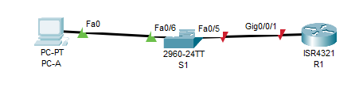

# Доступ к сетевым устройствам по протоколу SSH

## Топология


## Таблица адресации
|Устройство|Интерфейс|IP-адрес|Маска подсети|Шлюз по умолчанию|
|----------|---------|--------|-------------|-----------------|
|R1|G0/0/1|192.168.1.1|255.255.255.0|-|
|S1|VLAN 1|192.168.1.11|255.255.255.0|192.168.1.1|
|PC-A|NIC|192.168.1.3|255.255.255.0|192.168.1.1|

## Задачи
**Часть 1.** Настройка основных параметров устройства\
**Часть 2.** Настройка маршрутизатора для доступа по протоколу SSH\
**Часть 3.** Настройка коммутатора для доступа по протоколу SSH\
**Часть 4.** SSH через интерфейс командной строки (CLI) коммутатора

##	Общие сведения/сценарий
Раньше для удаленной настройки сетевых устройств в основном применялся протокол Telnet. Однако он не обеспечивает шифрование информации, передаваемой между клиентом и сервером, что позволяет анализаторам сетевых пакетов перехватывать пароли и данные конфигурации.\
Secure Shell (SSH) — это сетевой протокол, устанавливающий безопасное подключение с эмуляцией терминала к маршрутизатору или иному сетевому устройству. Протокол SSH шифрует все сведения, которые поступают по сетевому каналу, и предусматривает аутентификацию удаленного компьютера. Протокол SSH все больше заменяет Telnet — именно его выбирают сетевые специалисты в качестве средства удаленного входа в систему. SSH чаще всего используется для входа на удаленное устройство и выполнения команд. Но это может также передавать файлы по связанным протоколам SFTP или SCP.\
Чтобы протокол SSH мог работать, на сетевых устройствах, взаимодействующих между собой, должна быть настроена поддержка SSH. В этой лабораторной работе необходимо включить SSH-сервер на маршрутизаторе, после чего подключиться к этому маршрутизатору, используя ПК с установленным клиентом SSH. В локальной сети подключение обычно устанавливается с помощью Ethernet и IP.

##	Необходимые ресурсы
- 1 Маршрутизатор (Cisco 4221 с универсальным образом Cisco IOS XE версии 16.9.4 или аналогичным)
- 1 коммутатор (Cisco 2960 с ПО Cisco IOS версии 15.2(2) с образом lanbasek9 или аналогичная модель)
- 1 ПК (под управлением Windows с программой эмуляции терминала, например, Tera Term)
- Консольные кабели для настройки устройств Cisco IOS через консольные порты.
- Кабели Ethernet, расположенные в соответствии с топологией

##  Решение
### Часть 1. Настройка основных параметров устройств
#### Шаг 1. Создайте сеть согласно топологии.

#### Шаг 2. Выполните инициализацию и перезагрузку маршрутизатора и коммутатора.
Инициализируем и перезагружаем маршрутизатор:
```
Router>en
Router#conf t
Router(config)#hostname R1
```
И коммутатор:
```
Switch>en
Switch#conf t
Enter configuration commands, one per line.  End with CNTL/Z.
Switch(config)#hostname S1
```
#### Шаг 3. Настройте маршрутизатор.
a. Подключитесь к маршрутизатору с помощью консоли и активируйте привилегированный режим EXEC.
```
R1>en
```
b. Войдите в режим конфигурации.
```
R1#conf t
```
c. Отключите поиск DNS, чтобы предотвратить попытки маршрутизатора неверно преобразовывать введенные команды таким образом, как будто они являются именами узлов.
```
R1(config)#no ip domain-lookup
```
d. Назначьте class в качестве зашифрованного пароля привилегированного режима EXEC.
```
R1(config)#enable secret class
```
e. Назначьте cisco в качестве пароля консоли и включите вход в систему по паролю.
```
R1(config)#line con 0
R1(config-line)#password cisco
R1(config-line)#login
```
f. Назначьте cisco в качестве пароля VTY и включите вход в систему по паролю.
```
R1(config-line)#line vty 0 4
R1(config-line)#password cisco
R1(config-line)#login
```
g. Зашифруйте открытые пароли.
```
R1(config)#service password-encryption
```
h. Создайте баннер, который предупреждает о запрете несанкционированного доступа.
```
R1(config)#banner motd #
Enter TEXT message.  End with the character '#'.
You shall not pass!
#
```
i. Настройте и активируйте на маршрутизаторе интерфейс G0/0/1, используя информацию, приведенную в таблице адресации.
```
R1(config)#int g0/0/1
R1(config-if)#ip address 192.168.1.1 255.255.255.0
R1(config-if)#no shutdown
```
j. Сохраните текущую конфигурацию в файл загрузочной конфигурации.
```
R1#wr
Building configuration...
[OK]
```

#### Шаг 4. Настройте компьютер PC-A.
Настройте для PC-A IP-адрес,маску подсети и шлюз по умолчанию.
```
C:\>ipconfig

FastEthernet0 Connection:(default port)

   Connection-specific DNS Suffix..: 
   Link-local IPv6 Address.........: FE80::201:64FF:FE71:8A43
   IPv6 Address....................: ::
   IPv4 Address....................: 192.168.1.3
   Subnet Mask.....................: 255.255.255.0
   Default Gateway.................: ::
                                     192.168.1.1

```
#### Шаг 5. Проверьте подключение к сети.
```
C:\>ping 192.168.1.1

Pinging 192.168.1.1 with 32 bytes of data:

Reply from 192.168.1.1: bytes=32 time<1ms TTL=255
Reply from 192.168.1.1: bytes=32 time<1ms TTL=255
Reply from 192.168.1.1: bytes=32 time<1ms TTL=255
Reply from 192.168.1.1: bytes=32 time<1ms TTL=255

Ping statistics for 192.168.1.1:
    Packets: Sent = 4, Received = 4, Lost = 0 (0% loss),
Approximate round trip times in milli-seconds:
    Minimum = 0ms, Maximum = 0ms, Average = 0ms
```

### Часть 2. Настройка маршрутизатора для доступа по протоколу SSH
#### Шаг 1. Настройте аутентификацию устройств.
a. Задайте имя устройства.
```
hostname R1
```
b. Задайте домен для устройства.
```
R1(config)#ip domain-name otus.ru
```
#### Шаг 2. Создайте ключ шифрования с указанием его длины.
```
R1(config)#crypto key generate rsa
The name for the keys will be: R1.otus.ru
Choose the size of the key modulus in the range of 360 to 4096 for your
  General Purpose Keys. Choosing a key modulus greater than 512 may take
  a few minutes.

How many bits in the modulus [512]: 2048
% Generating 2048 bit RSA keys, keys will be non-exportable...[OK]
```
#### Шаг 3. Создайте имя пользователя в локальной базе учетных записей.
```
R1(config)#username admin secret Adm1nP@55
```
#### Шаг 4. Активируйте протокол SSH на линиях VTY.
a. Активируйте протоколы Telnet и SSH на входящих линиях VTY с помощью команды transport input.
```
R1(config)#ip ssh version 2
R1(config)#line vty 0 4
R1(config-line)#transport input all
```
b. Измените способ входа в систему таким образом, чтобы использовалась проверка пользователей по локальной базе учетных записей.
```
R1(config-line)#login local
```
#### Шаг 5. Сохраните текущую конфигурацию в файл загрузочной конфигурации.
```
R1(config-line)#end
R1#
%SYS-5-CONFIG_I: Configured from console by console

R1#wr
Building configuration...
[OK]
```
#### Шаг 6. Установите соединение с маршрутизатором по протоколу SSH.
```
C:\>ssh -l admin 192.168.1.1

Password: 

You shall not pass!

R1>en
Password: 
R1#exit
```
Соединение с роутером R1 по протоколу SSH успешно установлено.

### Часть 3. Настройка коммутатора для доступа по протоколу SSH
#### Шаг 1. Настройте основные параметры коммутатора.
Откройте окно конфигурации
a. Подключитесь к коммутатору с помощью консольного подключения и активируйте привилегированный режим EXEC.
b. Войдите в режим конфигурации.
```
Switch>en
Switch#conf t
Switch(config)#hostname S1
S1(config)#
```
c. Отключите поиск DNS, чтобы предотвратить попытки маршрутизатора неверно преобразовывать введенные команды таким образом, как будто они являются именами узлов.
```
S1(config)#no ip domain-lookup
```
d. Назначьте class в качестве зашифрованного пароля привилегированного режима EXEC.
e. Назначьте cisco в качестве пароля консоли и включите вход в систему по паролю.
f. Назначьте cisco в качестве пароля VTY и включите вход в систему по паролю.
g. Зашифруйте открытые пароли.
```
S1(config)#enable secret class
S1(config)#line con 0
S1(config-line)#password cisco
S1(config-line)#login
S1(config-line)#line vty 0 4
S1(config-line)#password cisco
S1(config-line)#login
S1(config-line)#service password-encryption
```
h. Создайте баннер, который предупреждает о запрете несанкционированного доступа.
```
S1(config)#banner motd #
Enter TEXT message.  End with the character '#'.
You shall not pass!
#
```
i. Настройте и активируйте на коммутаторе интерфейс VLAN 1, используя информацию, приведенную в таблице адресации.
```
S1(config)#int vlan 1
S1(config-if)#ip address 192.168.1.11 255.255.255.0
S1(config-if)#no shut
S1(config-if)#exit
S1(config)#ip default-gateway 192.168.1.1
```
j. Сохраните текущую конфигурацию в файл загрузочной конфигурации.
```
S1(config)#end
S1#wr
Building configuration...
[OK]
```
#### Шаг 2. Настройте коммутатор для соединения по протоколу SSH.
a. Настройте имя устройства, как указано в таблице адресации.\
b. Задайте домен для устройства.\
c. Создайте ключ шифрования с указанием его длины.\
d. Создайте имя пользователя в локальной базе учетных записей.\
e. Активируйте протоколы Telnet и SSH на линиях VTY.\
f. Измените способ входа в систему таким образом, чтобы использовалась проверка пользователей по локальной базе учетных записей.
```
S1(config)#hostname S1
S1(config)#ip domain-name otus.ru
S1(config)#crypto key generate rsa
The name for the keys will be: S1.otus.ru
Choose the size of the key modulus in the range of 360 to 4096 for your
  General Purpose Keys. Choosing a key modulus greater than 512 may take
  a few minutes.

How many bits in the modulus [512]: 2048
% Generating 2048 bit RSA keys, keys will be non-exportable...[OK]

S1(config)#username admin secret Adm1nP@55
*Mar 1 0:31:14.947: %SSH-5-ENABLED: SSH 1.99 has been enabled
S1(config)#line vty 0 4
S1(config-line)#transport input all
S1(config-line)#login local
```
#### Шаг 3. Установите соединение с коммутатором по протоколу SSH.
```
C:\>ssh -l admin 192.168.1.11

Password: 


You shall not pass!


S1>en
Password: 
S1#
```
Соединение с коммутатором S1 успешно установлено по протоколу SSH.

### Часть 4. Настройка протокола SSH с использованием интерфейса командной строки (CLI) коммутатора
#### Шаг 1. Посмотрите доступные параметры для клиента SSH в Cisco IOS.
```
S1#ssh ?
  -l  Log in using this user name
  -v  Specify SSH Protocol Version
```
#### Шаг 2. Установите с коммутатора S1 соединение с маршрутизатором R1 по протоколу SSH.
a. Чтобы подключиться к маршрутизатору R1 по протоколу SSH, введите команду –l admin. Это позволит вам войти в систему под именем admin. При появлении приглашения введите в качестве пароля Adm1nP@55
```
S1#ssh -l admin 192.168.1.1

Password: 

You shall not pass!

R1>en
Password: 
R1#
```
b. Чтобы вернуться к коммутатору S1, не закрывая сеанс SSH с маршрутизатором R1, нажмите комбинацию клавиш Ctrl+Shift+6. Отпустите клавиши Ctrl+Shift+6 и нажмите x. Отображается приглашение привилегированного режима EXEC коммутатора.\
c. Чтобы вернуться к сеансу SSH на R1, нажмите клавишу Enter в пустой строке интерфейса командной строки. Чтобы увидеть окно командной строки маршрутизатора, нажмите клавишу Enter еще раз.
```
R1#
S1#
S1#
[Resuming connection 1 to 192.168.1.1 ... ]

R1#
```
d. Чтобы завершить сеанс SSH на маршрутизаторе R1, введите в командной строке маршрутизатора команду exit.
```
R1#exit

[Connection to 192.168.1.1 closed by foreign host]
S1#
```
**Вопрос:**
Какие версии протокола SSH поддерживаются при использовании интерфейса командной строки?\
**Ответ:** это версии 1 и 2
```
S1(config)#ip ssh version ?
  <1-2>  Protocol version
```
## Вопрос для повторения
**Вопрос:** Как предоставить доступ к сетевому устройству нескольким пользователям, у каждого из которых есть собственное имя пользователя?\
**Ответ:** нужно создать каждого пользователя в базе устройства (если предполагается использование локальной базы устройства, а не стороннего сервера) c помощью команды username.
