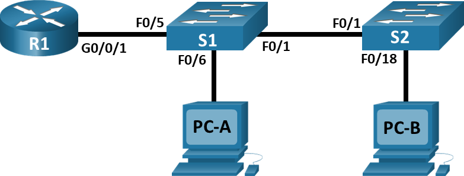

# Внедрение маршрутизации между виртуальными локальными сетями 

## Оглавление
- [Топология](#топология)
- [Таблица адресации](#таблица-адресации)
- [Таблица VLAN](#таблица-vlan)
- [Задачи](#задачи)
- [Общие сведения/сценарий](#общие-сведениясценарий)
- [Необходимые ресурсы](#необходимые-ресурсы)
- [Решение](#решение)
  - [Часть 1. Создание сети и настройка основных параметров устройства](#часть-1-создание-сети-и-настройка-основных-параметров-устройства)
    - [Шаг 1. Создайте сеть согласно топологии.](#шаг-1-создайте-сеть-согласно-топологии)
    - [Шаг 2. Настройте базовые параметры для маршрутизатора.](#шаг-2-настройте-базовые-параметры-для-маршрутизатора)
    - [Шаг 3. Настройте базовые параметры каждого коммутатора.](#шаг-3-настройте-базовые-параметры-каждого-коммутатора)
    - [Шаг 4. Настройте узлы ПК.](#шаг-4-настройте-узлы-пк)
  - [Часть 2. Создание сетей VLAN и назначение портов коммутатора](#часть-2-создание-сетей-vlan-и-назначение-портов-коммутатора)
    - [Шаг 1. Создайте сети VLAN на коммутаторах.](#шаг-1-создайте-сети-vlan-на-коммутаторах)
    - [Шаг 2. Назначьте сети VLAN соответствующим интерфейсам коммутатора.](#шаг-2-назначьте-сети-vlan-соответствующим-интерфейсам-коммутатора)
  - [Часть 3. Конфигурация магистрального канала стандарта 802.1Q между коммутаторами](#часть-3-конфигурация-магистрального-канала-стандарта-8021q-между-коммутаторами)
    - [Шаг 1. Вручную настройте магистральный интерфейс F0/1 на коммутаторах S1 и S2.](#шаг-1-вручную-настройте-магистральный-интерфейс-f01-на-коммутаторах-s1-и-s2)
    - [Шаг 2. Вручную настройте магистральный интерфейс F0/5 на коммутаторе S1.](#шаг-2-вручную-настройте-магистральный-интерфейс-f05-на-коммутаторе-s1)
  - [Часть 4. Настройка маршрутизации между сетями VLAN](#часть-4-настройка-маршрутизации-между-сетями-vlan)
    - [Шаг 1. Настройте маршрутизатор.](#шаг-1-настройте-маршрутизатор)
  - [Часть 5. Проверьте, работает ли маршрутизация между VLAN](#часть-5-проверьте-работает-ли-маршрутизация-между-vlan)
    - [Шаг 1. Выполните следующие тесты с PC-A. Все должно быть успешно.](#шаг-1-выполните-следующие-тесты-с-pc-a-все-должно-быть-успешно)
    - [Шаг 2. Пройдите следующий тест с PC-B](#шаг-2-пройдите-следующий-тест-с-pc-b)


## Топология


## Таблица адресации
|Устройство|Интерфейс|IP-адрес|Маска подсети|Шлюз по умолчанию|
|----------|---------|--------|-------------|-----------------|
|R1|G0/0/1.10|192.168.10.1|255.255.255.0|-|
|-|G0/0/1.20|192.168.20.1|255.255.255.0|-|
|-|G0/0/1.30|192.168.30.1|255.255.255.0|-|
|-|G0/0/1.1000|-|-|-|
|S1|VLAN 10|192.168.10.11|255.255.255.0|192.168.10.1|
|S2|VLAN 10|192.168.10.12|255.255.255.0|192.168.10.1|
|PC-A|NIC|192.168.20.3|255.255.255.0|192.168.20.1|
|PC-B|NIC|192.168.30.3|255.255.255.0|192.168.30.1|
## Таблица VLAN
|VLAN|Имя|Назначенный интерфейс|
|----|---|---------------------|
|10|Управление|S1: VLAN 10<br>S2: VLAN 10|
|20|Sales|S1: F0/6|
|30|Operations|S2: F0/18|
|999|Parking_Lot|S1: F0/2-4, F0/7-24, G0/1-2<br>S2: F0/2-17, F0/19-24, G0/1-2|
|1000|Собственная|-|
## Задачи
**Часть 1.** Создание сети и настройка основных параметров устройства.\
**Часть 2.** Создание сетей VLAN и назначение портов коммутатора.\
**Часть 3.** Настройка транка 802.1Q между коммутаторами.\
**Часть 4.** Настройка маршрутизации между сетями VLAN.\
**Часть 5.** Проверка, что маршрутизация между VLAN работает.\

##	Общие сведения/сценарий
В целях повышения производительности сети большие широковещательные домены 2-го уровня делят на домены меньшего размера. Для этого современные коммутаторы используют виртуальные локальные сети (VLAN). VLAN также можно использовать в качестве меры безопасности, отделяя конфиденциальный трафик данных от остальной части сети. Сети VLAN облегчают процесс проектирования сети, обеспечивающей помощь в достижении целей организации. Для связи между VLAN требуется устройство, работающее на уровне 3 модели OSI. Добавление маршрутизации между VLAN позволяет организации разделять и разделять широковещательные домены, одновременно позволяя им обмениваться данными друг с другом.\
Транковые каналы сети VLAN используются для распространения сетей VLAN по различным устройствам. Транковые каналы разрешают передачу трафика из множества сетей VLAN через один канал, не нанося вред идентификации и сегментации сети VLAN. Особый вид маршрутизации между VLAN, называемый «Router-on-a-Stick», использует магистраль от маршрутизатора к коммутатору, чтобы все VLAN могли переходить к маршрутизатору.\
В этой лабораторной работе вы создадите VLAN на обоих коммутаторах в топологии, назначите VLAN для коммутации портов доступа, убедитесь, что VLAN работают должным образом, создадите транки VLAN между двумя коммутаторами и между S1 и R1, и настройте маршрутизацию между VLAN на R1 для разрешения связи между хостами в разных VLAN независимо от подсети, в которой находится хост.
##	Необходимые ресурсы
- 1 Маршрутизатор (Cisco 4221 с универсальным образом Cisco IOS XE версии 16.9.4 или аналогичным).
- 2 коммутатора (Cisco 2960 с операционной системой Cisco IOS 15.2(2) (образ lanbasek9) или аналогичная модель).
- 2 ПК (ОС Windows с программой эмуляции терминалов, такой как Tera Term).
- Консольные кабели для настройки устройств Cisco IOS через консольные порты.
- Кабели Ethernet, расположенные в соответствии с топологией.
##  Решение
### Часть 1. Создание сети и настройка основных параметров устройства
#### Шаг 1. Создайте сеть согласно топологии.

#### Шаг 2. Настройте базовые параметры для маршрутизатора.
a. Подключитесь к маршрутизатору с помощью консоли и активируйте привилегированный режим EXEC.\
b. Войдите в режим конфигурации.\
c. Назначьте маршрутизатору имя устройства.\
d. Отключите поиск DNS, чтобы предотвратить попытки маршрутизатора неверно преобразовывать введенные команды таким образом, как будто они являются именами узлов.\
e. Назначьте class в качестве зашифрованного пароля привилегированного режима EXEC.\
f. Назначьте cisco в качестве пароля консоли и включите вход в систему по паролю.\
g. Установите cisco в качестве пароля виртуального терминала и активируйте вход.\
h. Зашифруйте открытые пароли.\
i. Создайте баннер с предупреждением о запрете несанкционированного доступа к устройству.\
j. Сохраните текущую конфигурацию в файл загрузочной конфигурации.\
k. Настройте на маршрутизаторе время.
```
Router>en
Router#conf t
Router(config)#enable secret class
Router(config)#line con 0
Router(config-line)#password cisco
Router(config-line)#login
Router(config-line)#line vty 0 4
Router(config-line)#password cisco
Router(config-line)#login
Router(config-line)#service password-encryption
Router(config)#hostname R1
R1(config)#end
R1#wr
Building configuration...
[OK]
R1#clock set 21:50:00 Oct 23 2025
R1#show clock 
21:50:7.454 UTC Thu Oct 23 2025
```
#### Шаг 3. Настройте базовые параметры каждого коммутатора.
a. Присвойте коммутатору имя устройства.
b. Отключите поиск DNS, чтобы предотвратить попытки маршрутизатора неверно преобразовывать введенные команды таким образом, как будто они являются именами узлов.
c. Назначьте class в качестве зашифрованного пароля привилегированного режима EXEC.
d. Назначьте cisco в качестве пароля консоли и включите вход в систему по паролю.
e. Установите cisco в качестве пароля виртуального терминала и активируйте вход.
f. Зашифруйте открытые пароли.
g. Создайте баннер с предупреждением о запрете несанкционированного доступа к устройству.
h. Настройте на коммутаторах время.
i. Сохранение текущей конфигурации в качестве начальной.
```
Switch>en
Switch#conf t
Switch(config)#enable secret class
Switch(config)#line con 0
Switch(config-line)#password cisco
Switch(config-line)#login
Switch(config-line)#line vty 0 4
Switch(config-line)#password cisco
Switch(config-line)#login
Switch(config-line)#service password-encryption
Switch(config)#hostname S1
S1(config)#end
S1#wr
Building configuration...
[OK]
S1#clock set 21:50:00 Oct 23 2025
S1#show clock
21:50:2.223 UTC Thu Oct 23 2025
```
#### Шаг 4. Настройте узлы ПК.
PC-A:
```
C:\>ipconfig

FastEthernet0 Connection:(default port)

   Connection-specific DNS Suffix..: 
   Link-local IPv6 Address.........: FE80::201:64FF:FE2A:E56D
   IPv6 Address....................: ::
   IPv4 Address....................: 192.168.20.3
   Subnet Mask.....................: 255.255.255.0
   Default Gateway.................: ::
                                     192.168.20.1
```
PC-B:
```
C:\>ipconfig

FastEthernet0 Connection:(default port)

   Connection-specific DNS Suffix..: 
   Link-local IPv6 Address.........: FE80::201:64FF:FE2A:E56D
   IPv6 Address....................: ::
   IPv4 Address....................: 192.168.30.3
   Subnet Mask.....................: 255.255.255.0
   Default Gateway.................: ::
                                     192.168.30.1
```
### Часть 2. Создание сетей VLAN и назначение портов коммутатора
#### Шаг 1. Создайте сети VLAN на коммутаторах.
a. Создайте и назовите необходимые VLAN на каждом коммутаторе из таблицы выше.
Откройте окно конфигурации.\
b. Настройте интерфейс управления и шлюз по умолчанию на каждом коммутаторе, используя информацию об IP-адресе в таблице адресации.\
c. Назначьте все неиспользуемые порты коммутатора VLAN Parking_Lot, настройте их для статического режима доступа и административно деактивируйте их.\
**S1:**
```
S1#conf t
S1(config)#vlan 10
S1(config-vlan)#name Management
S1(config-vlan)#vlan 20
S1(config-vlan)#name Sales
S1(config-vlan)#vlan 30
S1(config-vlan)#name Operations
S1(config-vlan)#vlan 999
S1(config-vlan)#name Parking_Lot
S1(config-vlan)#vlan 1000
S1(config-vlan)#name Self
S1(config)#int range f0/2-4,f0/7-24,G0/1-2
S1(config-if-range)#shut
S1(config-if-range)#switchport mode access 
S1(config-if-range)#switchport access vlan 999
S1(config-vlan)#int vlan 10
S1(config-if)#ip address 192.168.10.11 255.255.255.0
S1(config-if)#no shut
S1(config-if)#ex
S1(config)#ip default-gateway 192.168.10.1
```
**S2:**
```
S2#conf t
Enter configuration commands, one per line.  End with CNTL/Z.
S2(config)#vlan 10
S2(config-vlan)#name Management
S2(config-vlan)#vlan 20
S2(config-vlan)#name Sales
S2(config-vlan)#vlan 30
S2(config-vlan)#name Operations
S2(config-vlan)#vlan 999
S2(config-vlan)#name Parking_Lot
S2(config-vlan)#vlan 1000
S2(config-vlan)#name Self
S2(config)#int range f0/2-17,f0/19-24,G0/1-2
S2(config-if-range)#shut
S2(config-if-range)#switchport mode access 
S2(config-if-range)#switchport access vlan 999
S2(config-vlan)#int vlan 10
S2(config-if)#ip address 192.168.10.12 255.255.255.0
S2(config-if)#no shut
S2(config-if)#ex
S2(config)#ip default-gateway 192.168.10.1
```
#### Шаг 2. Назначьте сети VLAN соответствующим интерфейсам коммутатора.
a. Назначьте используемые порты соответствующей VLAN (указанной в таблице VLAN выше) и настройте их для режима статического доступа.\
b. Убедитесь, что VLAN назначены на правильные интерфейсы.\
**S1:**
```
S1(config-vlan)#int f0/6
S1(config-if)#switchport mode access 
S1(config-if)#switchport access vlan 20
```
**S2:**
```
S2(config-vlan)#int f0/18
S2(config-if)#switchport mode access 
S2(config-if)#switchport access vlan 30
```
### Часть 3. Конфигурация магистрального канала стандарта 802.1Q между коммутаторами
#### Шаг 1. Вручную настройте магистральный интерфейс F0/1 на коммутаторах S1 и S2.
a. Настройка статического транкинга на интерфейсе F0/1 для обоих коммутаторов.\
b. Установите native VLAN 1000 на обоих коммутаторах.\
c. Укажите, что VLAN 10, 20, 30 и 1000 могут проходить по транку.\
d. Проверьте транки, native VLAN и разрешенные VLAN через транк.
```
S1(config)#int fa0/1
S1(config-if)#switchport mode trunk 
S1(config-if)#switchport trunk native vlan 1000
S1(config-if)#switchport trunk allowed vlan 10,20,30,1000
```
#### Шаг 2. Вручную настройте магистральный интерфейс F0/5 на коммутаторе S1.
a. Настройте интерфейс S1 F0/5 с теми же параметрами транка, что и F0/1. Это транк до маршрутизатора.\
b. Сохраните текущую конфигурацию в файл загрузочной конфигурации.\
c. Проверка транкинга.\
```
S1(config)#int fa0/5
S1(config-if)#switchport mode trunk 
S1(config-if)#switchport trunk native vlan 1000
S1(config-if)#switchport trunk allowed vlan 10,20,30,1000
S1(config-if)#^Z
S1#wr
Building configuration...
[OK]
```
**Вопрос:** Что произойдет, если G0/0/1 на R1 будет отключен?\
**Ответ:** Линк между G0/0/1 и fa0/5 не будет поднят.
### Часть 4. Настройка маршрутизации между сетями VLAN
#### Шаг 1. Настройте маршрутизатор.
a. При необходимости активируйте интерфейс G0/0/1 на маршрутизаторе.\
b. Настройте подинтерфейсы для каждой VLAN, как указано в таблице IP-адресации. Все подинтерфейсы используют инкапсуляцию 802.1Q. Убедитесь, что подинтерфейсу для native VLAN не назначен IP-адрес. Включите описание для каждого подинтерфейса.\
c. Убедитесь, что вспомогательные интерфейсы работают.
```
R1#conf t
R1(config)#int g0/0/1
R1(config-if)#no shut
R1(config-if)#int g0/0/1.10
R1(config-subif)#description Management
R1(config-subif)#encapsulation dot1Q 10
R1(config-subif)ip address 192.168.10.1 255.255.255.0
R1(config-if)#int g0/0/1.20
R1(config-subif)#description Management
R1(config-subif)#encapsulation dot1Q 20
R1(config-subif)ip address 192.168.20.1 255.255.255.0
R1(config-if)#int g0/0/1.30
R1(config-subif)#description Management
R1(config-subif)#encapsulation dot1Q 30
R1(config-subif)ip address 192.168.30.1 255.255.255.0
R1(config-if)#int g0/0/1.1000
R1(config-subif)#description Management
R1(config-subif)#encapsulation dot1Q 1000 native
R1(config-subif)^Z
R1#wr
Building configuration...
[OK]
```
### Часть 5. Проверьте, работает ли маршрутизация между VLAN
#### Шаг 1. Выполните следующие тесты с PC-A. Все должно быть успешно.
Примечание. Возможно, вам придется отключить брандмауэр ПК для работы ping
a. Отправьте эхо-запрос с PC-A на шлюз по умолчанию.
```
C:\>ping 192.168.20.1

Pinging 192.168.20.1 with 32 bytes of data:

Reply from 192.168.20.1: bytes=32 time<1ms TTL=255
Reply from 192.168.20.1: bytes=32 time<1ms TTL=255
Reply from 192.168.20.1: bytes=32 time<1ms TTL=255
Reply from 192.168.20.1: bytes=32 time<1ms TTL=255

Ping statistics for 192.168.20.1:
    Packets: Sent = 4, Received = 4, Lost = 0 (0% loss),
Approximate round trip times in milli-seconds:
    Minimum = 0ms, Maximum = 0ms, Average = 0ms
```
b. Отправьте эхо-запрос с PC-A на PC-B.
```
C:\>ping 192.168.30.3

Pinging 192.168.30.3 with 32 bytes of data:

Reply from 192.168.30.3: bytes=32 time<1ms TTL=127
Reply from 192.168.30.3: bytes=32 time<1ms TTL=127
Reply from 192.168.30.3: bytes=32 time<1ms TTL=127
Reply from 192.168.30.3: bytes=32 time<1ms TTL=127

Ping statistics for 192.168.30.3:
    Packets: Sent = 4, Received = 4, Lost = 0 (0% loss),
Approximate round trip times in milli-seconds:
    Minimum = 0ms, Maximum = 0ms, Average = 0ms
```
Видим, что маршрутизация между vlan 20 и 30 работает корректно.
c. Отправьте команду ping с компьютера PC-A на коммутатор S2.
```
C:\>ping 192.168.10.12

Pinging 192.168.10.12 with 32 bytes of data:

Reply from 192.168.10.12: bytes=32 time<1ms TTL=254
Reply from 192.168.10.12: bytes=32 time<1ms TTL=254
Reply from 192.168.10.12: bytes=32 time<1ms TTL=254
Reply from 192.168.10.12: bytes=32 time<1ms TTL=254

Ping statistics for 192.168.10.12:
    Packets: Sent = 4, Received = 4, Lost = 0 (0% loss),
Approximate round trip times in milli-seconds:
    Minimum = 0ms, Maximum = 0ms, Average = 0ms
```
#### Шаг 2. Пройдите следующий тест с PC-B
В окне командной строки на PC-B выполните команду tracert на адрес PC-A.
```
C:\>tracert 192.168.20.3

Tracing route to 192.168.20.3 over a maximum of 30 hops: 

  1   0 ms      0 ms      0 ms      192.168.30.1
  2   0 ms      0 ms      0 ms      192.168.20.3

Trace complete.
```
**Вопрос:** Какие промежуточные IP-адреса отображаются в результатах?\
**Ответ:** 192.168.30.1 - шлюз по-умолчанию (R1) в vlan 30 и сам адрес PC-A (192.168.20.3)