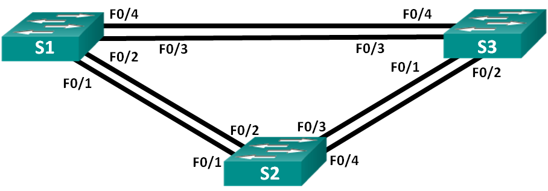
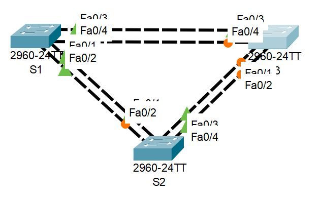
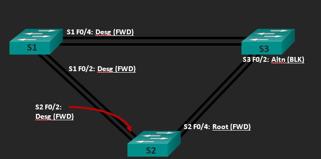

# Развертывание коммутируемой сети с резервными каналами

## Оглавление
- [Топология](#топология)
- [Таблица адресации](#таблица-адресации)
- [Задачи](#задачи)
- [Общие сведения/сценарий](#общие-сведениясценарий)
- [Необходимые ресурсы](#необходимые-ресурсы)
- [Решение](#решение)
  - [Часть 1. Создание сети и настройка основных параметров устройства](#часть-1-создание-сети-и-настройка-основных-параметров-устройства)
    - [Шаг 1. Создайте сеть согласно топологии.](#шаг-1-создайте-сеть-согласно-топологии)
    - [Шаг 2. Выполните инициализацию и перезагрузку коммутаторов.](#шаг-2-выполните-инициализацию-и-перезагрузку-коммутаторов)
    - [Шаг 3. Настройте базовые параметры каждого коммутатора.](#шаг-3-настройте-базовые-параметры-каждого-коммутатора)
    - [Шаг 4. Проверьте связь.](#шаг-4-проверьте-связь)
  - [Часть 2. Определение корневого моста](#часть-2-определение-корневого-моста)
    - [Шаг 1. Отключите все порты на коммутаторах.](#шаг-1-отключите-все-порты-на-коммутаторах)
    - [Шаг 2. Настройте подключенные порты в качестве транковых.](#шаг-2-настройте-подключенные-порты-в-качестве-транковых)
    - [Шаг 3. Включите порты F0/2 и F0/4 на всех коммутаторах.](#шаг-3-включите-порты-f02-и-f04-на-всех-коммутаторах)
    - [Шаг 4. Отобразите данные протокола spanning-tree.](#шаг-4-отобразите-данные-протокола-spanning-tree)
  - [Часть 3. Наблюдение за процессом выбора протоколом STP порта, исходя из стоимости портов](#часть-3-наблюдение-за-процессом-выбора-протоколом-stp-порта-исходя-из-стоимости-портов)
    - [Шаг 1. Определите коммутатор с заблокированным портом.](#шаг-1-определите-коммутатор-с-заблокированным-портом)
    - [Шаг 2. Измените стоимость порта.](#шаг-2-измените-стоимость-порта)
    - [Шаг 3. Просмотрите изменения протокола spanning-tree.](#шаг-3-просмотрите-изменения-протокола-spanning-tree)
    - [Шаг 4. Удалите изменения стоимости порта.](#шаг-4-удалите-изменения-стоимости-порта)
  - [Часть 4. Наблюдение за процессом выбора протоколом STP порта, исходя из приоритета портов](#часть-4-наблюдение-за-процессом-выбора-протоколом-stp-порта-исходя-из-приоритета-портов)
- [Вопросы для повторения](#вопросы-для-повторения)


## Топология

## Таблица адресации
|Устройство|Интерфейс|IP-адрес|Маска подсети|
|----------|---------|--------|-------------|
|S1|VLAN 1|192.168.1.1|255.255.255.0|
|S2|VLAN 1|192.168.1.2|255.255.255.0|
|S3|VLAN 1|192.168.1.3|255.255.255.0|
## Задачи
**Часть 1.** Создание сети и настройка основных параметров устройства\
**Часть 2.** Выбор корневого моста\
**Часть 3.** Наблюдение за процессом выбора протоколом STP порта, исходя из стоимости портов\
**Часть 4.** Наблюдение за процессом выбора протоколом STP порта, исходя из приоритета портов\


##	Общие сведения/сценарий
Избыточность позволяет увеличить доступность устройств в топологии сети за счёт устранения единой точки отказа. Избыточность в коммутируемой сети обеспечивается посредством использования нескольких коммутаторов или нескольких каналов между коммутаторами. Когда в проекте сети используется физическая избыточность, возможно возникновение петель и дублирование кадров.\
Протокол spanning-tree (STP) был разработан как механизм предотвращения возникновения петель на 2-м уровне для избыточных каналов коммутируемой сети. Протокол STP обеспечивает наличие только одного логического пути между всеми узлами назначения в сети путем намеренного блокирования резервных путей, которые могли бы вызвать петлю.\
В этой лабораторной работе команда show spanning-tree используется для наблюдения за процессом выбора протоколом STP корневого моста. Также вы будете наблюдать за процессом выбора портов с учетом стоимости и приоритета.

##	Необходимые ресурсы
- 3 коммутатора (Cisco 2960 с операционной системой Cisco IOS 15.0(2) (образ lanbasek9) или аналогичная модель)
- Консольные кабели для настройки устройств Cisco IOS через консольные порты
- Кабели Ethernet, расположенные в соответствии с топологией
##  Решение
### Часть 1. Создание сети и настройка основных параметров устройства
#### Шаг 1. Создайте сеть согласно топологии.

#### Шаг 2. Выполните инициализацию и перезагрузку коммутаторов.
```
Switch#erase startup-config 
Erasing the nvram filesystem will remove all configuration files! Continue? [confirm]
[OK]
Erase of nvram: complete
%SYS-7-NV_BLOCK_INIT: Initialized the geometry of nvram
Switch#reload
Proceed with reload? [confirm]
```
#### Шаг 3. Настройте базовые параметры каждого коммутатора.
a. Отключите поиск DNS.\
b. Присвойте имена устройствам в соответствии с топологией.\
c. Назначьте class в качестве зашифрованного пароля доступа к привилегированному режиму.\
d. Назначьте cisco в качестве паролей консоли и VTY и активируйте вход для консоли и VTY каналов.\
e. Настройте logging synchronous для консольного канала.\
f. Настройте баннерное сообщение дня (MOTD) для предупреждения пользователей о запрете несанкционированного доступа.\
g. Задайте IP-адрес, указанный в таблице адресации для VLAN 1 на всех коммутаторах.\
h. Скопируйте текущую конфигурацию в файл загрузочной конфигурации.
```
R1#conf t
Enter configuration commands, one per line.  End with CNTL/Z.
R1(config)#hostname S1
R1(config)#banner motd #
Enter TEXT message.  End with the character '#'.
You shall not pass!
#
R1(config)#enable secret class
R1(config)#line con 0
R1(config-line)#logging synchronous
R1(config-line)#password cisco
R1(config-line)#login
R1(config-line)#line vty 0 4
R1(config-line)#password cisco
R1(config-line)#login
R1(config-line)#service password-encryption
R1(config)#int vlan 1
R1(config-if)#ip address 192.168.1.1 255.255.255.0
R1(config-if)#no shut
R1(config-if)#end
R1#wr
Building configuration...
[OK]
```
Для S2 и S3 по аналогии (другие имена и ip-адрес vlan1).
#### Шаг 4. Проверьте связь.
Проверьте способность компьютеров обмениваться эхо-запросами.
Успешно ли выполняется эхо-запрос от коммутатора S1 на коммутатор S2?
```
S1#ping 192.168.1.2

Type escape sequence to abort.
Sending 5, 100-byte ICMP Echos to 192.168.1.2, timeout is 2 seconds:
..!!!
Success rate is 60 percent (3/5), round-trip min/avg/max = 0/1/5 ms
```
Успешно ли выполняется эхо-запрос от коммутатора S1 на коммутатор S3?
```
S1#ping 192.168.1.3

Type escape sequence to abort.
Sending 5, 100-byte ICMP Echos to 192.168.1.3, timeout is 2 seconds:
..!!!
Success rate is 60 percent (3/5), round-trip min/avg/max = 0/0/0 ms
```
Успешно ли выполняется эхо-запрос от коммутатора S2 на коммутатор S3?
```
S2#ping 192.168.1.3

Type escape sequence to abort.
Sending 5, 100-byte ICMP Echos to 192.168.1.3, timeout is 2 seconds:
..!!!
Success rate is 60 percent (3/5), round-trip min/avg/max = 0/0/0 ms
```
Все эхо-запросы между коммутаторами выполняются успешно.
### Часть 2. Определение корневого моста
#### Шаг 1. Отключите все порты на коммутаторах.
```
S1(config)#int range fa0/1-24,gi0/1-2
S1(config-if-range)#shut
```
#### Шаг 2. Настройте подключенные порты в качестве транковых.
```
S1(config)#int range fa0/1-4
S1(config-if-range)#switchport mode trunk 
```
#### Шаг 3. Включите порты F0/2 и F0/4 на всех коммутаторах.
```
S1(config)#int range fa0/2, fa0/4
S1(config-if-range)#no shut
```
#### Шаг 4. Отобразите данные протокола spanning-tree.
**S1:**
```
S1#sh spanning-tree 
VLAN0001
  Spanning tree enabled protocol ieee
  Root ID    Priority    32769
             Address     0001.636A.45A1
             This bridge is the root
             Hello Time  2 sec  Max Age 20 sec  Forward Delay 15 sec

  Bridge ID  Priority    32769  (priority 32768 sys-id-ext 1)
             Address     0001.636A.45A1
             Hello Time  2 sec  Max Age 20 sec  Forward Delay 15 sec
             Aging Time  20

Interface        Role Sts Cost      Prio.Nbr Type
---------------- ---- --- --------- -------- --------------------------------
Fa0/4            Desg FWD 19        128.4    P2p
Fa0/2            Desg FWD 19        128.2    P2p
```
Видим, что S1 корневой коммутатор.
**S2:**
```
S2#sh spanning-tree 
VLAN0001
  Spanning tree enabled protocol ieee
  Root ID    Priority    32769
             Address     0001.636A.45A1
             Cost        19
             Port        2(FastEthernet0/2)
             Hello Time  2 sec  Max Age 20 sec  Forward Delay 15 sec

  Bridge ID  Priority    32769  (priority 32768 sys-id-ext 1)
             Address     0001.974E.D940
             Hello Time  2 sec  Max Age 20 sec  Forward Delay 15 sec
             Aging Time  20

Interface        Role Sts Cost      Prio.Nbr Type
---------------- ---- --- --------- -------- --------------------------------
Fa0/4            Desg FWD 19        128.4    P2p
Fa0/2            Root FWD 19        128.2    P2p
```

**S3:**
```
S3#sh spanning-tree 
VLAN0001
  Spanning tree enabled protocol ieee
  Root ID    Priority    32769
             Address     0001.636A.45A1
             Cost        19
             Port        4(FastEthernet0/4)
             Hello Time  2 sec  Max Age 20 sec  Forward Delay 15 sec

  Bridge ID  Priority    32769  (priority 32768 sys-id-ext 1)
             Address     0002.176E.E770
             Hello Time  2 sec  Max Age 20 sec  Forward Delay 15 sec
             Aging Time  20

Interface        Role Sts Cost      Prio.Nbr Type
---------------- ---- --- --------- -------- --------------------------------
Fa0/2            Altn BLK 19        128.2    P2p
Fa0/4            Root FWD 19        128.4    P2p
```
В схеме ниже описаны роли и состояния всех активных портов:


Вопросы:
 1. Какой коммутатор является корневым мостом?\
 **Ответ:** Коммутатор S1
 2. Почему этот коммутатор был выбран протоколом spanning-tree в качестве корневого моста?\
 **Ответ:** коммутатор S1 имеет самое низкое значение MAC-адреса и поэтому он выбран, даже при том, что приоритеты у всех коммутаторов идентичные
 3. Какие порты на коммутаторе являются корневыми портами?\
 **Ответ:** корневыми портами являются те, которые имеют роль Root; на S1 нет корневых портов, так как он сам корневой бридж, на S2 - Fa0/2, на S3 - Fa0/4 
 4. Какие порты на коммутаторе являются назначенными портами?\
 **Ответ:** S1 - Fa0/2, Fa0/4, S2 - Fa0/4, S3 - нет назначенных портов
 5. Какой порт отображается в качестве альтернативного и в настоящее время заблокирован?\
 **Ответ:** роль альтернативного порта с заблокированным статусом имеет Fa0/2 на коммутаторе S3
 6. Почему протокол spanning-tree выбрал этот порт в качестве невыделенного (заблокированного) порта?\
 **Ответ:** у S2 MAC-адрес меньше, чем у S3 и поэтому путь от S3 к S1 теперь проходит через S2, а Fa0/2 на коммутаторе S3 считается альтернативным и заблокированным, чтобы избежеать петель в топологии.

### Часть 3. Наблюдение за процессом выбора протоколом STP порта, исходя из стоимости портов
#### Шаг 1. Определите коммутатор с заблокированным портом.
```
S3#sh spanning-tree 
VLAN0001
  Spanning tree enabled protocol ieee
  Root ID    Priority    32769
             Address     0001.636A.45A1
             Cost        19
             Port        4(FastEthernet0/4)
             Hello Time  2 sec  Max Age 20 sec  Forward Delay 15 sec

  Bridge ID  Priority    32769  (priority 32768 sys-id-ext 1)
             Address     0002.176E.E770
             Hello Time  2 sec  Max Age 20 sec  Forward Delay 15 sec
             Aging Time  20

Interface        Role Sts Cost      Prio.Nbr Type
---------------- ---- --- --------- -------- --------------------------------
Fa0/2            Altn BLK 19        128.2    P2p
Fa0/4            Root FWD 19        128.4    P2p
```
Видно, что коммутатор S3 имеет заблокированный порт Fa0/2.
#### Шаг 2. Измените стоимость порта.
```
S3(config)#int fa0/4
S3(config-if)#spanning-tree vlan 1 cost 18
```
#### Шаг 3. Просмотрите изменения протокола spanning-tree.
**S3:**
```
S3#show spanning-tree
VLAN0001
  Spanning tree enabled protocol ieee
  Root ID    Priority    32769
             Address     0001.636A.45A1
             Cost        18
             Port        4(FastEthernet0/4)
             Hello Time  2 sec  Max Age 20 sec  Forward Delay 15 sec

  Bridge ID  Priority    32769  (priority 32768 sys-id-ext 1)
             Address     0002.176E.E770
             Hello Time  2 sec  Max Age 20 sec  Forward Delay 15 sec
             Aging Time  20

Interface        Role Sts Cost      Prio.Nbr Type
---------------- ---- --- --------- -------- --------------------------------
Fa0/2            Desg LRN 19        128.2    P2p
Fa0/4            Root FWD 18        128.4    P2p
```
**S2:**
```
S2#sh spanning-tree 
VLAN0001
  Spanning tree enabled protocol ieee
  Root ID    Priority    32769
             Address     0001.636A.45A1
             Cost        19
             Port        2(FastEthernet0/2)
             Hello Time  2 sec  Max Age 20 sec  Forward Delay 15 sec

  Bridge ID  Priority    32769  (priority 32768 sys-id-ext 1)
             Address     0001.974E.D940
             Hello Time  2 sec  Max Age 20 sec  Forward Delay 15 sec
             Aging Time  20

Interface        Role Sts Cost      Prio.Nbr Type
---------------- ---- --- --------- -------- --------------------------------
Fa0/4            Altn BLK 19        128.4    P2p
Fa0/2            Root FWD 19        128.2    P2p
```
Видно, что порты поменяли роль на 180 градусов. Теперь на S3 Fa0/2 имеет роль назначенного (ранее был заблокирован), а на S3 Fa0/4 теперь заблокирован (ранее был назначенным).<br><br>
**Вопрос:** Почему протокол spanning-tree заменяет ранее заблокированный порт на назначенный порт и блокирует порт, который был назначенным портом на другом коммутаторе?\
**Ответ:** Мы изменили стоимость пути и теперь для STP порт fa0/4 на S3 является тоже предпочтительным, но, т.к. у S2 и S3 есть прямые линки с S1 (корневым) и эти порты самые предпочтительные для роли Root, а S2 теперь блокирует порт Fa0/4 идущий к S3 во избежание петли. 

#### Шаг 4. Удалите изменения стоимости порта.
a.	Выполните команду no spanning-tree vlan 1 cost 18 режима конфигурации интерфейса, чтобы удалить запись стоимости, созданную ранее.
```
S3(config)#int fa0/4
S3(config-if)#no spanning-tree vlan 1 cost 18
```
b.	Повторно выполните команду show spanning-tree, чтобы подтвердить, что протокол STP сбросил порт на коммутаторе некорневого моста, вернув исходные настройки порта. Протоколу STP требуется примерно 30 секунд, чтобы завершить процесс перевода порта.
```
S3#show spanning-tre
VLAN0001
  Spanning tree enabled protocol ieee
  Root ID    Priority    32769
             Address     0001.636A.45A1
             Cost        19
             Port        4(FastEthernet0/4)
             Hello Time  2 sec  Max Age 20 sec  Forward Delay 15 sec

  Bridge ID  Priority    32769  (priority 32768 sys-id-ext 1)
             Address     0002.176E.E770
             Hello Time  2 sec  Max Age 20 sec  Forward Delay 15 sec
             Aging Time  20

Interface        Role Sts Cost      Prio.Nbr Type
---------------- ---- --- --------- -------- --------------------------------
Fa0/2            Altn BLK 19        128.2    P2p
Fa0/4            Root FWD 19        128.4    P2p
```
Всё вернулось в прошлое состояние без ручной настройки стоимости.
### Часть 4. Наблюдение за процессом выбора протоколом STP порта, исходя из приоритета портов
a.	Включите порты F0/1 и F0/3 на всех коммутаторах.
```
S1(config)#int range f0/1,f0/3
S1(config-if-range)#no shut
```
b.	Подождите 30 секунд, чтобы протокол STP завершил процесс перевода порта, после чего выполните команду show spanning-tree на коммутаторах некорневого моста. Обратите внимание, что порт корневого моста переместился на порт с меньшим номером, связанный с коммутатором корневого моста, и заблокировал предыдущий порт корневого моста.\
**S2:**
```
S2#sh spanning-tree 
VLAN0001
  Spanning tree enabled protocol ieee
  Root ID    Priority    32769
             Address     0001.636A.45A1
             Cost        19
             Port        1(FastEthernet0/1)
             Hello Time  2 sec  Max Age 20 sec  Forward Delay 15 sec

  Bridge ID  Priority    32769  (priority 32768 sys-id-ext 1)
             Address     0001.974E.D940
             Hello Time  2 sec  Max Age 20 sec  Forward Delay 15 sec
             Aging Time  20

Interface        Role Sts Cost      Prio.Nbr Type
---------------- ---- --- --------- -------- --------------------------------
Fa0/4            Desg FWD 19        128.4    P2p
Fa0/2            Altn BLK 19        128.2    P2p
Fa0/1            Root FWD 19        128.1    P2p
Fa0/3            Desg FWD 19        128.3    P2p
```
**S3:**
```
S3#show spanning-tree
VLAN0001
  Spanning tree enabled protocol ieee
  Root ID    Priority    32769
             Address     0001.636A.45A1
             Cost        19
             Port        3(FastEthernet0/3)
             Hello Time  2 sec  Max Age 20 sec  Forward Delay 15 sec

  Bridge ID  Priority    32769  (priority 32768 sys-id-ext 1)
             Address     0002.176E.E770
             Hello Time  2 sec  Max Age 20 sec  Forward Delay 15 sec
             Aging Time  20

Interface        Role Sts Cost      Prio.Nbr Type
---------------- ---- --- --------- -------- --------------------------------
Fa0/3            Root FWD 19        128.3    P2p
Fa0/1            Altn BLK 19        128.1    P2p
Fa0/2            Altn BLK 19        128.2    P2p
Fa0/4            Altn BLK 19        128.4    P2p
```
Вопросы:
1. Какой порт выбран протоколом STP в качестве порта корневого моста на каждом коммутаторе некорневого моста?\
**Ответ:** Fa0/1 на S2 и Fa0/3 на S3.
2. Почему протокол STP выбрал эти порты в качестве портов корневого моста на этих коммутаторах?\
**Ответ:** это ясно без вникания в выводы команды show spanning-tree, так как Fa0/1 на S2 и Fa0/3 на S3 - прямые линки к корневому S1.

## Вопросы для повторения
1. Какое значение протокол STP использует первым после выбора корневого моста, чтобы определить выбор порта?\
**Ответ:** стоимость пути на портах
2. Если первое значение на двух портах одинаково, какое следующее значение будет использовать протокол STP при выборе порта?\
**Ответ:** BID порта, если стоимости равны
3. Если оба значения на двух портах равны, каким будет следующее значение, которое использует протокол STP при выборе порта?\
**Ответ:** номер порта, если стоимость и BID равны