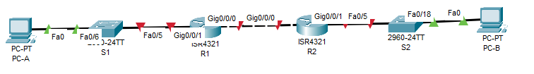

# Развертывание коммутируемой сети с резервными каналами

## Оглавление
- [Топология](#топология)
- [Таблица адресации](#таблица-адресации)
- [Таблица VLAN](#таблица-vlan)
- [Задачи](#задачи)
- [Общие сведения/сценарий](#общие-сведениясценарий)
- [Необходимые ресурсы](#необходимые-ресурсы)
- [Решение](#решение)
  - [Часть 1. Создание сети и настройка основных параметров устройства](#часть-1-создание-сети-и-настройка-основных-параметров-устройства)
    - [Шаг 1. Создание схемы адресации](#шаг-1-создание-схемы-адресации)
    - [Шаг 2. Создайте сеть согласно топологии.](#шаг-2-создайте-сеть-согласно-топологии)
    - [Шаг 3. Произведите базовую настройку маршрутизаторов.](#шаг-3-произведите-базовую-настройку-маршрутизаторов)
    - [Шаг 4. Настройка маршрутизации между сетями VLAN на маршрутизаторе R1](#шаг-4-настройка-маршрутизации-между-сетями-vlan-на-маршрутизаторе-r1)
    - [Шаг 5. Настройте G0/1 на R2, затем G0/0/0 и статическую маршрутизацию для обоих маршрутизаторов](#шаг-5-настройте-g01-на-r2-затем-g000-и-статическую-маршрутизацию-для-обоих-маршрутизаторов)
    - [Шаг 6. Настройте базовые параметры каждого коммутатора.](#шаг-6-настройте-базовые-параметры-каждого-коммутатора)
    - [Шаг 7. Создайте сети VLAN на коммутаторе S1.](#шаг-7-создайте-сети-vlan-на-коммутаторе-s1)
    - [Шаг 8. Назначьте сети VLAN соответствующим интерфейсам коммутатора.](#шаг-8-назначьте-сети-vlan-соответствующим-интерфейсам-коммутатора)
    - [Шаг 9. Вручную настройте интерфейс S1 F0/5 в качестве транка 802.1Q.](#шаг-9-вручную-настройте-интерфейс-s1-f05-в-качестве-транка-8021q)
  - [Часть 2. Настройка и проверка двух серверов DHCPv4 на R1](#часть-2-настройка-и-проверка-двух-серверов-dhcpv4-на-r1)
    - [Шаг 1. Настройте R1 с пулами DHCPv4 для двух поддерживаемых подсетей. Ниже приведен только пул DHCP для подсети A](#шаг-1-настройте-r1-с-пулами-dhcpv4-для-двух-поддерживаемых-подсетей-ниже-приведен-только-пул-dhcp-для-подсети-a)
    - [Шаг 2. Сохраните конфигурацию.](#шаг-2-сохраните-конфигурацию)
    - [Шаг 3. Проверка конфигурации сервера DHCPv4](#шаг-3-проверка-конфигурации-сервера-dhcpv4)
    - [Шаг 4. Попытка получить IP-адрес от DHCP на PC-A](#шаг-4-попытка-получить-ip-адрес-от-dhcp-на-pc-a)
  - [Часть 3. Настройка и проверка DHCP-ретрансляции на R2](#часть-3-настройка-и-проверка-dhcp-ретрансляции-на-r2)
    - [Шаг 1. Настройка R2 в качестве агента DHCP-ретрансляции для локальной сети на G0/0/1](#шаг-1-настройка-r2-в-качестве-агента-dhcp-ретрансляции-для-локальной-сети-на-g001)
    - [Шаг 2. Попытка получить IP-адрес от DHCP на PC-B](#шаг-2-попытка-получить-ip-адрес-от-dhcp-на-pc-b)


## Топология

## Таблица адресации
|Устройство|Интерфейс|IP-адрес|Маска подсети|Шлюз по умолчанию|
|----------|---------|--------|-------------|-----------------|
|R1|G0/0/0|10.0.0.1|255.255.255.252|-|
||G0/0/1|-|-||
||G0/0/1.100||||
||G0/0/1.200||||
||G0/0/1.1000|-|-||
|R2|G0/0/0|10.0.0.2|255.255.255.252|-|
||G0/0/1||||
|S1|VLAN 200||||
|S2|VLAN 1||||
|PC-A|NIC|DHCP|DHCP|DHCP|
|PC-B|NIC|DHCP|DHCP|DHCP|
## Таблица VLAN
|VLAN|Имя|Назначенный интерфейс|
|----|---|---------------------|
|1|Нет|S2: F0/18|
|100|Клиенты|S1: F0/6|
|200|Управление|S1: VLAN 200|
|999|Parking_Lot|S1: F0/1-4, F0/7-24, G0/1-2|
|1000|Собственная|-|
## Задачи
**Часть 1.** Создание сети и настройка основных параметров устройства\
**Часть 2.** Настройка и проверка двух серверов DHCPv4 на R1\
**Часть 3.** Настройка и проверка DHCP-ретрансляции на R2

## Общие сведения/сценарий
Протокол динамической конфигурации сетевого узла (DHCP) — сетевой протокол, позволяющий сетевым администраторам управлять и автоматизировать назначение IP-адресов. Без использования DHCP  для IPv4 администратору необходимо вручную назначать и настраивать IP-адреса, предпочтительные DNS-серверы и шлюзы по умолчанию. По мере увеличения сети и перемещении устройств из одной внутренней сети в другую это становится административной проблемой.\
В предложенном сценарии размеры компании увеличились, и сетевые администраторы больше не имеют возможности назначать IP-адреса для устройств вручную. Ваша задача заключается в настройке маршрутизатора R1 для назначения IPv4-адресов в двух разных подсетях. 

## Необходимые ресурсы
- 2 маршрутизатора (Cisco 4221 с универсальным образом Cisco IOS XE версии 16.9.4 или аналогичным)
- 2 коммутатора (Cisco 2960 с операционной системой Cisco IOS 15.2(2) (образ lanbasek9) или аналогичная модель)
- 2 ПК (ОС Windows с программой эмуляции терминалов, такой как Tera Term)
- Консольные кабели для настройки устройств Cisco IOS через консольные порты.
- Кабели Ethernet, расположенные в соответствии с топологией

## Решение
### Часть 1. Создание сети и настройка основных параметров устройства
#### Шаг 1. Создание схемы адресации
Подсеть сети 192.168.1.0/24 в соответствии со следующими требованиями:\
**a.** Одна подсеть «Подсеть A», поддерживающая 58 хостов (клиентская VLAN на R1).
- Подсеть А: 192.168.1.0/26 (62 хоста)
- Адрес R1 (VLAN100): 192.168.1.1

**b.** Одна подсеть «Подсеть B», поддерживающая 28 хостов (управляющая VLAN на R1).
- Подсеть B: 192.168.1.64/27 (32 хоста)
- Адрес R1 (VLAN200): 192.168.1.65
- Адрес S1 (VLAN 200): 192.168.1.66

**c.** Одна подсеть «Подсеть C», поддерживающая 12 узлов (клиентская сеть на R2).
- Подсеть C: 192.168.1.96/28 (16 хостов)
- Адрес R2 (G0/0/1): 192.168.1.97

Итоговая таблица маршрутизации:
|Устройство|Интерфейс|IP-адрес|Маска подсети|Шлюз по умолчанию|
|----------|---------|--------|-------------|-----------------|
|R1|G0/0/0|10.0.0.1|255.255.255.252|-|
||G0/0/1|-|-||
||G0/0/1.100|192.168.1.1|255.255.255.192|-|
||G0/0/1.200|192.168.1.65|255.255.255.224|-|
||G0/0/1.1000|-|-||
|R2|G0/0/0|10.0.0.2|255.255.255.252|-|
||G0/0/1|192.168.1.97|255.255.255.240|-|
|S1|VLAN 200|192.168.1.66|255.255.255.224|192.168.1.65|
|S2|VLAN 1||||
|PC-A|NIC|DHCP|DHCP|DHCP|
|PC-B|NIC|DHCP|DHCP|DHCP|

#### Шаг 2. Создайте сеть согласно топологии.

#### Шаг 3. Произведите базовую настройку маршрутизаторов.
**a.** Назначьте маршрутизатору имя устройства.\
**b.** Отключите поиск DNS, чтобы предотвратить попытки маршрутизатора неверно преобразовывать введенные команды таким образом, как будто они являются именами узлов.\
**c.** Назначьте class в качестве зашифрованного пароля привилегированного режима EXEC.\
**d.** Назначьте cisco в качестве пароля консоли и включите вход в систему по паролю.\
**e.** Назначьте cisco в качестве пароля VTY и включите вход в систему по паролю.\
**f.** Зашифруйте открытые пароли.\
**g.** Создайте баннер с предупреждением о запрете несанкционированного доступа к устройству.\
**h.** Сохраните текущую конфигурацию в файл загрузочной конфигурации.\
**i.** Установите часы на маршрутизаторе на сегодняшнее время и дату.\
```
Router>en
Router#conf t
Router(config)#hostname R2
R2(config)#no ip domain-lookup
R2(config)#banner motd #
You shall not pass!
#
R2(config)#enable secret class
R2(config)#line con 0
R2(config-line)#logging synchronous
R2(config-line)#password cisco
R2(config-line)#login
R2(config-line)#line vty 0 4
R2(config-line)#password cisco
R2(config-line)#login
R2(config-line)#service password-encryption
R2(config)#end
R2#clock set 10:50:00 Nov 23 2025
R2#wr
```
#### Шаг 4. Настройка маршрутизации между сетями VLAN на маршрутизаторе R1
**a.** Активируйте интерфейс G0/0/1 на маршрутизаторе.\
**b.** Настройте подинтерфейсы для каждой VLAN в соответствии с требованиями таблицы IP-адресации. Все субинтерфейсы используют инкапсуляцию 802.1Q и назначаются первый полезный адрес из вычисленного пула IP-адресов. Убедитесь, что подинтерфейсу для native VLAN не назначен IP-адрес. Включите описание для каждого подинтерфейса.\
**c.** Убедитесь, что вспомогательные интерфейсы работают.
```
R1(config)#int g0/0/1
R1(config-if)#no shut
R1(config-if)#int g0/0/1.100
R1(config-subif)#encapsulation dot1Q 100
R1(config-subif)#ip address 192.168.1.1 255.255.255.192
R1(config-subif)#description Clients
R1(config-subif)#int g0/0/1.200
R1(config-subif)#encapsulation dot1Q 200
R1(config-subif)#ip address 192.168.1.65 255.255.255.224
R1(config-subif)#description Management
R1(config-subif)#int g0/0/1.1000
R1(config-subif)#encapsulation dot1Q 1000 native 
R1(config-subif)#description Native
R1(config-subif)#int g0/0/0
R1(config-if)#ip address 10.0.0.1 255.255.255.252
R1(config-if)#description toR2
R1#sh ip int br
Interface              IP-Address      OK? Method Status                Protocol 
GigabitEthernet0/0/0   10.0.0.1        YES manual administratively down down 
GigabitEthernet0/0/1   unassigned      YES unset  up                    up 
GigabitEthernet0/0/1.100192.168.1.1     YES manual up                    up 
GigabitEthernet0/0/1.200192.168.1.65    YES manual up                    up 
GigabitEthernet0/0/1.1000unassigned      YES unset  up                    up 
Vlan1                  unassigned      YES unset  administratively down down
R1#wr
Building configuration...
[OK]
```
#### Шаг 5. Настройте G0/1 на R2, затем G0/0/0 и статическую маршрутизацию для обоих маршрутизаторов
**a.** Настройте G0/0/1 на R2 с первым IP-адресом подсети C, рассчитанным ранее.\
**b.** Настройте интерфейс G0/0/0 для каждого маршрутизатора на основе приведенной выше таблицы IP-адресации.\
**c.** Настройте маршрут по умолчанию на каждом маршрутизаторе, указываемом на IP-адрес G0/0/0 на другом маршрутизаторе.\
**d.** Убедитесь, что статическая маршрутизация работает с помощью пинга до адреса G0/0/1 R2 от R1.\
**e.** Сохраните текущую конфигурацию в файл загрузочной конфигурации.\
R1:
```
R1(config)#ip routing
R1(config)#ip route 0.0.0.0 0.0.0.0 10.0.0.1
R1(config)#int g0/0/0
R1(config-if)#no shut
```
R2:
```
R2(config)#int g0/0/1
R2(config-if)#ip address 192.168.1.97 255.255.255.240
R2(config-if)#no shut
R2(config-if)#int g0/0/0
R2(config-if)#ip address 10.0.0.2 255.255.255.240
R2(config-if)#description toR1
R2(config)#ip routing
R2(config)#ip route 0.0.0.0 0.0.0.0 10.0.0.1
R2(config)#int g0/0/0
R2(config-if)#no shut
```

Проверяем с R2 сетевую доступность до сети на интерфейсе G0/0/1 на R1:
```
R2(config-if)#do ping 192.168.1.65

Type escape sequence to abort.
Sending 5, 100-byte ICMP Echos to 192.168.1.65, timeout is 2 seconds:
.!!!!
Success rate is 80 percent (4/5), round-trip min/avg/max = 0/0/0 ms

R2(config-if)#do ping 192.168.1.1

Type escape sequence to abort.
Sending 5, 100-byte ICMP Echos to 192.168.1.1, timeout is 2 seconds:
!!!!!
Success rate is 100 percent (5/5), round-trip min/avg/max = 0/0/0 ms
```
#### Шаг 6. Настройте базовые параметры каждого коммутатора.
**a.** Присвойте коммутатору имя устройства.\
**b.** Отключите поиск DNS, чтобы предотвратить попытки маршрутизатора неверно преобразовывать введенные команды таким образом, как будто они являются именами узлов.\
**c.** Назначьте class в качестве зашифрованного пароля привилегированного режима EXEC.\
**d.** Назначьте cisco в качестве пароля консоли и включите вход в систему по паролю.\
**e.** Назначьте cisco в качестве пароля VTY и включите вход в систему по паролю.\
**f.** Зашифруйте открытые пароли.\
**g.** Создайте баннер с предупреждением о запрете несанкционированного доступа к устройству.\
**h.** Сохраните текущую конфигурацию в файл загрузочной конфигурации.\
**i.** Установите часы на маршрутизаторе на сегодняшнее время и дату.\
j. Скопируйте текущую конфигурацию в файл загрузочной конфигурации.
```
Switch>en
Switch#conf t
Switch(config)#hostname S1
S1(config)#no ip domain-lookup
S1(config)#banner motd #
You shall not pass!
#
S1(config)#enable secret class
S1(config)#line con 0
S1(config-line)#logging synchronous
S1(config-line)#password cisco
S1(config-line)#login
S1(config-line)#line vty 0 4
S1(config-line)#password cisco
S1(config-line)#login
S1(config-line)#service password-encryption
S1(config)#end
S1#clock set 10:50:00 Nov 23 2025
S1#wr
Building configuration...
[OK]
```
#### Шаг 7. Создайте сети VLAN на коммутаторе S1.
**a.** Создайте необходимые VLAN на коммутаторе 1 и присвойте им имена из приведенной выше таблицы.\
**b.** Настройте и активируйте интерфейс управления на S1 (VLAN 200), используя второй IP-адрес из подсети, рассчитанный ранее. Кроме того установите шлюз по умолчанию на S1.\
**c.** Настройте и активируйте интерфейс управления на S2 (VLAN 1), используя второй IP-адрес из подсети, рассчитанный ранее. Кроме того, установите шлюз по умолчанию на S2\
**d.** Назначьте все неиспользуемые порты S1 VLAN Parking_Lot, настройте их для статического режима доступа и административно деактивируйте их. На S2 административно деактивируйте все неиспользуемые порты.

S1:
```
S1(config)#vlan 100
S1(config-vlan)#name CLients
S1(config-vlan)#vlan 200
S1(config-vlan)#name Managements
S1(config-vlan)#vlan 999
S1(config-vlan)#name Parking_lot
S1(config-vlan)#vlan 1000
S1(config-vlan)#name Native
S1(config)#name Parking_lot
S1(config)#int ra f0/1-4,f0/7-24,g0/1-2
S1(config-if-range)#switchport access vlan 999
S1(config-if-range)#switchport mode access
S1(config-if-range)#shut
S1(config-if-range)#int f0/6
S1(config-if)#switchport mode access
S1(config-if)#switchport access vlan 100
S1(config-if)#int fa0/5
S1(config-if)#switchport mode trunk
S1(config-if)#switchport trunk native vlan 1000
S1(config-if)#switchport trunk allowed vlan 100,200,1000
S1(config-if)#int vlan 200
S1(config-if)#ip address 192.168.1.66 255.255.255.224
S1(config-if)#exit
S1(config)#ip default-gateway 192.168.1.65
S1#wr
Building configuration...
[OK]
```

S2:
```
S2(config)#int vlan 1
S2(config-if)#ip address 192.168.1.98 255.255.255.240
S2(config-if)#no shut
S2(config-if)#exit
S2(config)#ip default-gateway 192.168.1.97
S2(config)#int ra fa0/1-4,fa0/6-17,fa0/19-24,g0/1-2
S2(config-if-range)#shut
```
#### Шаг 8. Назначьте сети VLAN соответствующим интерфейсам коммутатора.
**a.** Назначьте используемые порты соответствующей VLAN (указанной в таблице VLAN выше) и настройте их для режима статического доступа.\
**b.** Убедитесь, что VLAN назначены на правильные интерфейсы.
```
Выполнил в шагах выше...
```
**Вопрос:** Почему интерфейс F0/5 указан в VLAN 1?\
**Ответ:** На R2 и S2 мы не настраивали транковых линк и инкапсуляцию dot1Q, поэтому для передачи будет ипользоваться стандарнтый vlan 1.

#### Шаг 9. Вручную настройте интерфейс S1 F0/5 в качестве транка 802.1Q.
**a.** Измените режим порта коммутатора, чтобы принудительно создать магистральный канал. \
**b.** В рамках конфигурации транка  установите для native  VLAN значение 1000. \
**c.** В качестве другой части конфигурации магистрали укажите, что VLAN 100, 200 и 1000 могут проходить по транку. \
**d.** Сохраните текущую конфигурацию в файл загрузочной конфигурации. \
**e.** Проверьте состояние транка.
```
Тоже выполнил в шагах выше...
```
**Вопрос:** Какой IP-адрес был бы у ПК, если бы он был подключен к сети с помощью DHCP?
**Ответ:** IP из подсети VLAN100 (192.168.1.0/26), но не адрес R1.
### Часть 2. Настройка и проверка двух серверов DHCPv4 на R1
В части 2 необходимо настроить и проверить сервер DHCPv4 на R1. Сервер DHCPv4 будет обслуживать две подсети, подсеть A и подсеть C.
#### Шаг 1. Настройте R1 с пулами DHCPv4 для двух поддерживаемых подсетей. Ниже приведен только пул DHCP для подсети A
**a.** Исключите первые пять используемых адресов из каждого пула адресов.\
**b.** Создайте пул DHCP (используйте уникальное имя для каждого пула).\
**c.** Укажите сеть, поддерживающую этот DHCP-сервер.\
**d.** В качестве имени домена укажите CCNA-lab.com.\
**e.** Настройте соответствующий шлюз по умолчанию для каждого пула DHCP.\
**f.** Настройте время аренды на 2 дня 12 часов и 30 минут.\
**g.** Затем настройте второй пул DHCPv4, используя имя пула R2_Client_LAN и вычислите сеть, маршрутизатор по умолчанию, и используйте то же имя домена и время аренды, что и предыдущий пул DHCP.
```
R1#conf t
R1(config)#ip dhcp excluded-address 192.168.1.1 192.168.1.5
R1(config)#ip dhcp excluded-address 192.168.1.97 192.168.1.101
R1(config)#ip dhcp pool VLAN_100
R1(dhcp-config)#network 192.168.1.0 255.255.255.192
R1(dhcp-config)#default-router 192.168.1.1
R1(dhcp-config)#domain-name CCNA-lab.com
R1(dhcp-config)#ip dhcp pool R2_Client_LAN
R1(dhcp-config)#network 192.168.1.96 255.255.255.240
R1(dhcp-config)#default-router 192.168.1.97
R1(dhcp-config)#domain-name CCNA-lab.com
R1(dhcp-config)#end
```
При выполненисе в CPT на роутере ISR4321 не удалось использовать параметр lease:
```
R1(dhcp-config)#?
  default-router  Default routers
  dns-server      Set name server
  domain-name     Domain name
  exit            Exit from DHCP pool configuration mode
  network         Network number and mask
  no              Negate a command or set its defaults
  option          Raw DHCP options
R1(dhcp-config)#lease
                ^
% Invalid input detected at '^' marker.
```
#### Шаг 2. Сохраните конфигурацию.
Сохраните текущую конфигурацию в файл загрузочной конфигурации.
Закройте окно настройки.
```
R1#wr
Building configuration...
[OK]
```
#### Шаг 3. Проверка конфигурации сервера DHCPv4
**a.** Чтобы просмотреть сведения о пуле, выполните команду show ip dhcp pool.\
**b.** Выполните команду show ip dhcp bindings для проверки установленных назначений адресов DHCP.\
**c.** Выполните команду show ip dhcp server statistics для проверки сообщений DHCP.
```
R1#show ip dhcp pool

Pool VLAN_100 :
 Utilization mark (high/low)    : 100 / 0
 Subnet size (first/next)       : 0 / 0 
 Total addresses                : 62
 Leased addresses               : 0
 Excluded addresses             : 2
 Pending event                  : none

 1 subnet is currently in the pool
 Current index        IP address range                    Leased/Excluded/Total
 192.168.1.1          192.168.1.1      - 192.168.1.62      0    / 2     / 62

Pool R2_Client_LAN :
 Utilization mark (high/low)    : 100 / 0
 Subnet size (first/next)       : 0 / 0 
 Total addresses                : 14
 Leased addresses               : 0
 Excluded addresses             : 2
 Pending event                  : none

 1 subnet is currently in the pool
 Current index        IP address range                    Leased/Excluded/Total
 192.168.1.97         192.168.1.97     - 192.168.1.110     0    / 2     / 14
R1#show ip dhcp bin
R1#show ip dhcp binding 
IP address       Client-ID/              Lease expiration        Type
                 Hardware address
```
#### Шаг 4. Попытка получить IP-адрес от DHCP на PC-A
**a.** Из командной строки компьютера PC-A выполните команду ipconfig /all.\
**b.** После завершения процесса обновления выполните команду ipconfig для просмотра новой информации об IP-адресе.\
**c.** Проверьте подключение с помощью пинга IP-адреса интерфейса R0 G0/0/1.\
```

FastEthernet0 Connection:(default port)

   Connection-specific DNS Suffix..: wr
   Physical Address................: 0002.177E.0C4D
   Link-local IPv6 Address.........: FE80::202:17FF:FE7E:C4D
   IPv6 Address....................: ::
   IPv4 Address....................: 192.168.1.6
   Subnet Mask.....................: 255.255.255.192
   Default Gateway.................: ::
                                     192.168.1.1
   DHCP Servers....................: 192.168.1.1
   DHCPv6 IAID.....................: 
   DHCPv6 Client DUID..............: 00-01-00-01-04-4B-95-3D-00-02-17-7E-0C-4D
   DNS Servers.....................: ::
                                     0.0.0.0
C:\>ping 192.168.1.1

Pinging 192.168.1.1 with 32 bytes of data:

Reply from 192.168.1.1: bytes=32 time<1ms TTL=255
Reply from 192.168.1.1: bytes=32 time<1ms TTL=255
Reply from 192.168.1.1: bytes=32 time<1ms TTL=255
Reply from 192.168.1.1: bytes=32 time=10ms TTL=255

Ping statistics for 192.168.1.1:
    Packets: Sent = 4, Received = 4, Lost = 0 (0% loss),
Approximate round trip times in milli-seconds:
    Minimum = 0ms, Maximum = 10ms, Average = 2ms
```
### Часть 3. Настройка и проверка DHCP-ретрансляции на R2
В части 3 настраивается R2 для ретрансляции DHCP-запросов из локальной сети на интерфейсе G0/0/1 на DHCP-сервер (R1). 
#### Шаг 1. Настройка R2 в качестве агента DHCP-ретрансляции для локальной сети на G0/0/1
**a.** Настройте команду ip helper-address на G0/0/1, указав IP-адрес G0/0/0 R1.\
**b.** Сохраните конфигурацию.
```
R2(config)#int g0/0/1
R2(config-if)#ip helper-address 10.0.0.1
R2(config-if)#end
R2#
R2#wr
Building configuration...
[OK]
```
#### Шаг 2. Попытка получить IP-адрес от DHCP на PC-B
**a.** Из командной строки компьютера PC-B выполните команду ipconfig /all.\
**b.** После завершения процесса обновления выполните команду ipconfig для просмотра новой информации об IP-адресе.\
**c.** Проверьте подключение с помощью пинга IP-адреса интерфейса R1 G0/0/1.\
**d.** Выполните show ip dhcp binding для R1 для проверки назначений адресов в DHCP.\
**e.** Выполните команду show ip dhcp server statistics для проверки сообщений DHCP.\
PC-B:
```
C:\>ipconfig /all

FastEthernet0 Connection:(default port)

   Connection-specific DNS Suffix..: CCNA-lab.com
   Physical Address................: 0009.7C16.C976
   Link-local IPv6 Address.........: FE80::209:7CFF:FE16:C976
   IPv6 Address....................: ::
   IPv4 Address....................: 192.168.1.102
   Subnet Mask.....................: 255.255.255.240
   Default Gateway.................: ::
                                     192.168.1.97
   DHCP Servers....................: 10.0.0.1
   DHCPv6 IAID.....................: 
   DHCPv6 Client DUID..............: 00-01-00-01-4C-56-00-D3-00-09-7C-16-C9-76
   DNS Servers.....................: ::
                                     0.0.0.0

C:\>ping 192.168.1.1

Pinging 192.168.1.1 with 32 bytes of data:

Reply from 192.168.1.1: bytes=32 time<1ms TTL=254
Reply from 192.168.1.1: bytes=32 time=4ms TTL=254
Reply from 192.168.1.1: bytes=32 time<1ms TTL=254
Reply from 192.168.1.1: bytes=32 time<1ms TTL=254

Ping statistics for 192.168.1.1:
    Packets: Sent = 4, Received = 4, Lost = 0 (0% loss),
Approximate round trip times in milli-seconds:
    Minimum = 0ms, Maximum = 4ms, Average = 1ms
```
R1:
```
R1#sh ip dhcp binding 
IP address       Client-ID/              Lease expiration        Type
                 Hardware address
192.168.1.6      0002.177E.0C4D           --                     Automatic
192.168.1.102    0009.7C16.C976           --                     Automatic
```