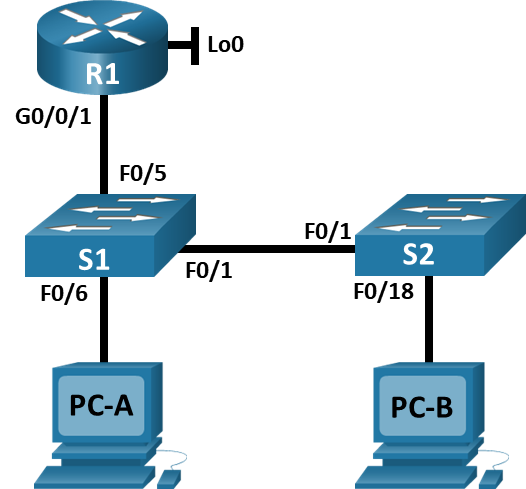
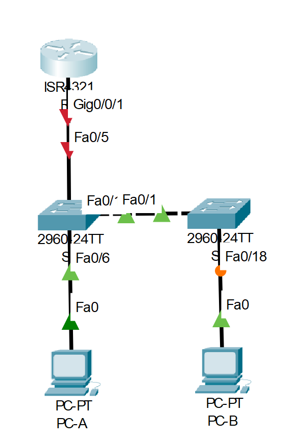

# Конфигурация безопасности коммутатора

## Оглавление
- [Топология](#топология)
- [Таблица адресации](#таблица-адресации)
- [Задачи](#задачи)
- [Общие сведения/сценарий](#общие-сведениясценарий)
- [Необходимые ресурсы](#необходимые-ресурсы)
- [Решение](#решение)
  - [Часть 1. Настройка основного сетевого устройства](#часть-1-настройка-основного-сетевого-устройства)
    - [Шаг 1. Создайте сеть.](#шаг-1-создайте-сеть)
    - [Шаг 2. Настройте маршрутизатор R1.](#шаг-2-настройте-маршрутизатор-r1)
    - [Шаг 3. Настройка и проверка основных параметров коммутатора](#шаг-3-настройка-и-проверка-основных-параметров-коммутатора)
  - [Часть 2. Настройка сетей VLAN на коммутаторах.](#часть-2-настройка-сетей-vlan-на-коммутаторах)
    - [Шаг 1. Сконфигруриуйте VLAN 10.](#шаг-1-сконфигруриуйте-vlan-10)
    - [Шаг 2. Сконфигруриуйте SVI для VLAN 10.](#шаг-2-сконфигруриуйте-svi-для-vlan-10)
    - [Шаг 3. Настройте VLAN 333 с именем Native на S1 и S2.](#шаг-3-настройте-vlan-333-с-именем-native-на-s1-и-s2)
    - [Шаг 4. Настройте VLAN 999 с именем ParkingLot на S1 и S2.](#шаг-4-настройте-vlan-999-с-именем-parkinglot-на-s1-и-s2)
  - [Часть 3. Настройки безопасности коммутатора.](#часть-3-настройки-безопасности-коммутатора)
    - [Шаг 1. Релизация магистральных соединений 802.1Q.](#шаг-1-релизация-магистральных-соединений-8021q)
    - [Шаг 2. Настройка портов доступа](#шаг-2-настройка-портов-доступа)
    - [Шаг 3. Безопасность неиспользуемых портов коммутатора](#шаг-3-безопасность-неиспользуемых-портов-коммутатора)
    - [Шаг 4. Документирование и реализация функций безопасности порта.](#шаг-4-документирование-и-реализация-функций-безопасности-порта)
    - [Шаг 5. Реализовать безопасность DHCP snooping.](#шаг-5-реализовать-безопасность-dhcp-snooping)
    - [Шаг 6. Реализация PortFast и BPDU Guard](#шаг-6-реализация-portfast-и-bpdu-guard)
    - [Шаг 7. Проверьте наличие сквозного подключения.](#шаг-7-проверьте-наличие-сквозного-подключения)
  - [Вопросы для повторения](#вопросы-для-повторения)

## Топология


## Таблица адресации
|Устройство|interface/vlan|IP-адрес|Маска подсети|
|----------|--------------|--------|-------------|
|R1|G0/0/1|192.168.10.1|255.255.255.0|
||Loopback 0|10.10.1.1|255.255.255.0|
|S1|VLAN 10|192.168.10.201|255.255.255.0|
|S2|VLAN 10|192.168.10.202|255.255.255.0|
|PC A|NIC|DHCP|255.255.255.0|
|PC B|NIC|DHCP|255.255.255.0|

## Задачи
**Часть 1.** Настройка основного сетевого устройств
- Создайте сеть.
- Настройте маршрутизатор R1.
- Настройка и проверка основных параметров коммутатора

**Часть 2.** Настройка сетей VLAN
- Сконфигруриуйте VLAN 10.
- Сконфигруриуйте SVI для VLAN 10.
- Настройте VLAN 333 с именем Native на S1 и S2.
- Настройте VLAN 999 с именем ParkingLot на S1 и S2.

**Часть 3:** Настройки безопасности коммутатора
- Реализация магистральных соединений 802.1Q.
- Настройка портов доступа
- Безопасность неиспользуемых портов коммутатора
- Документирование и реализация функций безопасности порта.
- Реализовать безопасность DHCP snooping .
- Реализация PortFast и BPDU Guard
- Проверка сквозной связанности.


##	Общие сведения/сценарий
Избыточность позволяет увеличить доступность устройств в топологии сети за счёт устранения единой точки отказа. Это комплексная лабораторная работа, нацеленная на повторение ранее изученных функций безопасности уровня 2.\

**Примечание:** Маршрутизаторы, используемые в практических лабораторных работах CCNA, - это Cisco 4221 с Cisco IOS XE Release 16.9.3 (образ universalk9). В лабораторных работах используются коммутаторы Cisco Catalyst 2960 с Cisco IOS версии 15.0(2) (образ lanbasek9). Можно использовать другие маршрутизаторы, коммутаторы и версии Cisco IOS. В зависимости от модели устройства и версии Cisco IOS доступные команды и результаты их выполнения могут отличаться от тех, которые показаны в лабораторных работах. Правильные идентификаторы интерфейса см. в сводной таблице по интерфейсам маршрутизаторов в конце лабораторной работы.\

**Примечание:** Убедитесь, что все настройки коммутатора удалены и загрузочная конфигурация отсутствует. Если вы не уверены, обратитесь к инструктору.

##	Необходимые ресурсы
-	1 Маршрутизатор (Cisco 4221 с универсальным образом Cisco IOS XE версии 16.9.3 или аналогичным)
-	2 коммутатора (Cisco 2960 с операционной системой Cisco IOS 15.0(2) (образ lanbasek9) или аналогичная модель)
-	2 ПК (ОС Windows с программой эмуляции терминалов, такой как Tera Term)
-	Консольные кабели для настройки устройств Cisco IOS через консольные порты.
-	Кабели Ethernet, расположенные в соответствии с топологией

##  Решение

### Часть 1. Настройка основного сетевого устройства
#### Шаг 1. Создайте сеть.
**a.** Создайте сеть согласно топологии.\
\
**b.** Инициализация устройств
#### Шаг 2. Настройте маршрутизатор R1.
**a.** Загрузите следующий конфигурационный скрипт на R1.
```
R1>enable
R1#configure terminal
Enter configuration commands, one per line.  End with CNTL/Z.
R1(config)#hostname R1
R1(config)#no ip domain lookup
R1(config)#ip dhcp excluded-address 192.168.10.1 192.168.10.9
R1(config)#ip dhcp excluded-address 192.168.10.201 192.168.10.202
R1(config)#ip dhcp relay information trust-all
R1(config)#!
R1(config)#ip dhcp pool Students
R1(dhcp-config)# network 192.168.10.0 255.255.255.0
R1(dhcp-config)# default-router 192.168.10.1
R1(dhcp-config)# domain-name CCNA2.Lab-11.6.1
R1(dhcp-config)#!
R1(dhcp-config)#interface Loopback0

R1(config-if)# ip address 10.10.1.1 255.255.255.0
R1(config-if)#!
R1(config-if)#interface GigabitEthernet0/0/1
R1(config-if)# description Link to S1
R1(config-if)# ip address 192.168.10.1 255.255.255.0
R1(config-if)# no shutdown

R1(config-if)#!
R1(config-if)#line con 0
R1(config-line)# logging synchronous
R1(config-line)# exec-timeout 0 0
R1(config-line)#
%LINK-5-CHANGED: Interface Loopback0, changed state to up

%LINEPROTO-5-UPDOWN: Line protocol on Interface Loopback0, changed state to up

%LINK-5-CHANGED: Interface GigabitEthernet0/0/1, changed state to up

%LINEPROTO-5-UPDOWN: Line protocol on Interface GigabitEthernet0/0/1, changed state to up
```
**b.** Проверьте текущую конфигурацию на R1, используя следующую команду:
```
R1#show ip interface brief
Interface              IP-Address      OK? Method Status                Protocol 
GigabitEthernet0/0/0   unassigned      YES unset  administratively down down 
GigabitEthernet0/0/1   192.168.10.1    YES manual up                    up 
Loopback0              10.10.1.1       YES manual up                    up 
Vlan1                  unassigned      YES unset  administratively down down
```
**c.** Убедитесь, что IP-адресация и интерфейсы находятся в состоянии up / up (при необходимости устраните неполадки).\
Интерфейсы Gi0/0/1 и Lo0 имеют верно настроенную адресацию и включены.
#### Шаг 3. Настройка и проверка основных параметров коммутатора
**a.** Настройте имя хоста для коммутаторов S1 и S2.\
**b.** Запретите нежелательный поиск в DNS.\
**c.** Настройте описания интерфейса для портов, которые используются в S1 и S2.\
**d.** Установите для шлюза по умолчанию для VLAN управления значение 192.168.10.1 на обоих коммутаторах.
```
S1>enable
S1#conf t
S1(config)#hostname S1
S1(config)#no ip domain-lookup
S1(config)#int fa0/1
S1(config-if)#description toS2
S1(config-if)#int fa0/6
S1(config-if)#description toPC-A
S1(config-if)#exit
S1(config)#ip default-gateway 192.168.10.1
```

### Часть 2. Настройка сетей VLAN на коммутаторах.
#### Шаг 1. Сконфигруриуйте VLAN 10.
Добавьте VLAN 10 на S1 и S2 и назовите VLAN - Management.
```
S1(config)#vlan 10
S1(config-vlan)#name Management
```
#### Шаг 2. Сконфигруриуйте SVI для VLAN 10.
Настройте IP-адрес в соответствии с таблицей адресации для SVI для VLAN 10 на S1 и S2. Включите интерфейсы SVI и предоставьте описание для интерфейса.
```
S1(config-vlan)#exit
S1(config)#int vlan 10
S1(config-if)#ip add 192.168.10.201 255.255.255.0
S1(config-if)#description Management
```
#### Шаг 3. Настройте VLAN 333 с именем Native на S1 и S2.
```
S1(config-if)#vlan 333
S1(config-vlan)#name Native
```
#### Шаг 4. Настройте VLAN 999 с именем ParkingLot на S1 и S2.
```
S1(config-vlan)#vlan 999
S1(config-vlan)#name ParkingLot
%LINK-5-CHANGED: Interface Vlan10, changed state to up

S1(config-vlan)#
```
### Часть 3. Настройки безопасности коммутатора.
#### Шаг 1. Релизация магистральных соединений 802.1Q.
**a.** Настройте все магистральные порты Fa0/1 на обоих коммутаторах для использования VLAN 333 в качестве native VLAN.
```
S1(config-vlan)#int fa0/1
S1(config-if)#switchport mode trunk

S1(config-if)#
%LINEPROTO-5-UPDOWN: Line protocol on Interface FastEthernet0/1, changed state to down

%LINEPROTO-5-UPDOWN: Line protocol on Interface FastEthernet0/1, changed state to up

%LINEPROTO-5-UPDOWN: Line protocol on Interface Vlan10, changed state to up

S1(config-if)#switchport trunk native vlan 333
```
**b.** Убедитесь, что режим транкинга успешно настроен на всех коммутаторах.
```
S1#show interface trunk
Port        Mode         Encapsulation  Status        Native vlan
Fa0/1       on           802.1q         trunking      333

Port        Vlans allowed on trunk
Fa0/1       1-1005

Port        Vlans allowed and active in management domain
Fa0/1       1,10,333,999

Port        Vlans in spanning tree forwarding state and not pruned
Fa0/1       10,999
```
Видим, что транк работает корректно.
**c.** Отключить согласование DTP F0/1 на S1 и S2.
```
S1(config)#int fa0/1
S1(config-if)#switchport nonegotiate 
```
**d.** Проверьте с помощью команды show interfaces.
```
S1#show interfaces f0/1 switchport | include Negotiation
Negotiation of Trunking: Off
```
#### Шаг 2. Настройка портов доступа
**a.** На S1 настройте F0/5 и F0/6 в качестве портов доступа и свяжите их с VLAN 10.
```
S1(config)#int ra fa0/5-6
S1(config-if-range)#switchport mode access
S1(config-if-range)#switchport access vlan 10
```
**b.** На S2 настройте порт доступа Fa0/18 и свяжите его с VLAN 10.
```
S2(config)#int fa0/18
S2(config-if)#switchport mode access
S2(config-if)#switchport access vlan 10
```
#### Шаг 3. Безопасность неиспользуемых портов коммутатора
**a.** На S1 и S2 переместите неиспользуемые порты из VLAN 1 в VLAN 999 и отключите неиспользуемые порты. \
**b.** Убедитесь, что неиспользуемые порты отключены и связаны с VLAN 999, введя команду show interfaces status.
```
S1(config)#int ra fa0/2-4,fa0/7-24,gi0/1-2
S1(config-if-range)#switchport access vlan 999
S1(config-if-range)#shut
S1#^Z
S1#show interfaces status
Port      Name               Status       Vlan       Duplex  Speed Type
Fa0/1     toS2               disabled 999        auto    auto  10/100BaseTX
Fa0/2                        disabled 999        auto    auto  10/100BaseTX
Fa0/3                        disabled 999        auto    auto  10/100BaseTX
Fa0/4                        disabled 999        auto    auto  10/100BaseTX
Fa0/5     toR1               connected    10         auto    auto  10/100BaseTX
Fa0/6     toPC-A             connected    10         auto    auto  10/100BaseTX
.......
Fa0/24                       disabled 999        auto    auto  10/100BaseTX
Gig0/1                       disabled 999        auto    auto  10/100BaseTX
Gig0/2                       disabled 999        auto    auto  10/100BaseTX
```
#### Шаг 4. Документирование и реализация функций безопасности порта.
Интерфейсы F0/6 на S1 и F0/18 на S2 настроены как порты доступа. На этом шаге вы также настроите безопасность портов на этих двух портах доступа.\
**a.** На S1, введите команду show port-security interface f0/6  для отображения настроек по умолчанию безопасности порта для интерфейса F0/6. Запишите свои ответы ниже.
<table>
  <thead>
    <tr><th colspan="3">Конфигурация безопасности порта по умолчанию</th></tr>
    <tr><th>Функция</th><th>Настройка по умолчанию<th></tr>
  </thead>
  <tbody>
    <tr><td>Защита портов</td><td>Disabled</td></tr>
    <tr><td>Максимальное количество записей MAC-адресов</td><td>1</td></tr>
    <tr><td>Режим проверки на нарушение безопасности</td><td>Shutdown</td></tr>
    <tr><td>Aging Time</td><td>0</td></tr>
    <tr><td>Aging Type</td><td>Absolute</td></tr>
    <tr><td>Secure Static Address Aging</td><td>Disabled</td></tr>
    <tr><td>Sticky MAC Address</td><td>0</td></tr>
  </tbody>
</table>	

**b.** На S1 включите защиту порта на F0/6
```
S1(config)#int fa0/6
S1(config-if)#switchport port-security
S1(config-if)#switchport port-security aging time 60
S1(config-if)#switchport port-security violation restrict 
S1(config-if)#switchport port-security maximum 3
```
В CPT нет команды switchport port-security aging type и не удалось задать режим работы Inactivity.
```
S1(config-if)#switchport port-security aging type?
% Unrecognized command
```
**c.** Verify port security on S1 F0/6.
```
S1#show port-security interface f0/6
Port Security              : Enabled
Port Status                : Secure-up
Violation Mode             : Restrict
Aging Time                 : 60 mins
Aging Type                 : Absolute
SecureStatic Address Aging : Disabled
Maximum MAC Addresses      : 3
Total MAC Addresses        : 0
Configured MAC Addresses   : 0
Sticky MAC Addresses       : 0
Last Source Address:Vlan   : 0000.0000.0000:0
Security Violation Count   : 0
```
**d.** Включите безопасность порта для F0/18 на S2. Настройте каждый активный порт доступа таким образом, чтобы он автоматически добавлял адреса МАС, изученные на этом порту, в текущую конфигурацию.\
**e.** Настройте следующие параметры безопасности порта на S2 F0/18\
**f.** Проверка функции безопасности портов на S2 F0/18.
```
S1(config)#int ra fa0/5-6
S1(config-if-range)#switchport port-security
S1(config-if-range)#switchport port-security mac-address sticky 
```
```
S2(config)#int fa0/18
S2(config-if)#switchport port-security
S2(config-if)#switchport port-security mac-address sticky
S2(config-if)#switchport port-security maximum 2
S2(config-if)#switchport port-security violation protect
S2(config-if)#switchport port-security aging time 60
S2#^Z
S2#show port-security interface f0/18
Port Security              : Enabled
Port Status                : Secure-up
Violation Mode             : Protect
Aging Time                 : 60 mins
Aging Type                 : Absolute
SecureStatic Address Aging : Disabled
Maximum MAC Addresses      : 2
Total MAC Addresses        : 0
Configured MAC Addresses   : 0
Sticky MAC Addresses       : 0
Last Source Address:Vlan   : 0000.0000.0000:0
Security Violation Count   : 0
```
#### Шаг 5. Реализовать безопасность DHCP snooping.
**a.** На S2 включите DHCP snooping и настройте DHCP snooping во VLAN 10.
**b.** Настройте магистральные порты на S2 как доверенные порты.
**c.** Ограничьте ненадежный порт Fa0/18 на S2 пятью DHCP-пакетами в секунду.
**d.** Проверка DHCP Snooping на S2.
```
S2(config)#ip dhcp snooping
S2(config)#ip dhcp snooping vlan 10
S2(config)#int fa0/1
S2(config-if)#ip dhcp snooping trust 
S2(config-if)#exit
S2(config)#int fa0/18
S2(config-if)#no ip dhcp snooping trust 
S2(config-if)#ip dhcp snooping limit rate 5
S2(config-if)#^Z
S2#show ip dhcp snooping
Switch DHCP snooping is enabled
DHCP snooping is configured on following VLANs:
10
Insertion of option 82 is enabled
Option 82 on untrusted port is not allowed
Verification of hwaddr field is enabled
Interface                  Trusted    Rate limit (pps)
-----------------------    -------    ----------------
FastEthernet0/1            yes        unlimited       
FastEthernet0/18           no         5 
```
**e.** В командной строке на PC-B освободите, а затем обновите IP-адрес.
```
C:\>ipconfig

FastEthernet0 Connection:(default port)

   Connection-specific DNS Suffix..: CCNA2.Lab-11.6.1
   Link-local IPv6 Address.........: FE80::20B:BEFF:FEC0:515A
   IPv6 Address....................: ::
   IPv4 Address....................: 192.168.10.10
   Subnet Mask.....................: 255.255.255.0
   Default Gateway.................: ::
                                     192.168.10.1
```
**f.** Проверьте привязку отслеживания DHCP с помощью команды show ip dhcp snooping binding.
```
S2#show ip dhcp snooping binding
MacAddress          IpAddress        Lease(sec)  Type           VLAN  Interface
------------------  ---------------  ----------  -------------  ----  -----------------
00:0B:BE:C0:51:5A   192.168.10.10    0           dhcp-snooping  10    FastEthernet0/18
Total number of bindings: 1
```
#### Шаг 6. Реализация PortFast и BPDU Guard
**a.** Настройте PortFast на всех портах доступа, которые используются на обоих коммутаторах.\
**b.** Включите защиту BPDU на портах доступа VLAN 10 S1 и S2, подключенных к PC-A и PC-B.\
**c.** Убедитесь, что защита BPDU и PortFast включены на соответствующих портах.
```
S1(config)#int ra fa0/5-6
S1(config-if-range)#spanning-tree portfast
S1(config-if-range)#int fa0/6
S1(config-if)#spanning-tree bpduguard enable
S1(config-if)#do show running-config
......
interface FastEthernet0/5
 switchport access vlan 10
 switchport mode access
 switchport port-security
 switchport port-security mac-address sticky 
 spanning-tree portfast
!
interface FastEthernet0/6
 description toPC-A
 switchport access vlan 10
 switchport mode access
 switchport port-security
 switchport port-security maximum 3
 switchport port-security mac-address sticky 
 switchport port-security violation restrict 
 switchport port-security aging time 60
 spanning-tree portfast
 spanning-tree bpduguard enable
.....
```
BPDU guard и PortFast включены на портах доступа.
#### Шаг 7. Проверьте наличие сквозного подключения.
Проверка с PC-A до PC-B:
```
C:\> ping 192.168.10.10

Pinging 192.168.10.10 with 32 bytes of data:

Reply from 192.168.10.10: bytes=32 time<1ms TTL=128
Reply from 192.168.10.10: bytes=32 time<1ms TTL=128

Ping statistics for 192.168.10.10:
    Packets: Sent = 2, Received = 2, Lost = 0 (0% loss),
Approximate round trip times in milli-seconds:
    Minimum = 0ms, Maximum = 0ms, Average = 0ms
```
Проверка с PC-A до S1:
```
C:\> ping 192.168.10.201

Pinging 192.168.10.201 with 32 bytes of data:

Request timed out.
Reply from 192.168.10.201: bytes=32 time<1ms TTL=255
Reply from 192.168.10.201: bytes=32 time<1ms TTL=255

Ping statistics for 192.168.10.201:
    Packets: Sent = 3, Received = 2, Lost = 1 (34% loss),
Approximate round trip times in milli-seconds:
    Minimum = 0ms, Maximum = 0ms, Average = 0ms
```
Проверка с PC-A до R1:
```
C:\> ping 192.168.10.1

Pinging 192.168.10.1 with 32 bytes of data:

Reply from 192.168.10.1: bytes=32 time=6ms TTL=255
Reply from 192.168.10.1: bytes=32 time<1ms TTL=255

Ping statistics for 192.168.10.1:
    Packets: Sent = 2, Received = 2, Lost = 0 (0% loss),
Approximate round trip times in milli-seconds:
    Minimum = 0ms, Maximum = 6ms, Average = 3ms
C:\> ping 10.10.1.1

Pinging 10.10.1.1 with 32 bytes of data:

Reply from 10.10.1.1: bytes=32 time<1ms TTL=255
Reply from 10.10.1.1: bytes=32 time=4ms TTL=255
Reply from 10.10.1.1: bytes=32 time<1ms TTL=255

Ping statistics for 10.10.1.1:
    Packets: Sent = 3, Received = 3, Lost = 0 (0% loss),
Approximate round trip times in milli-seconds:
    Minimum = 0ms, Maximum = 4ms, Average = 1ms
```

Проверка с PC-B до R1:
```
C:\>ping 10.10.1.1

Pinging 10.10.1.1 with 32 bytes of data:

Reply from 10.10.1.1: bytes=32 time<1ms TTL=255
Reply from 10.10.1.1: bytes=32 time<1ms TTL=255

Ping statistics for 10.10.1.1:
    Packets: Sent = 2, Received = 2, Lost = 0 (0% loss),
Approximate round trip times in milli-seconds:
    Minimum = 0ms, Maximum = 0ms, Average = 0ms
```

Проверка с PC-B до S1:
```
C:\>ping 192.168.10.201

Pinging 192.168.10.201 with 32 bytes of data:

Request timed out.
Reply from 192.168.10.201: bytes=32 time<1ms TTL=255
Reply from 192.168.10.201: bytes=32 time=4ms TTL=255
Reply from 192.168.10.201: bytes=32 time<1ms TTL=255

Ping statistics for 192.168.10.201:
    Packets: Sent = 4, Received = 3, Lost = 1 (25% loss),
Approximate round trip times in milli-seconds:
    Minimum = 0ms, Maximum = 4ms, Average = 1ms
```

### Вопросы для повторения
1. С точки зрения безопасности порта на S2, почему нет значения таймера для оставшегося возраста в минутах, когда было сконфигурировано динамическое обучение - sticky?\
**Ответ:** Механизм sticky записывает MAC адрес, который появился на порту, в конфигурацию, что делает эту запись статичной и для неё нет необходимости считать aging time.
2. Что касается безопасности порта на S2, если вы загружаете скрипт текущей конфигурации на S2, почему порту 18 на PC-B никогда не получит IP-адрес через DHCP?\
**Ответ:** ...
3. Что касается безопасности порта, в чем разница между типом абсолютного устаревания и типом устаревание по неактивности?\
**Ответ:** Absolute aging работает как таймер без условия, т.е. запись удалится по истечению таймера без всяких условий, а при inactivity aging - запись удаляется только при отсутствии активности (трафика на порту от этого MAC) в течении действия таймера.