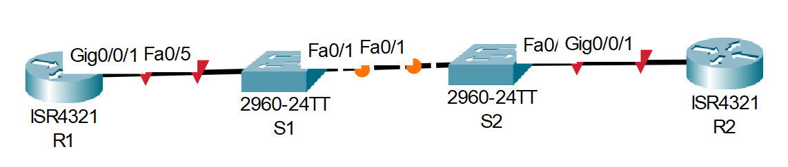

# Настройка протокола OSPFv2 для одной области

## Оглавление
- [Топология](#топология)
- [Таблица адресации](#таблица-адресации)
- [Цели](#цели)
- [Общие сведения/сценарий](#общие-сведениясценарий)
- [Необходимые ресурсы](#необходимые-ресурсы)
- [Решение](#решение)
  - [Часть 1. Создание сети и настройка основных параметров устройства](#часть-1-создание-сети-и-настройка-основных-параметров-устройства)
    - [Шаг 1. Создайте сеть согласно топологии.](#шаг-1-создайте-сеть-согласно-топологии)
    - [Шаг 2. Произведите базовую настройку маршрутизаторов.](#шаг-2-произведите-базовую-настройку-маршрутизаторов)
    - [Шаг 3. Настройте базовые параметры каждого коммутатора.](#шаг-3-настройте-базовые-параметры-каждого-коммутатора)
  - [Часть 2. Настройка и проверка базовой работы протокола OSPFv2 для одной области](#часть-2-настройка-и-проверка-базовой-работы-протокола-ospfv2-для-одной-области)
    - [Шаг 1. Настройте адреса интерфейса и базового OSPFv2 на каждом маршрутизаторе.](#шаг-1-настройте-адреса-интерфейса-и-базового-ospfv2-на-каждом-маршрутизаторе)
  - [Часть 3. Оптимизация и проверка конфигурации OSPFv2 для одной области](#часть-3-оптимизация-и-проверка-конфигурации-ospfv2-для-одной-области)
    - [Шаг 1. Реализация различных оптимизаций на каждом маршрутизаторе.](#шаг-1-реализация-различных-оптимизаций-на-каждом-маршрутизаторе)
    - [Шаг 2. Убедитесь, что оптимизация OSPFv2 реализовалась.](#шаг-2-убедитесь-что-оптимизация-ospfv2-реализовалась)

## Топология


## Таблица адресации
| Устройство | Интерфейс | IP-адрес | Маска подсети |
| --- | --- | --- | --- |
|R1|G0/0/1|10.53.0.1|255.255.255.0|
||Loopback1|172.16.1.1|255.255.255.0|
|R2|G0/0/1|10.53.0.2|255.255.255.0|
||Loopback1|192.168.1.1|255.255.255.0|

## Цели
**Часть 1.** Создание сети и настройка основных параметров устройства\
**Часть 2.** Настройка и проверка базовой работы протокола  OSPFv2 для одной области\
**Часть 3.** Оптимизация и проверка конфигурации OSPFv2 для одной области

##	Общие сведения/сценарий
Вам было поручено настроить сеть небольшой компании с помощью OSPFv2. R1 будет размещать интернет-соединение (имитируемое интерфейсом Loopback 1) и делиться информацией о маршруте по умолчанию до  R2. После первоначальной настройки организация попросила оптимизировать конфигурацию, чтобы уменьшить трафик протокола и гарантировать, что R1 продолжает контролировать маршрутизацию.

**Примечание:** Статическая маршрутизация, используемая в данной лаборатории, заключается в оценке возможности настройки и настройки OSPFv2 в конфигурации для одной области. Этот подход, используемый в данной лаборатории, может не отражать рекомендации по работе с сетевыми сетями.

**Примечание:** Маршрутизаторы, используемые в практических лабораторных работах CCNA, - это Cisco 4221 с Cisco IOS XE Release 16.9.4 (образ universalk9). В лабораторных работах используются коммутаторы Cisco Catalyst 2960 с Cisco IOS версии 15.2(2) (образ lanbasek9). Можно использовать другие маршрутизаторы, коммутаторы и версии Cisco IOS. В зависимости от модели устройства и версии Cisco IOS доступные команды и результаты их выполнения могут отличаться от тех, которые показаны в лабораторных работах. Правильные идентификаторы интерфейса см. в сводной таблице по интерфейсам маршрутизаторов в конце лабораторной работы.

**Примечание:** Убедитесь, что у всех маршрутизаторов и коммутаторов была удалена начальная конфигурация. Если вы не уверены в этом, обратитесь к инструктору.

##	Необходимые ресурсы
- 2 маршрутизатора (Cisco 4221 с универсальным образом Cisco IOS XE версии 16.9.4 или аналогичным)
- 2 коммутатора (Cisco 2960 с операционной системой Cisco IOS 15.2(2) (образ lanbasek9) или аналогичная модель)
- 1 ПК (под управлением Windows с программой эмуляции терминала, например, Tera Term)
- Консольные кабели для настройки устройств Cisco IOS через консольные порты.
- Кабели Ethernet, расположенные в соответствии с топологией

##  Решение
### Часть 1. Создание сети и настройка основных параметров устройства
#### Шаг 1. Создайте сеть согласно топологии.
Подключите устройства, как показано в топологии, и подсоедините необходимые кабели.

#### Шаг 2. Произведите базовую настройку маршрутизаторов.
**a.** Назначьте маршрутизатору имя устройства.\
**b.** Отключите поиск DNS, чтобы предотвратить попытки маршрутизатора неверно преобразовывать введенные команды таким образом, как будто они являются именами узлов.\
**c.** Назначьте class в качестве зашифрованного пароля привилегированного режима EXEC.\
**d.** Назначьте cisco в качестве пароля консоли и включите вход в систему по паролю.\
**e.** Назначьте cisco в качестве пароля VTY и включите вход в систему по паролю.\
**f.** Зашифруйте открытые пароли.\
**g.** Создайте баннер с предупреждением о запрете несанкционированного доступа к устройству.\
**h.** Сохраните текущую конфигурацию в файл загрузочной конфигурации.
```
Router>en
Router#conf t
Router(config)#hostname R2
R2(config)#no ip domain-lookup
R2(config)#banner motd #
You shall not pass!
#
R2(config)#enable secret class
R2(config)#line con 0
R2(config-line)#password cisco
R2(config-line)#login
R2(config-line)#line vty 0 4
R2(config-line)#password cisco
R2(config-line)#login
R2(config-line)#service password-encryption
R2(config)#end
R2#wr
```
#### Шаг 3. Настройте базовые параметры каждого коммутатора.
**a.** Назначьте коммутатору имя устройства.
**b.** Отключите поиск DNS, чтобы предотвратить попытки маршрутизатора неверно преобразовывать введенные команды таким образом, как будто они являются именами узлов.
**c.** Назначьте class в качестве зашифрованного пароля привилегированного режима EXEC.
**d.** Назначьте cisco в качестве пароля консоли и включите вход в систему по паролю.
**e.** Назначьте cisco в качестве пароля VTY и включите вход в систему по паролю.
**f.** Зашифруйте открытые пароли.
**g.** Создайте баннер с предупреждением о запрете несанкционированного доступа к устройству.
**h.** Сохраните текущую конфигурацию в файл загрузочной конфигурации.
```
Switch>en
Switch#conf t
Switch(config)#hostname S1
S1(config)#no ip domain-lookup
S1(config)#banner motd #
You shall not pass!
#
S1(config)#enable secret class
S1(config)#line con 0
S1(config-line)#password cisco
S1(config-line)#login
S1(config-line)#line vty 0 4
S1(config-line)#password cisco
S1(config-line)#login
S1(config-line)#service password-encryption
S1(config)#end
S1#wr
```

### Часть 2. Настройка и проверка базовой работы протокола OSPFv2 для одной области
#### Шаг 1. Настройте адреса интерфейса и базового OSPFv2 на каждом маршрутизаторе.
**a.** Настройте адреса интерфейсов на каждом маршрутизаторе, как показано в таблице адресации выше.\
**b.** Перейдите в режим конфигурации маршрутизатора OSPF, используя идентификатор процесса 56.\
**c.** Настройте статический идентификатор маршрутизатора для каждого маршрутизатора (1.1.1.1 для R1, 2.2.2.2 для R2).\
**d.** Настройте инструкцию сети для сети между R1 и R2, поместив ее в область 0.\
**e.** Только на R2 добавьте конфигурацию, необходимую для объявления сети Loopback 1 в область OSPF 0.
```
# R1:
R1(config)#router ospf 56
R1(config-router)#router-id 1.1.1.1
R1(config)#interface g0/0/1
R1(config-if)#ip address 10.53.0.1 255.255.255.0
R1(config-if)#no shutdown
R1(config-if)#ip ospf 56 area 0
R1(config-if)#exit
R1(config)#interface Loopback 1
R1(config-if)#ip address 172.16.1.1 255.255.255.0
02:04:00: %OSPF-5-ADJCHG: Process 56, Nbr 2.2.2.2 on GigabitEthernet0/0/1 from LOADING to FULL, Loading Done
# R2:
R2(config)#router ospf 56
R2(config-router)#router-id 2.2.2.2
R2(config)#interface g0/0/1
R2(config-if)#ip address 10.53.0.2 255.255.255.0
R2(config-if)#no shutdown
R2(config-if)#ip ospf 56 area 0
02:03:51: %OSPF-5-ADJCHG: Process 56, Nbr 1.1.1.1 on GigabitEthernet0/0/1 from LOADING to FULL, Loading Done
R2(config-if)#exit
R2(config)#interface Loopback 1
R2(config-if)#ip address 192.168.1.1 255.255.255.0
R2(config-if)#ip ospf 56 area 0
```
Видно, что статус OSPF перешёл в FULL. То есть - отношения между R1 и R2 по протоколу OFPS установлены.
**f.** Убедитесь, что OSPFv2 работает между маршрутизаторами. Выполните команду, чтобы убедиться, что R1 и R2 сформировали смежность.
```
# R1:
R1#show ip protocols
Routing Protocol is "ospf 56"
  Outgoing update filter list for all interfaces is not set 
  Incoming update filter list for all interfaces is not set 
  Router ID 1.1.1.1
  Number of areas in this router is 1. 1 normal 0 stub 0 nssa
  Maximum path: 4
  Routing for Networks:
  Routing Information Sources:  
    Gateway         Distance      Last Update 
    1.1.1.1              110      00:01:28
    2.2.2.2              110      00:01:06
  Distance: (default is 110)
R1#show ip ospf neighbor 
Neighbor ID     Pri   State           Dead Time   Address         Interface
2.2.2.2           1   FULL/BDR        00:00:32    10.53.0.2       GigabitEthernet0/0/1

# R2:
R2#show ip protocols
Routing Protocol is "ospf 56"
  Outgoing update filter list for all interfaces is not set 
  Incoming update filter list for all interfaces is not set 
  Router ID 2.2.2.2
  Number of areas in this router is 1. 1 normal 0 stub 0 nssa
  Maximum path: 4
  Routing for Networks:
  Routing Information Sources:  
    Gateway         Distance      Last Update 
    1.1.1.1              110      00:02:12
    2.2.2.2              110      00:01:50
  Distance: (default is 110)
R2#show ip ospf neighbor 
Neighbor ID     Pri   State           Dead Time   Address         Interface
1.1.1.1           1   FULL/DR         00:00:34    10.53.0.1       GigabitEthernet0/0/1
```
**Вопрос:** Какой маршрутизатор является DR? Какой маршрутизатор является BDR? Каковы критерии отбора?\
**Ответ:** DR является маршрутизатор R1, а BDR - R2. Настройки приоритетов вручную не делалось, поэтому выбор DR происходит по Router ID, т.е. выбирается роутер с самым высоким значением ID. В данном случае это R2, но он не был выбран как DR... Баг CPT?

**g.** На R1 выполните команду show ip route ospf, чтобы убедиться, что сеть R2 Loopback1 присутствует в таблице маршрутизации. Обратите внимание, что поведение OSPF по умолчанию заключается в объявлении интерфейса обратной связи в качестве маршрута узла с использованием 32-битной маски.\
**h.** Запустите Ping до  адреса интерфейса R2 Loopback 1 из R1. Выполнение команды ping должно быть успешным.
```
R1#show ip route ospf
     192.168.1.0/32 is subnetted, 1 subnets
O       192.168.1.1 [110/2] via 10.53.0.2, 00:03:04, GigabitEthernet0/0/1

R1#ping 192.168.1.1

Type escape sequence to abort.
Sending 5, 100-byte ICMP Echos to 192.168.1.1, timeout is 2 seconds:
!!!!!
Success rate is 100 percent (5/5), round-trip min/avg/max = 0/0/0 ms
```
Видим, что Lo1 роутера R2 есть в таблице маршрутизации на R1 и IP-адрес этого интерфейса доступен по протоколу ICMP.

### Часть 3. Оптимизация и проверка конфигурации OSPFv2 для одной области
#### Шаг 1. Реализация различных оптимизаций на каждом маршрутизаторе.
**a.** На R1 настройте приоритет OSPF интерфейса G0/0/1 на 50, чтобы убедиться, что R1 является назначенным маршрутизатором.\
**b.** Настройте таймеры OSPF на G0/0/1 каждого маршрутизатора для таймера приветствия, составляющего 30 секунд.\
**c.** На R1 настройте статический маршрут по умолчанию, который использует интерфейс Loopback 1 в качестве интерфейса выхода. Затем распространите маршрут по умолчанию в OSPF. Обратите внимание на сообщение консоли после установки маршрута по умолчанию.
```
R1(config)#interface g0/0/1
R1(config-if)#ip ospf priority 50
R1(config-if)#ip ospf hello-interval 30
R1(config-if)#ip route 0.0.0.0 0.0.0.0 loopback 1
%Default route without gateway, if not a point-to-point interface, may impact performance
^Z
R1(config)#ip routing
R1(config)#router ospf 56
R1(config-router)#default-information originate
R1#clear ip ospf process
```
При добавление маршрута по умолчанию без указания адреса шлюза вышло предупреждение "%Default route without gateway, if not a point-to-point interface, may impact performance". Судя по информации с формума Cisco, это предупреждение подсказывает, что если мы не укажем адрес, а только имя интерфейса в качестве шлюза, то роутер будет делать ARP-запросы до хостов за этим интерфейсом и постоянно актуализировать свою ARP таблицу, что накладнее, чем просто обращаться к IP-адресу шлюза по L3.

Проверяем наличие маршрута по умолчанию на R2:
```
R2#sh ip ro
Codes: L - local, C - connected, S - static, R - RIP, M - mobile, B - BGP
       D - EIGRP, EX - EIGRP external, O - OSPF, IA - OSPF inter area
       N1 - OSPF NSSA external type 1, N2 - OSPF NSSA external type 2
       E1 - OSPF external type 1, E2 - OSPF external type 2, E - EGP
       i - IS-IS, L1 - IS-IS level-1, L2 - IS-IS level-2, ia - IS-IS inter area
       * - candidate default, U - per-user static route, o - ODR
       P - periodic downloaded static route

Gateway of last resort is 10.53.0.1 to network 0.0.0.0

     10.0.0.0/8 is variably subnetted, 2 subnets, 2 masks
C       10.53.0.0/24 is directly connected, GigabitEthernet0/0/1
L       10.53.0.2/32 is directly connected, GigabitEthernet0/0/1
     192.168.1.0/24 is variably subnetted, 2 subnets, 2 masks
C       192.168.1.0/24 is directly connected, Loopback1
L       192.168.1.1/32 is directly connected, Loopback1
O*E2 0.0.0.0/0 [110/1] via 10.53.0.1, 00:00:23, GigabitEthernet0/0/1
```
Видим, что маршрут появился с типом O*E2 (OSPF external type 2).

**d.** Добавьте конфигурацию, необходимую для OSPF для обработки R2 Loopback 1 как сети точка-точка. Это приводит к тому, что OSPF объявляет Loopback 1 использует маску подсети интерфейса.\
**e.** Только на R2 добавьте конфигурацию, необходимую для предотвращения отправки объявлений OSPF в сеть Loopback 1.
```
R2(config)#interface Loopback 1
R2(config-if)#ip ospf network point-to-point
R2(config-if)#router ospf 56
R2(config-router)#passive-interface loopback 1
```
**f.** Измените базовую пропускную способность для маршрутизаторов. После этой настройки перезапустите OSPF с помощью команды clear ip ospf process. Обратите внимание на сообщение консоли после установки новой опорной полосы пропускания.
```
R2(config-router)#router ospf 56
R2(config-router)#auto-cost reference-bandwidth 1000
% OSPF: Reference bandwidth is changed.
        Please ensure reference bandwidth is consistent across all routers.
R2(config-router)#^Z
R2#clear ip ospf process
Reset ALL OSPF processes? [no]: yes
```
#### Шаг 2. Убедитесь, что оптимизация OSPFv2 реализовалась.
**a.** Выполните команду show ip ospf interface g0/0/1 на R1 и убедитесь, что приоритет интерфейса установлен равным 50, а временные интервалы — Hello 30, Dead 120, а тип сети по умолчанию — Broadcast\
**b.** На R1 выполните команду show ip route ospf, чтобы убедиться, что сеть R2 Loopback1 присутствует в таблице маршрутизации. Обратите внимание на разницу в метрике между этим выходным и предыдущим выходным. Также обратите внимание, что маска теперь составляет 24 бита, в отличие от 32 битов, ранее объявленных.
```
R1#show ip ospf interface g0/0/1

GigabitEthernet0/0/1 is up, line protocol is up
  Internet address is 10.53.0.1/24, Area 0
  Process ID 56, Router ID 1.1.1.1, Network Type BROADCAST, Cost: 1
  Transmit Delay is 1 sec, State DR, Priority 50
  Designated Router (ID) 1.1.1.1, Interface address 10.53.0.1
  Backup Designated Router (ID) 2.2.2.2, Interface address 10.53.0.2
  Timer intervals configured, Hello 30, Dead 120, Wait 40, Retransmit 5
    Hello due in 00:00:18
  Index 1/1, flood queue length 0
  Next 0x0(0)/0x0(0)
  Last flood scan length is 1, maximum is 1
  Last flood scan time is 0 msec, maximum is 0 msec
  Neighbor Count is 1, Adjacent neighbor count is 1
    Adjacent with neighbor 2.2.2.2  (Backup Designated Router)
  Suppress hello for 0 neighbor(s)
R1#show ip route ospf
O    192.168.1.0 [110/1] via 10.53.0.2, 00:18:10, GigabitEthernet0/0/1
```
Видим, что приоритет равен 50, а hello-интервал - 30, тип сети - broadcast. Также, маршрут до 192.168.1.0/24 через Lo1 на R2 присутствует.

**c.** Введите команду show ip route ospf на маршрутизаторе R2. Единственная информация о маршруте OSPF должна быть распространяемый по умолчанию маршрут R1.\
**d.** Запустите Ping до адреса интерфейса R1 Loopback 1 из R2. Выполнение команды ping должно быть успешным.
```
R2#show ip route ospf
O*E2 0.0.0.0/0 [110/1] via 10.53.0.1, 00:02:25, GigabitEthernet0/0/1
R2#ping 172.16.1.1

Type escape sequence to abort.
Sending 5, 100-byte ICMP Echos to 172.16.1.1, timeout is 2 seconds:
!!!!!
Success rate is 100 percent (5/5), round-trip min/avg/max = 0/0/0 ms
```