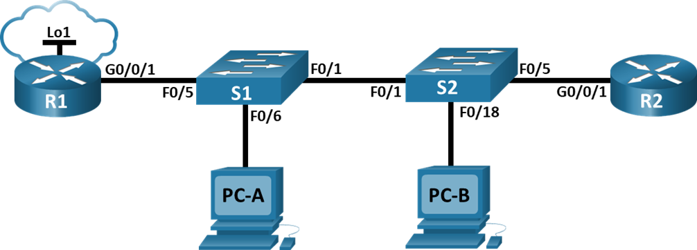
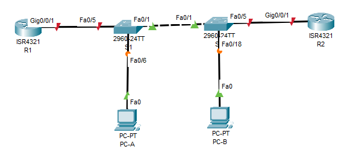

# Настройка и проверка расширенных списков контроля доступа.

## Оглавление

## Топология

## Таблица адресации
| Устройство | Интерфейс | IP-адрес | Маска подсети | Шлюз по умолчанию |
| ---------- | --------- | -------- | ------------- | ----------------- |
| R1 | G0/0/1 | — | — | — |
|    | G0/0/1.20 | 10.20.0.1 | 255.255.255.0 | — |
|    | G0/0/1.30 | 10.30.0.1 | 255.255.255.0 | — |
|    | G0/0/1.40 | 10.40.0.1 | 255.255.255.0 | — |
|    | G0/0/1.1000 | — | — | — |
|    | Loopback1 | 172.16.1.1 | 255.255.255.0 | — |
| R2 | G0/0/1 | 10.20.0.4 | 255.255.255.0 | — |
| S1 | VLAN 20 | 10.20.0.2 | 255.255.255.0 | 10.20.0.1 |
| S2 | VLAN 20 | 10.20.0.3 | 255.255.255.0 | 10.20.0.1 |
| PC-A | NIC | 10.30.0.10 | 255.255.255.0 | 10.30.0.1 |
| PC-B | NIC | 10.40.0.10 | 255.255.255.0 | 10.40.0.1 |

## Таблица VLAN
| VLAN | Имя | Назначенный интерфейс |
| ---- | --- | --------------------- |
| 20 | Management | S2: F0/5 |
| 30 | Operations | S1: F0/6 |
| 40 | Sales | S2: F0/18 |
| 999 | ParkingLot | S1: F0/2-4, F0/7-24, G0/1-2 <br>S2: F0/2-4, F0/6-17, F0/19-24, G0/1-2 |
| 1000 | Native | — |

## Задачи
**### Часть 1.** Создание сети и настройка основных параметров устройства.\
**### Часть 2.** Настройка и проверка списков расширенного контроля доступа.

## Общие сведения/сценарий
Вам было поручено настроить списки контроля доступа в сети небольшой компании. ACL являются одним из самых простых и прямых средств управления трафиком уровня 3. R1 будет размещать интернет-соединение (смоделированное интерфейсом Loopback 1) и предоставлять информацию о маршруте по умолчанию для R2. После завершения первоначальной настройки компания имеет некоторые конкретные требования к безопасности дорожного движения, которые вы несете ответственность за реализацию.

**Примечание:** Маршрутизаторы, используемые в практических лабораторных работах CCNA, - это Cisco 4221 с Cisco IOS XE Release 16.9.4 (образ universalk9). В лабораторных работах используются коммутаторы Cisco Catalyst 2960 с Cisco IOS версии 15.2(2) (образ lanbasek9). Можно использовать другие маршрутизаторы, коммутаторы и версии Cisco IOS. В зависимости от модели устройства и версии Cisco IOS доступные команды и результаты их выполнения могут отличаться от тех, которые показаны в лабораторных работах. Правильные идентификаторы интерфейса см. в сводной таблице по интерфейсам маршрутизаторов в конце лабораторной работы.

**Примечание:** Убедитесь, что у всех маршрутизаторов и коммутаторов была удалена начальная конфигурация. Если вы не уверены в этом, обратитесь к инструктору.

## Необходимые ресурсы
- 2 маршрутизатора (Cisco 4221 с универсальным образом Cisco IOS XE версии 16.9.4 или аналогичным)
- 2 коммутатора (Cisco 2960 с операционной системой Cisco IOS 15.2(2) (образ lanbasek9) или аналогичная модель)
- 2 ПК (ОС Windows с программой эмуляции терминалов, такой как Tera Term)
- Консольные кабели для настройки устройств Cisco IOS через консольные порты.
- Кабели Ethernet, расположенные в соответствии с топологией


##  Решение
### Часть 1. Создание сети и настройка основных параметров устройства
#### Шаг 1. Создайте сеть согласно топологии.
Подключите устройства, как показано в топологии, и подсоедините необходимые кабели.

#### Шаг 2. Произведите базовую настройку маршрутизаторов.
**a.** Назначьте маршрутизатору имя устройства.\
**b.** Отключите поиск DNS, чтобы предотвратить попытки маршрутизатора неверно преобразовывать введенные команды таким образом, как будто они являются именами узлов.\
**c.** Назначьте class в качестве зашифрованного пароля привилегированного режима EXEC.\
**d.** Назначьте cisco в качестве пароля консоли и включите вход в систему по паролю.\
**e.** Назначьте cisco в качестве пароля VTY и включите вход в систему по паролю.\
**f.** Зашифруйте открытые пароли.\
**g.** Создайте баннер с предупреждением о запрете несанкционированного доступа к устройству.\
**h.** Сохраните текущую конфигурацию в файл загрузочной конфигурации.
```
Router>en
Router#conf t
Router(config)#hostname R2
R2(config)#no ip domain-lookup
R2(config)#banner motd #
You shall not pass!
#
R2(config)#enable secret class
R2(config)#line con 0
R2(config-line)#password cisco
R2(config-line)#login
R2(config-line)#line vty 0 4
R2(config-line)#password cisco
R2(config-line)#login
R2(config-line)#service password-encryption
R2(config)#end
R2#wr
```
#### Шаг 3. Настройте базовые параметры каждого коммутатора.
**a.** Присвойте коммутатору имя устройства.\
**b.** Отключите поиск DNS, чтобы предотвратить попытки маршрутизатора неверно преобразовывать введенные команды таким образом, как будто они являются именами узлов.\
**c.** Назначьте class в качестве зашифрованного пароля привилегированного режима EXEC.\
**d.** Назначьте cisco в качестве пароля консоли и включите вход в систему по паролю.\
**e.** Назначьте cisco в качестве пароля VTY и включите вход в систему по паролю.\
**f.** Зашифруйте открытые пароли.\
**g.** Создайте баннер с предупреждением о запрете несанкционированного доступа к устройству.\
**h.** Сохраните текущую конфигурацию в файл загрузочной конфигурации.
```
Switch>en
Switch#conf t
Switch(config)#hostname S1
S1(config)#no ip domain-lookup
S1(config)#banner motd #
You shall not pass!
#
S1(config)#enable secret class
S1(config)#line con 0
S1(config-line)#password cisco
S1(config-line)#login
S1(config-line)#line vty 0 4
S1(config-line)#password cisco
S1(config-line)#login
S1(config-line)#service password-encryption
S1(config)#end
S1#wr
```
### Часть 2. Настройка сетей VLAN на коммутаторах.
#### Шаг 1. Создайте сети VLAN на коммутаторах.
**a.** Создайте необходимые VLAN и назовите их на каждом коммутаторе из приведенной выше таблицы.\
**b.** Настройте интерфейс управления и шлюз по умолчанию на каждом коммутаторе, используя информацию об IP-адресе в таблице адресации.\
**c.** Назначьте все неиспользуемые порты коммутатора VLAN Parking Lot, настройте их для статического режима доступа и административно деактивируйте их.\
```
S1(config)#vlan 20
S1(config-vlan)#name Management
S1(config-vlan)#vlan 30
S1(config-vlan)#name Operations
S1(config-vlan)#vlan 40
S1(config-vlan)#name Sales
S1(config-vlan)#vlan 999
S1(config-vlan)#name ParkingLot
S1(config-vlan)#vlan 1000
S1(config-vlan)#name Native
S1(config-vlan)#int vlan 20
S1(config-if)#
%LINK-5-CHANGED: Interface Vlan20, changed state to up
S1(config-if)#ip address 10.20.0.2 255.255.255.0
S1(config-if)#exit
S1(config)#ip default-gateway 10.20.0.1
S1(config)#int ra f0/2-4,f0/7-24,g0/1-2
S1(config-if-range)#switchport mode access
S1(config-if-range)#switchport access vlan 999
S1(config-if-range)#shut
```
#### Шаг 2. Назначьте сети VLAN соответствующим интерфейсам коммутатора.
**a.** Назначьте используемые порты соответствующей VLAN (указанной в таблице VLAN выше) и настройте их для режима статического доступа.\
**b.** Выполните команду show vlan brief, чтобы убедиться, что сети VLAN назначены правильным интерфейсам.
```
# S1:
S1(config)#int fa0/6
S1(config-if)#switchport mode access
S1(config-if)#switchport access vlan 30
S1(config-if)#end
S1#show vlan brief

VLAN Name                             Status    Ports
---- -------------------------------- --------- -------------------------------
1    default                          active    Fa0/1, Fa0/5
20   Management                       active    
30   Operations                       active    Fa0/6
40   Sales                            active    
999  ParkingLot                       active    Fa0/2, Fa0/3, Fa0/4, Fa0/7
                                                Fa0/8, Fa0/9, Fa0/10, Fa0/11
                                                Fa0/12, Fa0/13, Fa0/14, Fa0/15
                                                Fa0/16, Fa0/17, Fa0/18, Fa0/19
                                                Fa0/20, Fa0/21, Fa0/22, Fa0/23
                                                Fa0/24, Gig0/1, Gig0/2
1000 Native                           active    
1002 fddi-default                     active    
1003 token-ring-default               active    
1004 fddinet-default                  active    
1005 trnet-default                    active

# S2:
S2(config-if)#int f0/5
S2(config-if)#switchport mode access
S2(config-if)#switchport access vlan 20
S2(config-if)#int f0/18
S2(config-if)#switchport mode access
S2(config-if)#switchport access vlan 40
S2(config-if)#end
S2#show vlan brief

VLAN Name                             Status    Ports
---- -------------------------------- --------- -------------------------------
1    default                          active    Fa0/1
20   Management                       active    Fa0/5
30   Operations                       active    
40   Sales                            active    Fa0/18
999  ParkingLot                       active    Fa0/2, Fa0/3, Fa0/4, Fa0/6
                                                Fa0/7, Fa0/8, Fa0/9, Fa0/10
                                                Fa0/11, Fa0/12, Fa0/13, Fa0/14
                                                Fa0/15, Fa0/16, Fa0/17, Fa0/19
                                                Fa0/20, Fa0/21, Fa0/22, Fa0/23
                                                Fa0/24, Gig0/1, Gig0/2
1000 Native                           active    
1002 fddi-default                     active    
1003 token-ring-default               active    
1004 fddinet-default                  active    
1005 trnet-default                    active 
```
VLAN назначены необходимым интерфейсам, судя по выводу show vlan brief.

### Часть 3. Настройте транки (магистральные каналы).
#### Шаг 1. Вручную настройте магистральный интерфейс F0/1.
**a.** Измените режим порта коммутатора на интерфейсе F0/1, чтобы принудительно создать магистральную связь. Не забудьте сделать это на обоих коммутаторах.\
**b.** В рамках конфигурации транка установите для native vlan значение 1000 на обоих коммутаторах. При настройке двух интерфейсов для разных собственных VLAN сообщения об ошибках могут отображаться временно.\
**c.** В качестве другой части конфигурации транка укажите, что VLAN 20, 30, 40 и 1000 разрешены в транке.\
**d.** Выполните команду show interfaces trunk для проверки портов магистрали, собственной VLAN и разрешенных VLAN через магистраль.
```
S2(config)#int fa0/1
S2(config-if)#switchport mode trunk
S2(config-if)#switchport trunk native vlan 1000
S2(config-if)#%SPANTREE-2-RECV_PVID_ERR: Received BPDU with inconsistent peer vlan id 1 on FastEthernet0/1 VLAN1000.

%SPANTREE-2-BLOCK_PVID_LOCAL: Blocking FastEthernet0/1 on VLAN1000. Inconsistent local vlan.
S2(config-if)#switchport trunk allowed vlan 20,30,40,1000
S2(config-if)#end
S2#show interfaces trunk
Port        Mode         Encapsulation  Status        Native vlan
Fa0/1       on           802.1q         trunking      1000

Port        Vlans allowed on trunk
Fa0/1       20,30,40,1000

Port        Vlans allowed and active in management domain
Fa0/1       20,30,40,1000

Port        Vlans in spanning tree forwarding state and not pruned
Fa0/1       20,30,40,1000
```
Из вывода show interfaces trunk видим, что нативный VLAN указан верный (1000), разрешённые VLAN тоже перечислены.
#### Шаг 2. Вручную настройте магистральный интерфейс F0/5 на коммутаторе S1.
**a.** Настройте интерфейс S1 F0/5 с теми же параметрами транка, что и F0/1. Это транк до маршрутизатора.\
**b.** Сохраните текущую конфигурацию в файл загрузочной конфигурации.\
**c.** Используйте команду show interfaces trunk для проверки настроек транка.
```
S1(config)#int fa0/5
S1(config-if)#switchport mode trunk
S1(config-if)#switchport trunk native vlan 1000
S1(config-if)#switchport trunk allowed vlan 20,30,40,1000
```
### Часть 4. Настройте маршрутизацию.
#### Шаг 1. Настройка маршрутизации между сетями VLAN на R1.
**a.** Активируйте интерфейс G0/0/1 на маршрутизаторе.\
**b.** Настройте подинтерфейсы для каждой VLAN, как указано в таблице IP-адресации. Все подинтерфейсы используют инкапсуляцию 802.1Q. Убедитесь, что подинтерфейс для собственной VLAN не имеет назначенного IP-адреса. Включите описание для каждого подинтерфейса.\
**c.** Настройте интерфейс Loopback 1 на R1 с адресацией из приведенной выше таблицы.\
**d.** С помощью команды show ip interface brief проверьте конфигурацию подинтерфейса.

```
R1(config)#int gigabitEthernet 0/0/1
R1(config-if)#no shut
R1(config-if)#int gigabitEthernet 0/0/1.20
R1(config-subif)#encapsulation dot1Q 20
R1(config-subif)#ip address 10.20.0.1 255.255.255.0
R1(config-subif)#description Management
R1(config-subif)#int gigabitEthernet 0/0/1.30
R1(config-subif)#encapsulation dot1Q 30
R1(config-subif)#ip address 10.30.0.1 255.255.255.0
R1(config-subif)#description Operations
R1(config-subif)#int gigabitEthernet 0/0/1.40
R1(config-subif)#encapsulation dot1Q 40
R1(config-subif)#ip address 10.40.0.1 255.255.255.0
R1(config-subif)#description Sales
R1(config-subif)#int gigabitEthernet 0/0/1.1000
R1(config-subif)#encapsulation dot1Q 1000 native
R1(config-subif)#description Native
R1(config)#int  lo1
R1(config-if)#ip address 172.16.1.1 255.255.255.0
R1(config-subif)#end
R1#show ip interface brief 
Interface              IP-Address      OK? Method Status                Protocol 
GigabitEthernet0/0/0   unassigned      YES unset  administratively down down 
GigabitEthernet0/0/1   unassigned      YES unset  up                    up 
GigabitEthernet0/0/1.2010.20.0.1       YES manual up                    up 
GigabitEthernet0/0/1.3010.30.0.1       YES manual up                    up 
GigabitEthernet0/0/1.4010.40.0.1       YES manual up                    up 
GigabitEthernet0/0/1.1000unassigned      YES unset  up                    up 
Loopback1              172.16.1.1      YES manual up                    up 
Vlan1                  unassigned      YES unset  administratively down down
```
#### Шаг 2. Настройка интерфейса R2 g0/0/1 с использованием адреса из таблицы и маршрута по умолчанию с адресом следующего перехода 10.20.0.1
```
R2(config)#int g0/0/1
R2(config-if)#no shut
R2(config-if)#ip address 10.20.0.4 255.255.255.0
R2(config-if)#exit
R2(config)#ip route 0.0.0.0 0.0.0.0 10.20.0.1
```
### Часть 5. Настройте удаленный доступ
#### Шаг 1. Настройте все сетевые устройства для базовой поддержки SSH.
**a.** Создайте локального пользователя с именем пользователя SSHadmin и зашифрованным паролем $cisco123!\
**b.** Используйте ccna-lab.com в качестве доменного имени.\
**c.** Генерируйте криптоключи с помощью 1024 битного модуля.\
**d.** Настройте первые пять линий VTY на каждом устройстве, чтобы поддерживать только SSH-соединения и с локальной аутентификацией.
```
R1(config)#username SSHadmin secret $cisco123!
R1(config)#ip domain-name ccna-lab.com
R1(config)#crypto key generate rsa
The name for the keys will be: R1.ccna-lab.com
Choose the size of the key modulus in the range of 360 to 4096 for your
  General Purpose Keys. Choosing a key modulus greater than 512 may take
  a few minutes.
How many bits in the modulus [512]: 1024
% Generating 1024 bit RSA keys, keys will be non-exportable...[OK]
R1(config)#ip ssh version 2
R1(config)#line vty 0 4
R1(config-line)#transport input ssh
R1(config-line)#login local
```
#### Шаг 2. Включите защищенные веб-службы с проверкой подлинности на R1.
**a.** Включите сервер HTTPS на R1.\
**b.** Настройте R1 для проверки подлинности пользователей, пытающихся подключиться к веб-серверу.
В CPT на Cisco 4321 нет реализации ip http... Не получается настроить.
### Часть 6. Проверка подключения
#### Шаг 1. Настройте узлы ПК.
```
# PC-A:
C:\>ipconfig 10.30.0.10 255.255.255.0 10.30.0.1

# PC-B:
C:\>ipconfig 10.40.0.10 255.255.255.0 10.40.0.1
```
#### Шаг 2. Выполните следующие тесты. Эхозапрос должен пройти успешно.
| От | Протокол | Назначение | Результат |
| -- | -------- | ---------- | --------- |
| PC-A | Ping | 10.40.0.10 | Успех |
| PC-A | Ping | 10.20.0.1 | Успех |
| PC-B | Ping | 10.30.0.10 | Успех |
| PC-B | Ping | 10.20.0.1 | Успех |
| PC-B | Ping | 172.16.1.1 | Успех |
| PC-B | HTTPS | 10.20.0.1 | Успех |
| PC-B | HTTPS | 172.16.1.1 | Успех |
| PC-B | SSH | 10.20.0.1 | Успех |
| PC-B | SSH | 172.16.1.1 | Успех |
### Часть 7. Настройка и проверка списков контроля доступа (ACL)
При проверке базового подключения компания требует реализации следующих политик безопасности:\
**Политика 1.** Сеть Sales не может использовать SSH в сети Management (но в  другие сети SSH разрешен).\
**Политика 2.** Сеть Sales не имеет доступа к IP-адресам в сети Management с помощью любого веб-протокола (HTTP/HTTPS). Сеть Sales также не имеет доступа к интерфейсам R1 с помощью любого веб-протокола. Разрешён весь другой веб-трафик (обратите внимание — Сеть Sales  может получить доступ к интерфейсу Loopback 1 на R1).\
**Политика 3.** Сеть Sales не может отправлять эхо-запросы ICMP в сети Operations или Management. Разрешены эхо-запросы ICMP к другим адресатам.\
**Политика 4:** Cеть Operations не может отправлять ICMP эхозапросы в сеть Sales. Разрешены эхо-запросы ICMP к другим адресатам.
#### Шаг 1. Проанализируйте требования к сети и политике безопасности для планирования реализации ACL.
1. Политики 1, 2 и 3 можно объявить в одном расширенном списке доступа, так как все условия основаны на источнике в виде сети Sales, а трафик во все сети назначения пойдёт в интерфейс G0/0/1.40 роутера R1.
2. Политику 4 нужно реализовать через отдельный расширенный лист, который нужно назначить на интерфейс G0/0/1.30 для обработки входящего трафика.
#### Шаг 2. Разработка и применение расширенных списков доступа, которые будут соответствовать требованиям политики безопасности.
Настройка расширенного листа доступа Sales для политик 1,2,3:
```
ip access-list extended Sales
 remark Policy1
 deny tcp 10.40.0.0 0.0.0.255 10.20.0.0 0.0.0.255 eq 22
 remark Policy2
 deny tcp 10.40.0.0 0.0.0.255 10.20.0.0 0.0.0.255 eq www
 deny tcp 10.40.0.0 0.0.0.255 10.20.0.0 0.0.0.255 eq 443
 deny tcp 10.40.0.0 0.0.0.255 host 10.20.0.1 eq www
 deny tcp 10.40.0.0 0.0.0.255 host 10.20.0.1 eq 443
 deny tcp 10.40.0.0 0.0.0.255 host 10.30.0.1 eq www
 deny tcp 10.40.0.0 0.0.0.255 host 10.30.0.1 eq 443
 deny tcp 10.40.0.0 0.0.0.255 host 10.40.0.1 eq www
 deny tcp 10.40.0.0 0.0.0.255 host 10.40.0.1 eq 443
 remark Policy3
 deny icmp 10.40.0.0 0.0.0.255 10.30.0.0 0.0.0.255 echo
 deny icmp 10.40.0.0 0.0.0.255 10.20.0.0 0.0.0.255 echo
 permit ip any any
R1(config)#int g0/0/1.40
R1(config-subif)#ip access-group Sales in
``` 
Настройка расширенного листа доступа Operations для политики номер 4:
```
R1(config)#ip access-list extended Operations
R1(config-ext-nacl)#remark Policy4
R1(config-ext-nacl)#deny icmp 10.30.0.0 0.0.0.255 10.40.0.0 0.0.0.255 echo
R1(config-ext-nacl)#permit ip any any
R1(config-ext-nacl)#int g0/0/1.30
R1(config-subif)#ip access-group Operations in
```
#### Шаг 3. Убедитесь, что политики безопасности применяются развернутыми списками доступа.
Выполните следующие тесты. Ожидаемые результаты показаны в таблице:
| От | Протокол | Назначение | Результат |
| -- | -------- | ---------- | --------- |
| PC-A | Ping | 10.40.0.10 | Сбой |
| PC-A | Ping | 10.20.0.1 | Успех |
| PC-B | Ping | 10.30.0.10 | Сбой |
| PC-B | Ping | 10.20.0.1 | Сбой |
| PC-B | Ping | 172.16.1.1 | Успех |
| PC-B | HTTPS | 10.20.0.1 | Сбой |
| PC-B | HTTPS | 172.16.1.1 | Успех |
| PC-B | SSH | 10.20.0.4 | Сбой |
| PC-B | SSH | 172.16.1.1 | Успех |

**Ping с PC-A до 10.40.0.10:**
```
C:\>ping 10.40.0.10

Pinging 10.40.0.10 with 32 bytes of data:

Request timed out.

Ping statistics for 10.40.0.10:
    Packets: Sent = 2, Received = 0, Lost = 2 (100% loss),

C:\>ping 10.20.0.1

Pinging 10.20.0.1 with 32 bytes of data:

Reply from 10.20.0.1: bytes=32 time<1ms TTL=255
Reply from 10.20.0.1: bytes=32 time<1ms TTL=255

Ping statistics for 10.20.0.1:
    Packets: Sent = 2, Received = 2, Lost = 0 (0% loss),
Approximate round trip times in milli-seconds:
    Minimum = 0ms, Maximum = 0ms, Average = 0ms
```
Теперь видно, что работают правила доступа, которые реализованы по политике 4 - в сеть VLAN40 echo-запросы не проходят из сети VLAN30.

**Ping с PC-B до 10.30.0.10 (PC-A):**
```
C:\>ping 10.30.0.10

Pinging 10.30.0.10 with 32 bytes of data:

Reply from 10.40.0.1: Destination host unreachable.
Reply from 10.40.0.1: Destination host unreachable.
Reply from 10.40.0.1: Destination host unreachable.
Reply from 10.40.0.1: Destination host unreachable.

Ping statistics for 10.30.0.10:
    Packets: Sent = 4, Received = 0, Lost = 4 (100% loss),
```
Тут срабатывает политика 3:
```
   100 deny icmp 10.40.0.0 0.0.0.255 10.30.0.0 0.0.0.255 echo (4 match(es))
```
Счётчик показывет как раз 4 отброшенных пакета.

**Ping с PC-B до 10.20.0.1:**
```
C:\>ping 10.20.0.1

Pinging 10.20.0.1 with 32 bytes of data:

Reply from 10.40.0.1: Destination host unreachable.
Reply from 10.40.0.1: Destination host unreachable.
Reply from 10.40.0.1: Destination host unreachable.
Reply from 10.40.0.1: Destination host unreachable.

Ping statistics for 10.20.0.1:
    Packets: Sent = 4, Received = 0, Lost = 4 (100% loss),
```
Тут срабатывает политика 3:
```
    110 deny icmp 10.40.0.0 0.0.0.255 10.20.0.0 0.0.0.255 echo (4 match(es))
```

**Ping с PC-B до 172.16.1.1:**
```
C:\>ping 172.16.1.1

Pinging 172.16.1.1 with 32 bytes of data:

Reply from 172.16.1.1: bytes=32 time=5ms TTL=255
Reply from 172.16.1.1: bytes=32 time<1ms TTL=255
Reply from 172.16.1.1: bytes=32 time<1ms TTL=255
Reply from 172.16.1.1: bytes=32 time<1ms TTL=255

Ping statistics for 172.16.1.1:
    Packets: Sent = 4, Received = 4, Lost = 0 (0% loss),
Approximate round trip times in milli-seconds:
    Minimum = 0ms, Maximum = 5ms, Average = 1ms
```
Данный трафик разрешён, так как мы не запрещали его правилами и он проходит через permit ip any any листа Sales.

**SSH с PC-B до 10.20.0.4:**
```
C:\>ssh -l SSHadmin 10.20.0.4

% Connection timed out; remote host not responding
```
Подключение по SSH неудачно, т.к. сработало правило политики 1:
```
10 deny tcp 10.40.0.0 0.0.0.255 10.20.0.0 0.0.0.255 eq 22 (12 match(es))
```

**SSH с PC-B до 172.16.1.1:**
```
C:\>ssh -l SSHadmin 172.16.1.1

Password: 

You shall not pass!
```
Подключение по SSH до R1 (172.16.1.1) прошло удачно в виду отсутствие запрещающих этого правил.