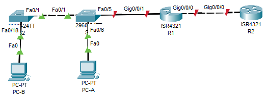

# Настройка NAT для IPv4

## Оглавление
- [Топология](#топология)
- [Таблица адресации](#таблица-адресации)
- [Таблица VLAN](#таблица-vlan)
- [Задачи](#задачи)
- [Общие сведения/сценарий](#общие-сведениясценарий)
- [Необходимые ресурсы](#необходимые-ресурсы)
- [Решение](#решение)
  - [Часть 1. Создание сети и настройка основных параметров устройства](#часть-1-создание-сети-и-настройка-основных-параметров-устройства)
    - [Шаг 1. Подключите кабели сети согласно приведенной топологии.](#шаг-1-подключите-кабели-сети-согласно-приведенной-топологии)
    - [Шаг 2. Произведите базовую настройку маршрутизаторов.](#шаг-2-произведите-базовую-настройку-маршрутизаторов)
    - [Шаг 3. Настройте базовые параметры каждого коммутатора.](#шаг-3-настройте-базовые-параметры-каждого-коммутатора)
  - [Часть 2. Настройка и проверка NAT для IPv4.](#часть-2-настройка-и-проверка-nat-для-ipv4)
    - [Шаг 1. Настройте NAT на R1, используя пул из трех адресов 209.165.200.226-209.165.200.228.](#шаг-1-настройте-nat-на-r1-используя-пул-из-трех-адресов-209165200226-209165200228)
    - [Шаг 2. Проверьте конфигурацию.](#шаг-2-проверьте-конфигурацию)
  - [Часть 3. Настройка и проверка PAT для IPv4.](#часть-3-настройка-и-проверка-pat-для-ipv4)
    - [Шаг 1. Удалите команду преобразования на R1.](#шаг-1-удалите-команду-преобразования-на-r1)
    - [Шаг 2. Добавьте команду PAT на R1.](#шаг-2-добавьте-команду-pat-на-r1)
    - [Шаг 3. Протестируйте и проверьте конфигурацию.](#шаг-3-протестируйте-и-проверьте-конфигурацию)
    - [Шаг 4. На R1 удалите команды преобразования nat pool.](#шаг-4-на-r1-удалите-команды-преобразования-nat-pool)
    - [Шаг 5. Добавьте команду PAT overload, указав внешний интерфейс.](#шаг-5-добавьте-команду-pat-overload-указав-внешний-интерфейс)
    - [Шаг 6. Протестируйте и проверьте конфигурацию.](#шаг-6-протестируйте-и-проверьте-конфигурацию)
  - [Часть 4. Настройка и проверка статического NAT для IPv4.](#часть-4-настройка-и-проверка-статического-nat-для-ipv4)
    - [Шаг 1. На R1 очистите текущие трансляции и статистику.](#шаг-1-на-r1-очистите-текущие-трансляции-и-статистику)
    - [Шаг 2. На R1 настройте команду NAT, необходимую для статического сопоставления внутреннего адреса с внешним адресом.](#шаг-2-на-r1-настройте-команду-nat-необходимую-для-статического-сопоставления-внутреннего-адреса-с-внешним-адресом)
    - [Шаг 3. Протестируйте и проверьте конфигурацию.](#шаг-3-протестируйте-и-проверьте-конфигурацию-1)

## Топология

## Таблица адресации
| Устройство | Интерфейс | IP-адрес | Маска подсети |
| ---------- | --------- | -------- | ------------- |
| R1 | G0/0/0 | 209.165.200.230 | 255.255.255.248 |
|    | G0/0/1 | 192.168.1.1 | 255.255.255.0 |
| R2 | G0/0/0 | 209.165.200.225 | 255.255.255.248 |
|    | Lo1 | 209.165.200.1 | 255.255.255.224 |
| S1 | VLAN 1 | 192.168.1.11 | 255.255.255.0 |
| S2 | VLAN 1 | 192.168.1.12 | 255.255.255.0 |
| PC-A | NIC | 192.168.1.2 | 255.255.255.0 |
| PC-B | NIC | 192.168.1.3 | 255.255.255.0 |


## Таблица VLAN
| VLAN | Имя | Назначенный интерфейс |
| ---- | --- | --------------------- |
| 20 | Management | S2: F0/5 |
| 30 | Operations | S1: F0/6 |
| 40 | Sales | S2: F0/18 |
| 999 | ParkingLot | S1: F0/2-4, F0/7-24, G0/1-2 <br>S2: F0/2-4, F0/6-17, F0/19-24, G0/1-2 |
| 1000 | Native | — |

## Задачи
**Часть 1.** Создание сети и настройка основных параметров устройства\
**Часть 2.** Настройка и проверка NAT для IPv4\
**Часть 3.** Настройка и проверка PAT для IPv4\
**Часть 4.** Настройка и проверка статического NAT для IPv4

## Общие сведения/сценарий
Преобразование (NAT) — это процесс, при котором сетевое устройство, например маршрутизатор Cisco, назначает публичный адрес узлам в пределах частной сети. NAT используют для сокращения количества публичных IP-адресов, используемых организацией, поскольку количество доступных публичных IPv4-адресов ограничено.\
Интернет-провайдер выделил компании общедоступное пространство IP-адресов 209.165.200.224/29. Эта сеть используется для обращения к каналу между маршрутизатором ISP (R2) и шлюзом компании (R1). Первый адрес (209.165.200.225) назначается интерфейсу g0/0 на R2, а последний адрес (209.165.200.230) назначается интерфейсу g0/0/0 на R1.\
Остальные адреса (209.165.200.226-209.165.200.229) будут использоваться для предоставления доступа в Интернет хостам компании. Маршрут по умолчанию используется от R1 до R2. Подключение интернет-провайдера к Интернету смоделировано loopback-адресом на маршрутизаторе интернет-провайдера.\
В этой лабораторной работе  вы будете настраивать различные типы NAT. Вы выполните тестирование, отображение и проверку осуществления всех преобразований и проанализируете статистику NAT/PAT для контроля процесса.\
**Примечание:** Маршрутизаторы, используемые в практических лабораторных работах CCNA, - это Cisco 4221 с Cisco IOS XE Release 16.9.3 (образ universalk9). В лабораторных работах используются коммутаторы Cisco Catalyst 2960 с Cisco IOS версии 15.2(2) (образ lanbasek9). Можно использовать другие маршрутизаторы, коммутаторы и версии Cisco IOS. В зависимости от модели устройства и версии Cisco IOS доступные команды и результаты их выполнения могут отличаться от тех, которые показаны в лабораторных работах. Правильные идентификаторы интерфейса см. в сводной таблице по интерфейсам маршрутизаторов в конце лабораторной работы.\
**Примечание.** Убедитесь, что у всех маршрутизаторов и коммутаторов была удалена начальная конфигурация. Если вы не уверены в этом, обратитесь к инструктору.


## Необходимые ресурсы
- 2 маршрутизатора (Cisco 4221 с универсальным образом Cisco IOS XE версии 16.9.4 или аналогичным)
- 2 коммутатора (Cisco 2960 с операционной системой Cisco IOS 15.2(2) (образ lanbasek9) или аналогичная модель)
- 2 ПК (ОС Windows с программой эмуляции терминалов, такой как Tera Term)
- Консольные кабели для настройки устройств Cisco IOS через консольные порты
- Кабели Ethernet, расположенные в соответствии с топологией

##  Решение
### Часть 1. Создание сети и настройка основных параметров устройства
#### Шаг 1. Подключите кабели сети согласно приведенной топологии.
Подключите устройства в соответствии с топологией и подсоедините соответствующие кабели.

#### Шаг 2. Произведите базовую настройку маршрутизаторов.
**a.** Назначьте маршрутизатору имя устройства.\
**b.** Отключите поиск DNS, чтобы предотвратить попытки маршрутизатора неверно преобразовывать введенные команды таким образом, как будто они являются именами узлов.\
**c.** Назначьте class в качестве зашифрованного пароля привилегированного режима EXEC.\
**d.** Назначьте cisco в качестве пароля консоли и включите вход в систему по паролю.\
**e.** Назначьте cisco в качестве пароля VTY и включите вход в систему по паролю.\
**f.** Зашифруйте открытые пароли.\
**g.** Создайте баннер с предупреждением о запрете несанкционированного доступа к устройству.\
**h.** Настройте IP-адресации интерфейса, как указано в таблице выше.\
**i.** Настройте маршрут по умолчанию. от R2 до R1.\
**j.** Сохраните текущую конфигурацию в файл загрузочной конфигурации.\
**R1:**
```
R1>en
R1#conf t
R1(config)#hostname R1
R1(config)#no ip domain-lookup
R1(config)#banner motd #
Enter TEXT message.  End with the character '#'.
You shall not pass!
#
R1(config)#enable secret class
R1(config)#line vty 0 4
R1(config-line)#password cisco
R1(config-line)#login
R1(config-line)#service password-encryption
R1(config)#int gi0/0/0
R1(config-if)#ip address 209.165.200.230 255.255.255.248
R1(config-if)#no shut
R1(config-if)#int gi0/0/1
R1(config-if)#ip address 192.168.1.1 255.255.255.0
R1(config-if)#no shut
R2(config-if)#ip routing
R2(config)#ip route 0.0.0.0 0.0.0.0 209.165.200.225
R1(config)#end
R1#wr
```
**R2:**
```
R2#conf t
R2(config)#hostname R2
R2(config)#no ip domain-lookup
R2(config)#banner motd #
Enter TEXT message.  End with the character '#'.
You shall not pass!
#
R2(config)#enable secret class
R2(config)#line vty 0 4
R2(config-line)#password cisco
R2(config-line)#login
R2(config-line)#service password-encryption
R2(config)#int gi0/0/0
R2(config-if)#ip address 209.165.200.225 255.255.255.248
R2(config-if)#no shut
R2(config-if)#int lo1
R2(config-if)#ip address 209.165.200.1 255.255.255.224
R2(config)#end
R2#wr
```
#### Шаг 3. Настройте базовые параметры каждого коммутатора.
**a.** Присвойте коммутатору имя устройства.\
**b.** Отключите поиск DNS, чтобы предотвратить попытки маршрутизатора неверно преобразовывать введенные команды таким образом, как будто они являются именами узлов.\
**c.** Назначьте class в качестве зашифрованного пароля привилегированного режима EXEC.\
**d.** Назначьте cisco в качестве пароля консоли и включите вход в систему по паролю.\
**e.** Назначьте cisco в качестве пароля VTY и включите вход в систему по паролю.\
**f.** Зашифруйте открытые пароли.\
**g.** Создайте баннер с предупреждением о запрете несанкционированного доступа к устройству.\
**h.** Выключите все интерфейсы, которые не будут использоваться.\
**i.** Настройте IP-адресации интерфейса, как указано в таблице выше.\
**j.** Сохраните текущую конфигурацию в файл загрузочной конфигурации.
```
S1(config)#hostname S1
S1(config)#no ip domain-lookup
S1(config)#banner motd #
Enter TEXT message.  End with the character '#'.
You shall not pass!
#
S1(config)#enable secret class
S1(config)#line vty 0 4
S1(config-line)#password cisco
S1(config-line)#login
S1(config-line)#service password-encryption
S1(config)#int vlan 1
S1(config-if)#ip address 192.168.1.11 255.255.255.0
S1(config-if)#no shut
S1(config)exit
S1(config)ip default-gateway 192.168.1.1
S1(config)#end
S1#wr
```

### Часть 2. Настройка и проверка NAT для IPv4.
В части 2 необходимо настроить и проверить NAT для IPv4.
#### Шаг 1. Настройте NAT на R1, используя пул из трех адресов 209.165.200.226-209.165.200.228. 
**a.** Настройте простой список доступа, который определяет, какие хосты будут разрешены для трансляции. В этом случае все устройства в локальной сети R1 имеют право на трансляцию.\
**b.** Создайте пул NAT и укажите ему имя и диапазон используемых адресов.\
**c.** Настройте перевод, связывая ACL и пул с процессом преобразования.\
**d.** Задайте внутренний (inside) интерфейс.\
**e.** Определите внешний (outside) интерфейс.
```
R1(config)#access-list 1 permit 192.168.1.0 0.0.0.255
R1(config)#ip nat pool PUBLIC_ACCESS 209.165.200.226 209.165.200.228 netmask 255.255.255.248
R1(config)#interface g0/0/1
R1(config-if)#ip nat inside
R1(config-if)#interface g0/0/0
R1(config-if)#ip nat outside
R1(config-if)#ip nat inside source list 1 pool PUBLIC_ACCESS
```
#### Шаг 2. Проверьте конфигурацию. 
**a.** С PC-B, запустите эхо-запрос интерфейса Lo1 (209.165.200.1) на R2.
```
C:\>ping 209.165.200.1

Pinging 209.165.200.1 with 32 bytes of data:

Reply from 209.165.200.1: bytes=32 time<1ms TTL=254
Reply from 209.165.200.1: bytes=32 time<1ms TTL=254
Reply from 209.165.200.1: bytes=32 time<1ms TTL=254
Reply from 209.165.200.1: bytes=32 time<1ms TTL=254

Ping statistics for 209.165.200.1:
    Packets: Sent = 4, Received = 4, Lost = 0 (0% loss),
Approximate round trip times in milli-seconds:
    Minimum = 0ms, Maximum = 0ms, Average = 0ms
```
Таблица трансляций во время выполнения icmp запросов:
```
R1#sh ip nat tr
Pro  Inside global      Inside local       Outside local      Outside global
icmp 209.165.200.226:25 192.168.1.2:25     209.165.200.1:25   209.165.200.1:25
icmp 209.165.200.226:26 192.168.1.2:26     209.165.200.1:26   209.165.200.1:26
```
**Вопросы:**
- Во что был транслирован внутренний локальный адрес PC-B? **Ответ:** В первый адрес пула PUBLIC_ACCESS - 209.165.200.226.
- Какой тип адреса NAT является переведенным адресом? **Ответ:** Адрес в столбце Inside global
 
**b.** С PC-A, запустите эхо-запрос интерфейса Lo1 (209.165.200.1) на R2. Если эхо-запрос не прошел, выполните отладку.
Пинг прошёл, но записей в таблице теперь больше и пул адресов занят тоже больше:
```
R1#sh ip nat tr
Pro  Inside global      Inside local       Outside local      Outside global
icmp 209.165.200.226:5  192.168.1.3:5      209.165.200.1:5    209.165.200.1:5
icmp 209.165.200.226:6  192.168.1.3:6      209.165.200.1:6    209.165.200.1:6
icmp 209.165.200.226:7  192.168.1.3:7      209.165.200.1:7    209.165.200.1:7
icmp 209.165.200.226:8  192.168.1.3:8      209.165.200.1:8    209.165.200.1:8
icmp 209.165.200.227:29 192.168.1.2:29     209.165.200.1:29   209.165.200.1:29
icmp 209.165.200.227:30 192.168.1.2:30     209.165.200.1:30   209.165.200.1:30
icmp 209.165.200.227:31 192.168.1.2:31     209.165.200.1:31   209.165.200.1:31
icmp 209.165.200.227:32 192.168.1.2:32     209.165.200.1:32   209.165.200.1:32
```
**c.** Обратите внимание, что предыдущая трансляция для PC-B все еще находится в таблице. Из S1, эхо-запрос интерфейса Lo1 (209.165.200.1) на R2.
**d.** Теперь запускаем пинг R2 Lo1 из S2. На этот раз перевод завершается неудачей, и вы получаете эти сообщения (или аналогичные) на консоли R1:
```
Sep 23 15:43:55.562: %IOSXE-6-PLATFORM: R0/0: cpp_cp: QFP:0.0 Thread:000 TS:00000001473688385900 %NAT-6-ADDR_ALLOC_FAILURE: Address allocation failed; pool 1 may be exhausted [2]
```
У меня подобного сообещения в CPT для 4321 не выходило, но на 4-м устройсте пинг уже не проходил:
```
C:\> ping 209.165.200.1

Pinging 209.165.200.1 with 32 bytes of data:

Request timed out.
Request timed out.
Request timed out.
Request timed out.
```
**e.** Это ожидаемый результат, потому что выделено только 3 адреса, и мы попытались ping Lo1 с четырех устройств. Напомним, что NAT — это трансляция «один-в-один». Как много выделено трансляций? Введите команду show ip nat translations verbose , и вы увидите, что ответ будет 24 часа.
Команды show ip nat translations verbose нет в CPT:
```
R1#show ip nat translations verbose
                            ^
% Invalid input detected at '^' marker.
```
**f.** Учитывая, что пул ограничен тремя адресами, NAT для пула адресов недостаточно для нашего приложения. Очистите преобразование NAT и статистику, и мы перейдем к PAT.
```
R1#clear ip nat translation *
R1#clear ip nat statistics 
                ^
% Invalid input detected at '^' marker.
```
Видно, что clear ip nat statistics тоже не реализовано в CPT... Но таблица динамических трансляц3ий очистилась:
```
R1#show ip nat translations 
R1#
```
### Часть 3. Настройка и проверка PAT для IPv4.
В части 3 необходимо настроить замену NAT на PAT в пул адресов, а затем на PAT с помощью интерфейса.
#### Шаг 1. Удалите команду преобразования на R1.
```
R1(config)#no ip nat inside source list 1 pool PUBLIC_ACCESS
```
#### Шаг 2. Добавьте команду PAT на R1.
```
R1(config)#ip nat inside source list 1 pool PUBLIC_ACCESS overload 
```
#### Шаг 3. Протестируйте и проверьте конфигурацию.
**a.** Давайте проверим, что PAT работает. С PC-B,  запустите эхо-запрос интерфейса Lo1 (209.165.200.1) на R2. Если эхо-запрос не прошел, выполните отладку. На R1 отобразите таблицу NAT на R1 с помощью команды show ip nat translations.
```
R1#show ip nat translations
Pro  Inside global      Inside local       Outside local      Outside global
icmp 209.165.200.226:53 192.168.1.2:53     209.165.200.1:53   209.165.200.1:53
icmp 209.165.200.226:54 192.168.1.2:54     209.165.200.1:54   209.165.200.1:54
icmp 209.165.200.226:55 192.168.1.2:55     209.165.200.1:55   209.165.200.1:55
icmp 209.165.200.226:56 192.168.1.2:56     209.165.200.1:56   209.165.200.1:56
```
**Вопросы:**
- Во что был транслирован внутренний локальный адрес PC-B? **Ответ:** В адрес 209.165.200.228
- Какой тип адреса NAT является переведенным адресом? **Ответ:** Inside global
- Чем отличаются выходные данные команды show ip nat translations из упражнения NAT? **Ответ:** Принципиально - ничем, так как пока отправлен запрос только с одного устройства.
 
**b.** С PC-A, запустите эхо-запрос интерфейса Lo1 (209.165.200.1) на R2. Если эхо-запрос не прошел, выполните отладку. На R1 отобразите таблицу NAT на R1 с помощью команды show ip nat translations.\
**c.** Генерирует трафик с нескольких устройств для наблюдения PAT. На PC-A и PC-B используйте параметр -t с командой ping, чтобы отправить безостановочный ping на интерфейс Lo1 R2 (ping -t 209.165.200.1), затем вернитесь к R1 и выполните команду show ip nat translations:
```
R1#sh ip nat tr
Pro  Inside global        Inside local       Outside local      Outside global
icmp 209.165.200.226:1024 192.168.1.11:26    209.165.200.1:26   209.165.200.1:1024
icmp 209.165.200.226:26   192.168.1.12:26    209.165.200.1:26   209.165.200.1:26
icmp 209.165.200.226:27   192.168.1.12:27    209.165.200.1:27   209.165.200.1:27
icmp 209.165.200.226:28   192.168.1.12:28    209.165.200.1:28   209.165.200.1:28
icmp 209.165.200.226:29   192.168.1.12:29    209.165.200.1:29   209.165.200.1:29
icmp 209.165.200.226:30   192.168.1.12:30    209.165.200.1:30   209.165.200.1:30
icmp 209.165.200.226:38   192.168.1.3:38     209.165.200.1:38   209.165.200.1:38
icmp 209.165.200.226:39   192.168.1.3:39     209.165.200.1:39   209.165.200.1:39
icmp 209.165.200.226:40   192.168.1.3:40     209.165.200.1:40   209.165.200.1:40
icmp 209.165.200.226:41   192.168.1.3:41     209.165.200.1:41   209.165.200.1:41
icmp 209.165.200.226:65   192.168.1.2:65     209.165.200.1:65   209.165.200.1:65
icmp 209.165.200.226:66   192.168.1.2:66     209.165.200.1:66   209.165.200.1:66
icmp 209.165.200.226:67   192.168.1.2:67     209.165.200.1:67   209.165.200.1:67
icmp 209.165.200.226:68   192.168.1.2:68     209.165.200.1:68   209.165.200.1:68
icmp 209.165.200.226:69   192.168.1.2:69     209.165.200.1:69   209.165.200.1:69
icmp 209.165.200.226:70   192.168.1.2:70     209.165.200.1:70   209.165.200.1:70
icmp 209.165.200.226:71   192.168.1.2:71     209.165.200.1:71   209.165.200.1:71
icmp 209.165.200.226:72   192.168.1.2:72     209.165.200.1:72   209.165.200.1:72
```
Видно, что overload работает, роутер использует один адрес, но множество номеров портов для разных запросов.

**Вопрос:** Как маршрутизатор отслеживает, куда идут ответы?\
**Ответ:** Записывает в таблицу трансляции внутренние и внешние глобальные/локальные адреса и порты (а также протокол), чтобы потом вернуть ответ на запрос или отправить новый запрос в существующем соединении.

**d.** PAT в пул является очень эффективным решением для малых и средних организаций. Тем не менее есть неиспользуемые адреса IPv4, задействованные в этом сценарии. Мы перейдем к PAT с перегрузкой интерфейса, чтобы устранить эту трату IPv4 адресов. Остановите ping на PC-A и PC-B с помощью комбинации клавиш Control-C, затем очистите трансляции и статистику:
```
R1#clear ip nat translation * 
```
#### Шаг 4. На R1 удалите команды преобразования nat pool.
```
R1(config)#no ip nat inside source list 1 pool PUBLIC_ACCESS overload 
R1(config)#no ip nat pool PUBLIC_ACCESS
```
#### Шаг 5. Добавьте команду PAT overload, указав внешний интерфейс.
```
ip nat inside source list 1 interface g0/0/0 overload 
```
#### Шаг 6. Протестируйте и проверьте конфигурацию. 
**a.** Давайте проверим PAT, чтобы интерфейс работал. С PC-B,  запустите эхо-запрос интерфейса Lo1 (209.165.200.1) на R2. Если эхо-запрос не прошел, выполните отладку. На R1 отобразите таблицу NAT на R1 с помощью команды show ip nat translations.
```
R1#sh ip nat tr
Pro  Inside global      Inside local       Outside local      Outside global
icmp 209.165.200.230:77 192.168.1.2:77     209.165.200.1:77   209.165.200.1:77
icmp 209.165.200.230:78 192.168.1.2:78     209.165.200.1:78   209.165.200.1:78
icmp 209.165.200.230:79 192.168.1.2:79     209.165.200.1:79   209.165.200.1:79
icmp 209.165.200.230:80 192.168.1.2:80     209.165.200.1:80   209.165.200.1:80
icmp 209.165.200.230:81 192.168.1.2:81     209.165.200.1:81   209.165.200.1:81
icmp 209.165.200.230:82 192.168.1.2:82     209.165.200.1:82   209.165.200.1:82
icmp 209.165.200.230:83 192.168.1.2:83     209.165.200.1:83   209.165.200.1:83
icmp 209.165.200.230:84 192.168.1.2:84     209.165.200.1:84   209.165.200.1:84
```
**b.** Сделайте трафик с нескольких устройств для наблюдения PAT. На PC-A и PC-B используйте параметр -t с командой ping для отправки безостановочного ping на интерфейс Lo1 R2 (ping -t 209.165.200.1). На S1 и S2 выполните привилегированную команду exec ping 209.165.200.1 повторить 2000. Затем вернитесь к R1 и выполните команду show ip nat translations.
```
R1#sh ip nat tr
Pro  Inside global      Inside local       Outside local      Outside global
icmp 209.165.200.230:31 192.168.1.12:31    209.165.200.1:31   209.165.200.1:31
icmp 209.165.200.230:32 192.168.1.12:32    209.165.200.1:32   209.165.200.1:32
icmp 209.165.200.230:33 192.168.1.12:33    209.165.200.1:33   209.165.200.1:33
icmp 209.165.200.230:34 192.168.1.12:34    209.165.200.1:34   209.165.200.1:34
icmp 209.165.200.230:35 192.168.1.12:35    209.165.200.1:35   209.165.200.1:35
icmp 209.165.200.230:42 192.168.1.3:42     209.165.200.1:42   209.165.200.1:42
icmp 209.165.200.230:43 192.168.1.3:43     209.165.200.1:43   209.165.200.1:43
icmp 209.165.200.230:44 192.168.1.3:44     209.165.200.1:44   209.165.200.1:44
icmp 209.165.200.230:45 192.168.1.3:45     209.165.200.1:45   209.165.200.1:45
icmp 209.165.200.230:46 192.168.1.3:46     209.165.200.1:46   209.165.200.1:46
icmp 209.165.200.230:47 192.168.1.3:47     209.165.200.1:47   209.165.200.1:47
icmp 209.165.200.230:48 192.168.1.3:48     209.165.200.1:48   209.165.200.1:48
icmp 209.165.200.230:85 192.168.1.2:85     209.165.200.1:85   209.165.200.1:85
icmp 209.165.200.230:86 192.168.1.2:86     209.165.200.1:86   209.165.200.1:86
```
Теперь всегда для трансляции используется адрес интерфейса g0/0/0 (209.165.200.230).
### Часть 4. Настройка и проверка статического NAT для IPv4.
#### Шаг 1. На R1 очистите текущие трансляции и статистику.
```
R1#clear ip nat translation * 
```
#### Шаг 2. На R1 настройте команду NAT, необходимую для статического сопоставления внутреннего адреса с внешним адресом.
Для этого шага настройте статическое сопоставление между 192.168.1.11 и 209.165.200.1 с помощью следующей команды:
```
R1(config)#ip nat inside source static 192.168.1.2 209.165.200.229
```
#### Шаг 3. Протестируйте и проверьте конфигурацию.
**a.** Давайте проверим, что статический NAT работает. На R1 отобразите таблицу NAT на R1 с помощью команды show ip nat translations, и вы увидите статическое сопоставление.
```
R1#sh ip nat translations 
Pro  Inside global     Inside local       Outside local      Outside global
---  209.165.200.229   192.168.1.2        ---                ---
```
**b.** Таблица перевода показывает, что статическое преобразование действует. Проверьте это, запустив ping с R2 на 209.165.200.229. Пинги должны работать.
```
R2#ping 209.165.200.229

Type escape sequence to abort.
Sending 5, 100-byte ICMP Echos to 209.165.200.229, timeout is 2 seconds:
.!!!!
Success rate is 80 percent (4/5), round-trip min/avg/max = 0/0/0 ms
```
**c.** На R1 отобразите таблицу NAT на R1 с помощью команды show ip nat translations, и вы увидите статическое сопоставление и преобразование на уровне порта для входящих pings.
```
R1#sh ip nat translations 
Pro  Inside global     Inside local       Outside local      Outside global
icmp 209.165.200.229:10192.168.1.2:10     209.165.200.225:10 209.165.200.225:10
icmp 209.165.200.229:2 192.168.1.2:2      209.165.200.225:2  209.165.200.225:2
icmp 209.165.200.229:3 192.168.1.2:3      209.165.200.225:3  209.165.200.225:3
icmp 209.165.200.229:4 192.168.1.2:4      209.165.200.225:4  209.165.200.225:4
icmp 209.165.200.229:5 192.168.1.2:5      209.165.200.225:5  209.165.200.225:5
icmp 209.165.200.229:6 192.168.1.2:6      209.165.200.225:6  209.165.200.225:6
icmp 209.165.200.229:7 192.168.1.2:7      209.165.200.225:7  209.165.200.225:7
icmp 209.165.200.229:8 192.168.1.2:8      209.165.200.225:8  209.165.200.225:8
icmp 209.165.200.229:9 192.168.1.2:9      209.165.200.225:9  209.165.200.225:9
---  209.165.200.229   192.168.1.2        ---                ---
```