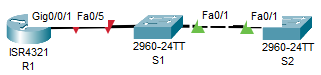

# Настройка протоколов CDP, LLDP и NTP

## Оглавление
- [Топология](#топология)
- [Таблица адресации](#таблица-адресации)
- [Задачи](#задачи)
- [Общие сведения/сценарий](#общие-сведениясценарий)
- [Необходимые ресурсы](#необходимые-ресурсы)
- [Решение](#решение)
  - [Часть 1. Создание сети и настройка основных параметров устройства](#часть-1-создание-сети-и-настройка-основных-параметров-устройства)
    - [Шаг 1. Подключите кабели сети согласно приведенной топологии.](#шаг-1-подключите-кабели-сети-согласно-приведенной-топологии)
    - [Шаг 2. Произведите базовую настройку маршрутизаторов.](#шаг-2-произведите-базовую-настройку-маршрутизаторов)
    - [Шаг 3. Настройте базовые параметры каждого коммутатора.](#шаг-3-настройте-базовые-параметры-каждого-коммутатора)
  - [Часть 2. Обнаружение сетевых ресурсов с помощью протокола CDP](#часть-2-обнаружение-сетевых-ресурсов-с-помощью-протокола-cdp)
  - [Часть 3. Обнаружение сетевых ресурсов с помощью протокола LLDP](#часть-3-обнаружение-сетевых-ресурсов-с-помощью-протокола-lldp)
  - [Часть 4. Настройка NTP](#часть-4-настройка-ntp)
    - [Шаг 1. Выведите на экран текущее время.](#шаг-1-выведите-на-экран-текущее-время)
    - [Шаг 2. Установите время.](#шаг-2-установите-время)
    - [Шаг 3. Настройте главный сервер NTP.](#шаг-3-настройте-главный-сервер-ntp)
    - [Шаг 4. Настройте клиент NTP.](#шаг-4-настройте-клиент-ntp)
    - [Шаг 5. Проверьте настройку NTP.](#шаг-5-проверьте-настройку-ntp)
  - [Вопрос для повторения](#вопрос-для-повторения)

## Топология

## Таблица адресации
| Устройство | Интерфейс | IP-адрес | Маска подсети | Шлюз по умолчанию |
| ---------- | --------- | -------- | ------------- | ----------------- |
| R1 | Loopback1 | 172.16.1.1 | 255.255.255.0 | — |
|    | G0/0/1 | 10.22.0.1 | 255.255.255.0 | — |
| S1 | SVI VLAN 1 | 10.22.0.2 | 255.255.255.0 | 10.22.0.1 |
| S2 | SVI VLAN 1 | 10.22.0.3 | 255.255.255.0 | 10.22.0.1 |

## Задачи
**Часть 1.** Создание сети и настройка основных параметров устройства\
**Часть 2.** Обнаружение сетевых ресурсов с помощью протокола CDP\
**Часть 3.** Обнаружение сетевых ресурсов с помощью протокола LLDP\
**Часть 4.** Настройка и проверка NTP

## Общие сведения/сценарий
Протокол Cisco Discovery Protocol (CDP) — собственный протокол Cisco для обнаружения сетевых ресурсов, функционирующий на канальном уровне. Он служит для обмена информацией, например именами устройств и версиями ПО IOS, с другими физически подключенными устройствами Cisco. Протокол Link Layer Discovery Protocol (LLDP) — это не зависящий от производителя протокол для обнаружения сетевых ресурсов, функционирующий на канальном уровне. В основном он используется сетевыми устройствами в локальной сети (LAN). Сетевые устройства сообщают соседям такие данные о себе, как идентификаторы и сведения о функциональных возможностях.\
Протокол сетевого времени (NTP) служит для синхронизации времени между распределенными серверами времени и клиентами. В качестве транспортного протокола NTP использует протокол UDP. Все операции обмена данными по протоколу NTP выполняются по времени в формате UTC.\
Сервер NTP обычно получает данные о времени из достоверного источника, такого как атомные часы, к которым подключен сервер. Затем он распределяет это время по сети. Протокол NTP чрезвычайно эффективен; для синхронизации времени на двух компьютерах с временной разницей в пределах миллисекунды требуется отправлять не более одного пакета в минуту.
В этой лабораторной работе вам предстоит задокументировать порты, которые используются для подключения к другим коммутаторам по протоколам CDP и LLDP. Полученные результаты следует указать в диаграмме сетевой топологии.\
**Примечание:** Маршрутизаторы, используемые в практических лабораторных работах CCNA, - это Cisco 4221 с Cisco IOS XE Release 16.9.4 (образ universalk9). В лабораторных работах используются коммутаторы Cisco Catalyst 2960 с Cisco IOS версии 15.2(2) (образ lanbasek9). Можно использовать другие маршрутизаторы, коммутаторы и версии Cisco IOS. В зависимости от модели устройства и версии Cisco IOS доступные команды и результаты их выполнения могут отличаться от тех, которые показаны в лабораторных работах. Правильные идентификаторы интерфейса см. в сводной таблице по интерфейсам маршрутизаторов в конце лабораторной работы.\
**Примечание.** Убедитесь, что у всех маршрутизаторов и коммутаторов была удалена начальная конфигурация. Если вы не уверены в этом, обратитесь к инструктору.

## Необходимые ресурсы
- 1 Маршрутизатор (Cisco 4221 с универсальным образом Cisco IOS XE версии 16.9.4 или аналогичным)
- 2 коммутатора (Cisco 2960 с операционной системой Cisco IOS 15.2(2) (образ lanbasek9) или аналогичная модель)
- 1 ПК (под управлением Windows с программой эмуляции терминала, например, Tera Term)
- Консольные кабели для настройки устройств Cisco IOS через консольные порты.
- Кабели Ethernet, расположенные в соответствии с топологией.

##  Решение
### Часть 1. Создание сети и настройка основных параметров устройства
#### Шаг 1. Подключите кабели сети согласно приведенной топологии.

#### Шаг 2. Произведите базовую настройку маршрутизаторов.
**a.** Назначьте маршрутизатору имя устройства.\
**b.** Отключите поиск DNS, чтобы предотвратить попытки маршрутизатора неверно преобразовывать введенные команды таким образом, как будто они являются именами узлов.\
**c.** Назначьте class в качестве зашифрованного пароля привилегированного режима EXEC.\
**d.** Назначьте cisco в качестве пароля консоли и включите вход в систему по паролю.\
**e.** Назначьте cisco в качестве пароля VTY и включите вход в систему по паролю.\
**f.** Зашифруйте открытые пароли.\
**g.** Создайте баннер с предупреждением о запрете несанкционированного доступа к устройству.\
**h.** Настройте IP-адресации интерфейса, как указано в таблице выше.\
**i.** Сохраните текущую конфигурацию в файл загрузочной конфигурации.
```
Router>en
Router#conf t
Router(config)#hostname R1
R1(config)#no ip domain-lookup
R1(config)#banner motd #
Enter TEXT message.  End with the character '#'.
You shall not pass!
#
R1(config)#enable secret class
R1(config)#line vty 0 4
R1(config-line)#password cisco
R1(config-line)#login
R1(config-line)#service password-encryption
R1(config)#int G0/0/1
R1(config-if)#ip address 10.22.0.1 255.255.255.0
R1(config-if)#no shut
R1(config-if)#int lo1
R1(config-if)#ip address 172.16.1.1 255.255.255.0
R1(config-if)#end
R1#wr
```
#### Шаг 3. Настройте базовые параметры каждого коммутатора.
**a.** Присвойте коммутатору имя устройства.\
**b.** Отключите поиск DNS, чтобы предотвратить попытки маршрутизатора неверно преобразовывать введенные команды таким образом, как будто они являются именами узлов.\
**c.** Назначьте class в качестве зашифрованного пароля привилегированного режима EXEC.\
**d.** Назначьте cisco в качестве пароля консоли и включите вход в систему по паролю.\
**e.** Назначьте cisco в качестве пароля VTY и включите вход в систему по паролю.\
**f.** Зашифруйте открытые пароли.\
**g.** Создайте баннер с предупреждением о запрете несанкционированного доступа к устройству.\
**h.** Выключите все интерфейсы, которые не будут использоваться.\
**i.** Сохраните текущую конфигурацию в файл загрузочной конфигурации.
```
S1#conf t
S1(config)#hostname S1
S1(config)#no ip domain-lookup
S1(config)#banner motd #
Enter TEXT message.  End with the character '#'.
You shall not pass!
#
S1(config)#enable secret class
S1(config)#line vty 0 4
S1(config-line)#password cisco
S1(config-line)#login
S1(config-line)#service password-encryption
S1(config)#interface range f0/2-4,f0/6-f0/24,g0/1-2
S1(config-if)#shut
S1(config)#end
S1#wr
```
### Часть 2. Обнаружение сетевых ресурсов с помощью протокола CDP
**a.** На R1 используйте соответствующую команду show cdp, чтобы определить, сколько интерфейсов включено CDP, сколько из них включено и сколько отключено.\
```
R1#show cdp interface 
Vlan1 is administratively down, line protocol is down
  Sending CDP packets every 60 seconds
  Holdtime is 180 seconds
GigabitEthernet0/0/0 is administratively down, line protocol is down
  Sending CDP packets every 60 seconds
  Holdtime is 180 seconds
GigabitEthernet0/0/1 is up, line protocol is up
  Sending CDP packets every 60 seconds
  Holdtime is 180 seconds
```
**Вопрос:** Сколько интерфейсов участвует в объявлениях CDP? Какие из них активны?\
**Ответ:** В объявлениях CDP участвуют все интерфейсы по умолчанию и только один интерфейс (Gi0/0/1) активен.
 
**b.** На R1 используйте соответствующую команду show cdp, чтобы определить версию IOS, используемую на S1.
```
R1#sh cdp entry S1

Device ID: S1
Entry address(es): 
Platform: cisco 2960, Capabilities: Switch
Interface: GigabitEthernet0/0/1, Port ID (outgoing port): FastEthernet0/5
Holdtime: 155

Version :
Cisco IOS Software, C2960 Software (C2960-LANBASEK9-M), Version 15.0(2)SE4, RELEASE SOFTWARE (fc1)
Technical Support: http://www.cisco.com/techsupport
Copyright (c) 1986-2013 by Cisco Systems, Inc.
Compiled Wed 26-Jun-13 02:49 by mnguyen

advertisement version: 2
Duplex: full
```
**Вопрос:** Какая версия IOS используется на S1?\
**Ответ:** 15.0(2)SE4
 
**c.** На S1 используйте соответствующую команду show cdp, чтобы определить, сколько пакетов CDP было выданных.\
Команда show cdp traffic не реализована в CPT...\
**d.** Настройте SVI для VLAN 1 на S1 и S2, используя IP-адреса, указанные в таблице адресации выше. Настройте шлюз по умолчанию для каждого коммутатора на основе таблицы адресов.\
Адреса для VLAN1 уже настроены, нужно только указать адрес шшлюза по умолчанию.
```
S1(config)#int vlan 1
S1(config-if)#ip address 10.22.0.2 255.255.255.0
S1(config-if)#no shut
S1(config-if)#exit
S1(config)#ip default-gateway 10.22.0.1
```
**e.** На R1 выполните команду show cdp entry S1 
```
R1#show cdp entry S1

Device ID: S1
Entry address(es): 
  IP address : 10.22.0.2
Platform: cisco 2960, Capabilities: Switch
Interface: GigabitEthernet0/0/1, Port ID (outgoing port): FastEthernet0/5
Holdtime: 171

Version :
Cisco IOS Software, C2960 Software (C2960-LANBASEK9-M), Version 15.0(2)SE4, RELEASE SOFTWARE (fc1)
Technical Support: http://www.cisco.com/techsupport
Copyright (c) 1986-2013 by Cisco Systems, Inc.
Compiled Wed 26-Jun-13 02:49 by mnguyen

advertisement version: 2
Duplex: full
```
**Вопрос:** Какие дополнительные сведения доступны теперь?\
**Ответ** Теперь в информации появился IP-адрес VLAN1 коммутатора S1

**f.** Отключить CDP глобально на всех устройствах. 
```
S2(config)#no cdp run
```
### Часть 3. Обнаружение сетевых ресурсов с помощью протокола LLDP
**a.** Введите соответствующую команду lldp, чтобы включить LLDP на всех устройствах в топологии.
```
S2(config)#lldp run
```
**b.** На S1 выполните соответствующую команду lldp, чтобы предоставить подробную информацию о S2. 
В CPT нет реализации команды:
```
%SYS-5-CONFIG_I: Configured from console by console
show lldp entry S2
             ^
% Invalid input detected at '^' marker.
```
В качестве альтернативы вот этот вывод:
```
S1#sh lldp neighbors 
Capability codes:
    (R) Router, (B) Bridge, (T) Telephone, (C) DOCSIS Cable Device
    (W) WLAN Access Point, (P) Repeater, (S) Station, (O) Other
Device ID           Local Intf     Hold-time  Capability      Port ID
S2                  Fa0/1          120        B               Fa0/1
R1                  Fa0/5          120        R               Gig0/0/1

Total entries displayed: 2
```
**c.** Соединитесь через консоль на всех устройствах и используйте команды LLDP, необходимые для отображения топологии физической сети только из выходных данных команды show.
R1:
```
R1#sh lldp neighbors 
Capability codes:
    (R) Router, (B) Bridge, (T) Telephone, (C) DOCSIS Cable Device
    (W) WLAN Access Point, (P) Repeater, (S) Station, (O) Other
Device ID           Local Intf     Hold-time  Capability      Port ID
S1                  Gig0/0/1       120        B               Fa0/5

Total entries displayed: 1
```
S2:
```
S2#sh lldp neighbors 
Capability codes:
    (R) Router, (B) Bridge, (T) Telephone, (C) DOCSIS Cable Device
    (W) WLAN Access Point, (P) Repeater, (S) Station, (O) Other
Device ID           Local Intf     Hold-time  Capability      Port ID
S1                  Fa0/1          120        B               Fa0/1

Total entries displayed: 1
```
 
### Часть 4. Настройка NTP
#### Шаг 1. Выведите на экран текущее время.
```
R1#sh clock detail 
*0:46:41.10 UTC Mon Mar 1 1993
Time source is hardware calendar
```
| Дата | Время | Часовой пояс | Источник времени |
| ---- | ----- | ------------ | ---------------- |
|01.03.1993|0:46:41|UTC|Локальное время устройства (hardware calendar)|
			
#### Шаг 2. Установите время.
С помощью команды clock set установите время на маршрутизаторе R1. Введенное время должно быть в формате UTC. 
```
R1#clock set 20:39:00 05 Jan 2026
```
#### Шаг 3. Настройте главный сервер NTP.
Настройте R1 в качестве хозяина NTP с уровнем слоя 4.
```
R1(config)#ntp master 4
```
#### Шаг 4. Настройте клиент NTP.
**a.** Выполните соответствующую команду на S1 и S2, чтобы просмотреть настроенное время. Запишите текущее время,  в следующей таблице.
```
# S1:
S1#show clock detail 
*0:21:21.28 UTC Mon Mar 1 1993
Time source is hardware calendar

# S2:
S2#show clock detail 
0:21:22.21 UTC Mon Mar 1 1993
Time source is user configuration
```
| Дата | Время | Часовой пояс |
| ---- | ----- | ------------ |
|01.03.1993|0:21:21|UTC|
|01.03.1993|0:21:22|UTC|
		
**b.** Настройте S1 и S2 в качестве клиентов NTP. Используйте соответствующие команды NTP для получения времени от интерфейса G0/0/1 R1, а также для периодического обновления календаря или аппаратных часов коммутатора.
```
S2(config)#ntp server 10.22.0.1
```
#### Шаг 5. Проверьте настройку NTP.
**a.** Используйте соответствующую команду show , чтобы убедиться, что S1 и S2 синхронизированы с R1.
Примечание. Синхронизация метки времени на маршрутизаторе R2 с меткой времени на маршрутизаторе R1 может занять несколько минут.
```
S1#show ntp status 
Clock is synchronized, stratum 16, reference is 10.22.0.1
nominal freq is 250.0000 Hz, actual freq is 249.9990 Hz, precision is 2**24
reference time is 2A98BDEE.00000028 (17:14:22.040 UTC Tue Nov 12 2058)
clock offset is 0.00 msec, root delay is 0.00  msec
root dispersion is 13.27 msec, peer dispersion is 0.12 msec.
loopfilter state is 'CTRL' (Normal Controlled Loop), drift is - 0.000001193 s/s system poll interval is 4, last update was 13 sec ago.
```
Видим статус "Clock is synchronized" и адрес сервера NTP 10.22.0.1 (наш R1), т.е. синхронизация работает.

**b.** Выполните соответствующую команду на S1 и S2, чтобы просмотреть настроенное время и сравнить ранее записанное время.
```
# S1:
S1#sh clock detail 
20:53:26.476 UTC Mon Jan 5 2026
Time source is NTP

# S2:
S2#sh clock detail 
20:53:29.929 UTC Mon Jan 5 2026
Time source is NTP
```
Время синхронизировалось с временем на R1 и источник времени сменился с "hardware calendar" на "NTP". Настройка прошла успешно.

### Вопрос для повторения
**Вопрос:** Для каких интерфейсов в пределах сети не следует использовать протоколы обнаружения сетевых ресурсов?\
**Ответ:** Не стоит включать LLDP и CDP для аплинков к интернет провайдеру. Также, не стоит включать LLDP/CDP для портов в сегменты сети, которые выполняют роль DMZ или гостевой, так как это небезопасно и предоставляет информацию об нашем устройстве потенциальному злоумышленнику. Ещё, возможно, не стоит включать LLDP/CDP на портах доступа с обычными рабочими станциями, так как это не даёт полезной информации о топологии сети.